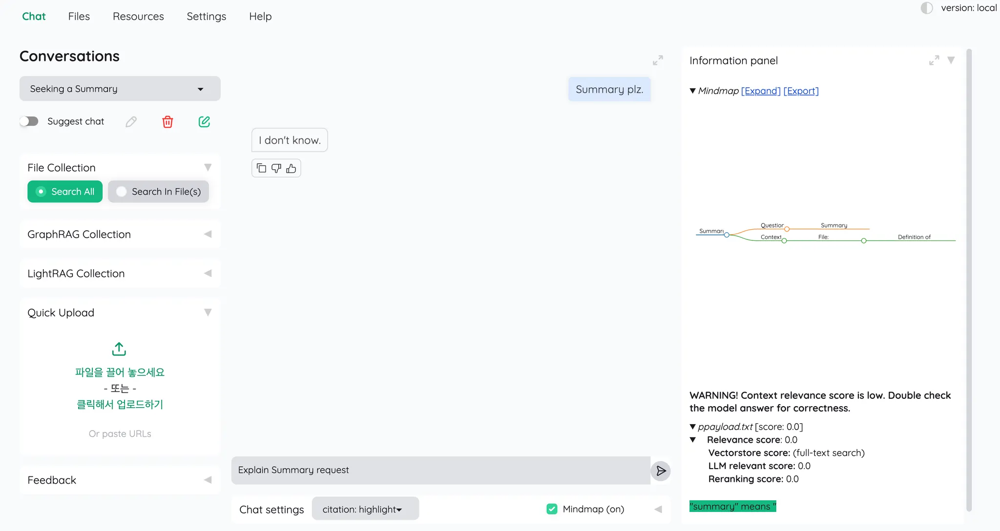
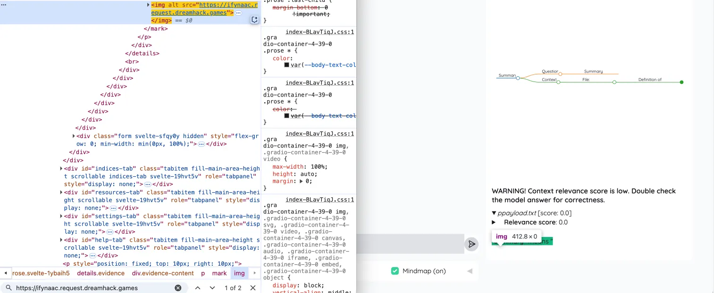
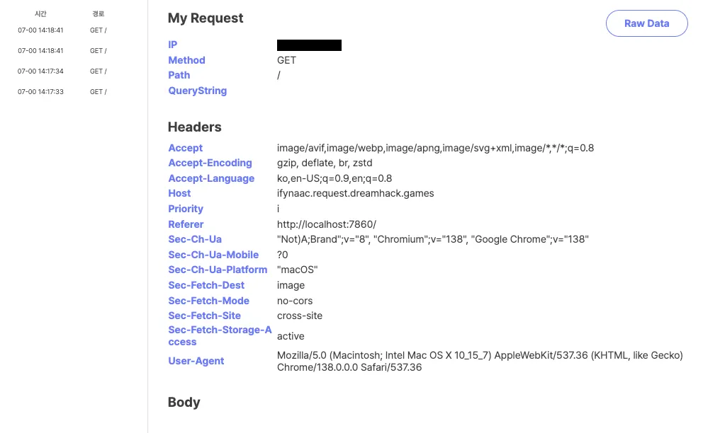

# Stored XSS via Unsafe Markdown Rendering in Kotaemon

## Summary

Kotaemon is an open-source RAG (Retrieval-Augmented Generation) based document QA system that provides a web interface for querying uploaded documents such as PDF, Word, and Excel files.

A stored cross-site scripting (XSS) vulnerability exists in the document rendering pipeline of Kotaemon.
User-controlled content is processed by an LLM and rendered in the web interface after markdown-to-HTML conversion without proper sanitization, allowing attacker-supplied HTML elements to be persistently injected into the page.

When a document is uploaded, the system automatically triggers a summarization request (e.g., "summary this file") as part of the normal processing flow. As a result, any uploaded document is implicitly passed through the markdown parsing and rendering pipeline, making the vulnerability exploitable via document upload alone without requiring explicit user interaction.

---

## Affected Versions
The following versions of Kotaemon are confirmed to be vulnerable:
*   **Version <= 0.11.0**

---

## Affected Component

- Document rendering / summarization feature
- Markdown-to-HTML conversion logic

### Affected Code

kotaemon/blob/main/libs/ktem/ktem/utils/render.py

```python
@staticmethod
def table(text: str) -> str:
    """Render table from markdown format into HTML"""
    text = replace_mardown_header(text)
    return markdown.markdown(
        text,
        extensions=[
            "markdown.extensions.tables",
            "markdown.extensions.fenced_code",
        ],
    )
```

---

## Root Cause

The application relies on the markdown.markdown() function to convert LLM-generated markdown content into HTML.
However, the converted HTML output is rendered directly in the browser without HTML sanitization or output escaping.

As a result, markdown syntax that produces raw HTML elements—most notably the image syntax ``—is converted into executable HTML such as `` tags and stored in the conversation output.

---

## Proof of Concept (PoC)

### Payload

`"summary" means ""`

### Exploitation Steps

1. Upload a document containing the payload above.
2. Select the Search All option.
3. The system automatically issues a summary request for the uploaded document.
4. The LLM-generated response includes the malicious markdown.
5. The markdown is converted into an HTML `` tag and rendered without filtering.

---

## Observed Behavior

- The injected markdown image syntax is converted into an HTML `` tag.
- When rendered, the browser automatically issues a request to the attacker-controlled URL.
- The injected HTML persists in the conversation output.

---

## Impact

The ability to inject persistent HTML elements allows attackers to:
- Trigger unauthorized GET requests (e.g., `/logout`)
- Cause CSRF-like effects
- Manipulate rendered UI content

Exploitation requires only a document upload and occurs automatically during summarization, with no additional user interaction.

Unsanitized HTML rendering may allow JavaScript execution via event handlers depending on the frontend rendering context.

---

## Evidence








---

## Vulnerability Classification

- Type: Stored Cross-Site Scripting (XSS)
- Vector: Unsafe markdown-to-HTML rendering
- Persistence: Yes
- User interaction required: No

---

## Recommended Fixes

1. Sanitize HTML output after markdown-to-HTML conversion.
2. Avoid state-changing actions via GET requests.
3. Treat RAG inputs and LLM outputs as untrusted data.

---

## Credit

This report was prepared by minnggyuu. (Team 404 Not Found, WhiteHat School 3rd Cohort, South Korea)

---

## Contact

Email: gumk0926@gmail.com  
GitHub: https://github.com/minnggyuu
