# Part1. Environment.

--- 

### Breakdown of the vulnerable software stack.

- **O.S.**: Windows 11 Pro version 25H2 (OS Build 26200.6584)

- **Vulnerable app**: FTP Float Server.

- **Environtment Configuration**: 
  
  - Nat adapter to provide the virtual machine with internet access and deploy the needed lab components

--- 

### Apps used in this lab.

The following tools were selected to facilitate the full lifecycle of exploit development for **CVE-2025-5548**, from initial reconnaissance to memory corruption analysis. Most of this aplications just need to be downloaded from its official site, run the installer and just follow the steps by clicking "next" 'till it's installed. 

#### 1 Tools and utils

##### GIT

Essential utility to clone certain repositories like Ghidra or custom exploit payloads from Github. Its also used for version control. Can be downloaded at this [link](https://git-scm.com/). 

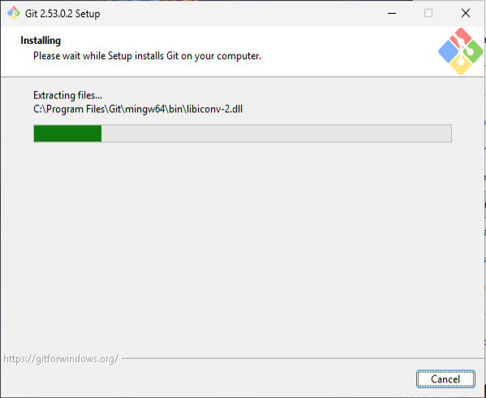

##### Nmap

Essential tool used for grab a banner, verify the connectivity and identify the target service version. In this LAB, the installation is jutified by the use of `ncat` command as in the example image below.  It's available at [nmap.org](https://nmap.org/download.html).

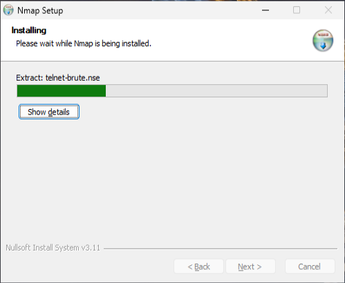

##### Windows SDK

Installed to provide the necessary header files and system debugging tools required for low-level interaction with the Windows 11 API and memory management. It can be downloaded at the official [webpage]([Introducción a Windows SDK - Windows apps | Microsoft Learn](https://learn.microsoft.com/es-es/windows/apps/windows-sdk/).

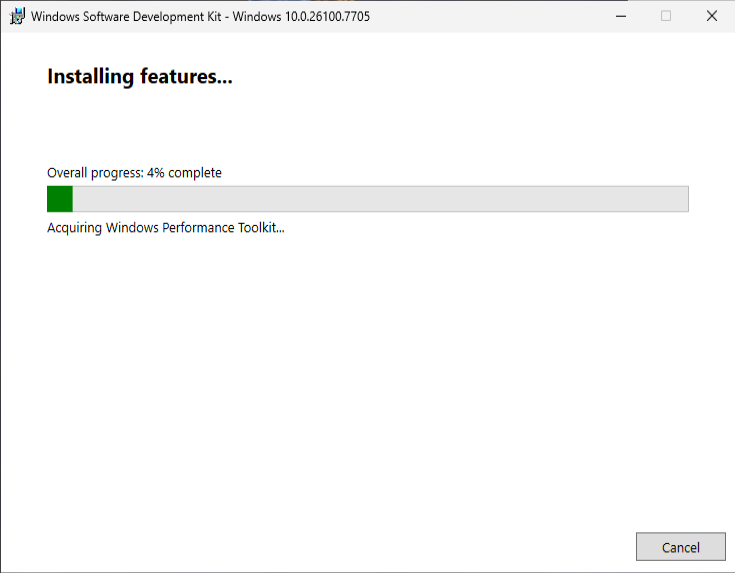

---

#### 2 IDEs

It's mandatory to use some Integrated Development Environments (IDEs) to provide syntax highlighting and debugging for **exploit automation**. Using an IDE is critical for managing the precise byte-string formatting (hex encoding) required to build a working buffer overflow payload without syntax errors. Some IDEs which I'm familiar are: 

##### Notepad++

A standard in the industry with plenty of plugins. It can be downloaded at its [website](https://notepad-plus-plus.org/downloads/). Be sure to download the latest version possible. 

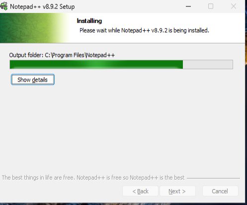

##### Visual studio Code

Used for advanced Python scripting. Its robust integration with terminal environments allows for seamless execution and testing of exploit code. The official download [website](https://code.visualstudio.com/download). 

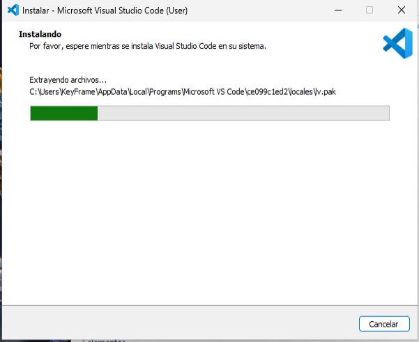

##### Pycharm Community.

Utilized for complex exploit development. Its built-in debugger is essential for verifying logic when automating multi-stage payloads or handling large buffers. It's specially useful on Python and the community edition can be downloaded from [PyCharm](https://www.jetbrains.com/es-es/pycharm/).

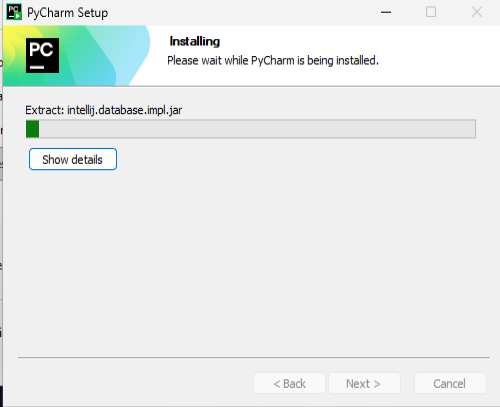

---

#### 3 Languages

There are some primary languages that must be installed on this lab to work properly to run and configure scripts, as well as to run some apps. 

##### Python

We need to install two versions of python at [python.org](https://www.python.org/downloads/):

- Python 3.x: the actual primary language for modern exploit automation and script execution.

- Python 2.7.18: a mandatory legacy dependency for the dynamic debugger [Immunity Debugger](#4-dynamic-debuggers) and needed to run the `mona.py` plugin. 

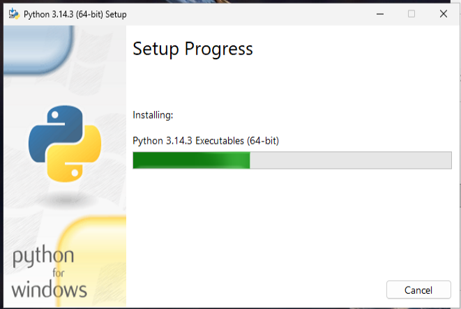

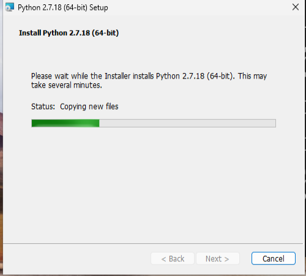

##### Java JDK

Required as a core dependency for running [Ghidra](#5-disassemblers--decompilers), which is a Java-based reverse engineering suite, installed from [Java Downloads.](https://www.oracle.com/es/java/technologies/downloads/#jdk25-windows)

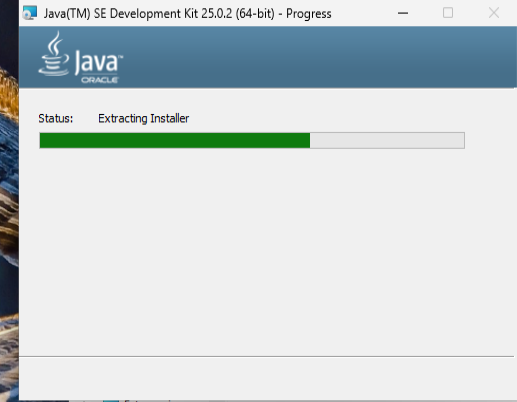

---

#### 4 Dynamic Debuggers

A powerful tool for runtime memory analysis and process attachment. It allows to monitor CPU registers (EIP, ESP) in real-time to identify the exact point of memory corruption. It can be obtained at this [Immunity GitHub](https://github.com/kbandla/ImmunityDebugger/releases).

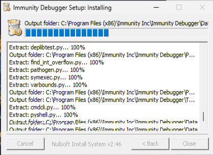

---

#### 5 Disassemblers & Decompilers

##### IDA Free

Used for disassembling the vulnerable binary to understand the execution flow and identify the vulnerable function. It's necessary an email to register and get the license and the installer at [IDA Free: Disassembler](https://hex-rays.com/ida-free).

:warning: **Note:** Remember to download the license `.hex` file and deploy it on `"%appdata\Hex-Rays\Ida Pro"`. 

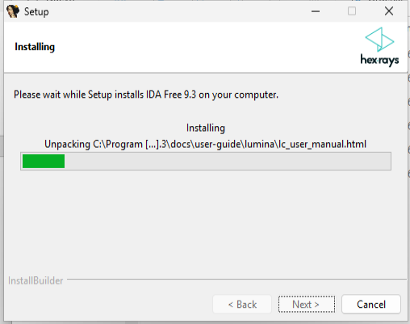

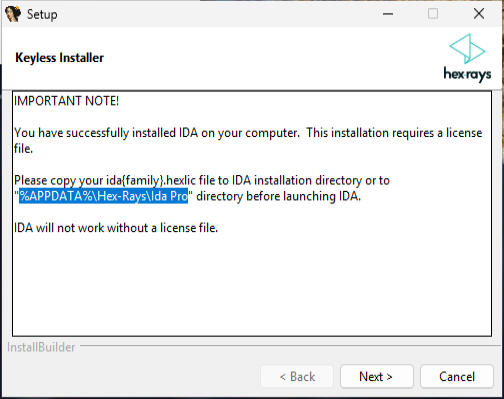

##### Ghidra

An open-source reverse engineering software used to decompile the binary to discover the specific overlfow vulnerability. It needs JAVA language an can be clone it from this [github](https://github.com/nationalsecurityagency/ghidra) with the following command: 

`git clone https://github.com/nationalsecurityagency/ghidra`

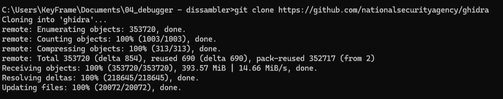

---

#### 6 Exploit Development

##### ##### Mona

This is an indispensable plugin for [Immunity Debugger](#4-dynamic-debuggers) used to find the `JMP ESP` isntructions, calculate offsets using cyclic patterns and identify the "bad characters". The steps for the setup are:

1. Place mona.py from this [github repository](https://github.com/corelan/mona) into the `PyCommands` folder inside the Immunity Debugger application directory at **C:\Program Files (x86)\Immunity Inc\Immunity Debugger\PyCommands**
2. Install the required Python version 2.7.xx. This is needed to avoid TLS issues when trying to update mona. Make sure you are installing the 32bit version of python.

Get more info at [Corelan](https://www.corelan.be/index.php/2011/07/14/mona-py-the-manual/).

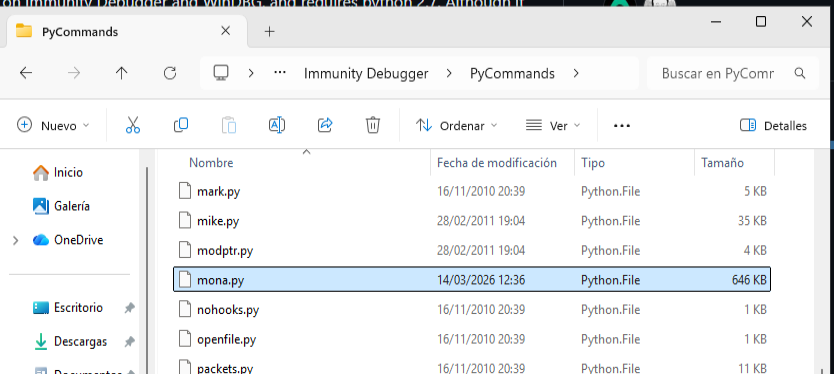

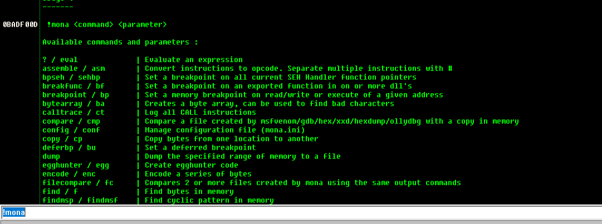

---

#### 7 Vulnerable apps

##### FreeFloat FTP Server v1.0

The target of this Proof of Concept (PoC). It contains a classic stack-based buffer overflow vulnerability listed under **CVE-2025-5548**, that can be downloaded at [Freefloat FTP Server 1.0](https://www.exploit-db.com/exploits/17546). 

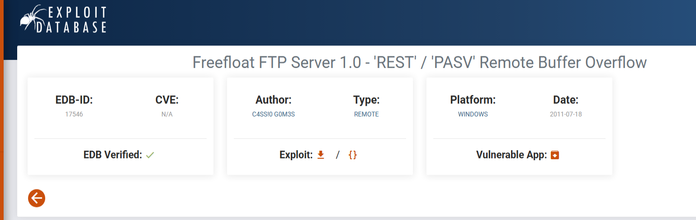

--- 

:bulb:**NOTE:** Although it's very important to know which ones and how to install this apps, there are lots of repositories and virtual machine templates that are already prepared for this kind of labs.
