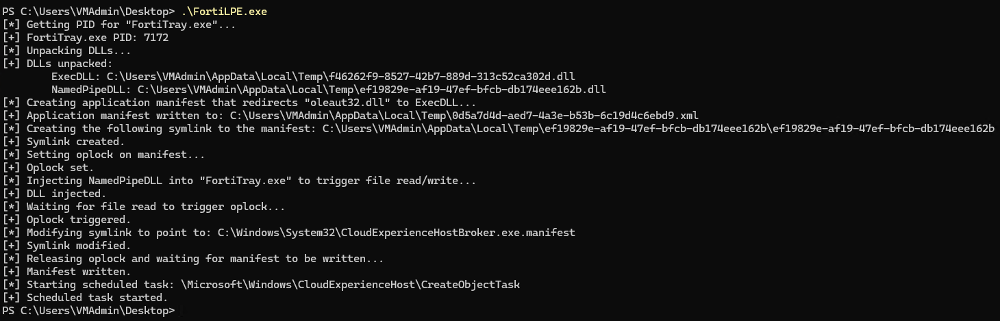
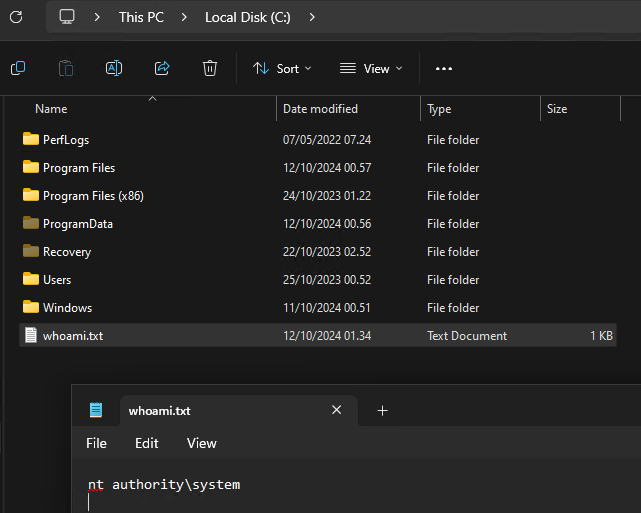

# Description
Local privilege escalation PoC exploit for CVE-2025-62676 / EUVD-2025-206993 that targets FortiClient VPN running on Windows. Executes a payload in the context of `SYSTEM` from a normal user context via an arbitrary XML file write. The PoC has been tested against FortiClient version 7.4.0 on Windows 11 Pro. The following versions are vulnerable according to the vendor:
- 7.4.0 - 7.4.4
- 7.2.0 - 7.2.12
- 7.0 (all versions)

The vulnerability was reported through the Trend Micro Zero Day Initiative: https://www.zerodayinitiative.com/advisories/ZDI-26-115/

Official advisory from Fortinet: https://fortiguard.fortinet.com/psirt/FG-IR-25-661

# Dependencies
- [OffWinLib](https://github.com/SpacePlant/OffWinLib) is used as a Git submobule.
- [Windows Implementation Libraries (WIL)](https://github.com/microsoft/wil) via the Microsoft.Windows.ImplementationLibrary NuGet package. If it is not installed automatically on build, run `nuget restore`.

# How to Build
1. Clone the repository with `git clone --recursive`.
2. The default payload runs `cmd /c whoami > C:\whoami.txt`. To change this, modify `dllmail.cpp` in the `ExecDLL` project.
3. Build the FortiLPE solution.

# How to Use
1. Run `FortiLPE.exe´.
2. If the payload is not executed, it is probably because `CloudExperienceHostBroker.exe` has been executed since last reboot before running the PoC. Reboot the machine and start the `CreateObjectTask` task manually (`Start-ScheduledTask -TaskPath \Microsoft\Windows\CloudExperienceHost -TaskName CreateObjectTask`). See [Technical Details](#technical-details) for more details.

# Technical Details
FortiClient creates a named pipe `FC_{F18F86FD-7503-4564-80CF-B6B199519837}` that regular users are allowed to communicate with. Communication is restricted to processes running from the FortiClient program folder (`C:\Program Files\Fortinet\FortiClient`), but this can be bypassed by injecting code into the running `FortiTray.exe` process, which is running from the program folder. Through this named pipe, it is possible to launch an instance of `FCConfig.exe` running as `SYSTEM` with user-controlled arguments.

By specifying an unrecognized operation (`-o A`), `FCConfig.exe` will read a target file (`-f FILE`) and then write it back to the same location (not sure why this is happening). By setting the target to a junction/symlink that points to a specific file and setting an oplock on the file, it is possible to make the process follow the symlink, read the file, and trigger the oplock. The symlink can then be modified to point to a different location. When the oplock is released, `FCConfig.exe` will follow the symlink to the new destination and write the file there, resulting in an arbitrary file write. The file needs to be valid XML (it seems to go through an XML formatter).

To turn the arbitrary XML file write into privileged code execution, an application manifest is written to redirect a DLL load for a process running as `SYSTEM`. `C:\Windows\System32\CloudExperienceHostBroker.exe` was chosen for this:
- It can be executed by a regular user starting the scheduled task `\Microsoft\Windows\CloudExperienceHost\CreateObjectTask`.
- It runs as `SYSTEM`.
- It does not have an embedded manifest (which would take priority).
- It does not already have an external manifest (which would probably be protected by `TrustedInstaller`).
- It does not run automatically. When an executable without an application manifest is executed, Windows will remember that no manifest should be loaded for that executable until next reboot. So unless we want to wait until next reboot for our code execution, we have to target an executable that is not executed often.

The PoC exploits the vulnerability using the following steps:
1. Drop a proxy DLL ("ExecDLL") to disk for `oleaut32.dll` that contains a payload.
2. Write an application manifest to disk that redirects `oleaut32.dll` to "ExecDLL".
3. Create a junction/symlink that points to the manifest.
4. Set an oplock on the manifest.
5. Inject a DLL into `FortiTray.exe` that sends a command to the `FC_{F18F86FD-7503-4564-80CF-B6B199519837}` named pipe with the arguments `-f APPLICATION_MANIFEST_PATH -o A`.
6. Wait for `FCConfig.exe` to trigger the oplock.
7. Modify the symlink to point to `C:\Windows\System32\CloudExperienceHostBroker.exe.manifest`.
8. Release oplock. `FCConfig.exe` will now read the application manifest and write it to the new symlink target.
9. Start the `\Microsoft\Windows\CloudExperienceHost\CreateObjectTask` task. `CloudExperienceHostBroker.exe` will now be executed as `SYSTEM`, `CloudExperienceHostBroker.exe.manifest` will tell the system to load "ExecDLL" instead of `oleaut32.dll`, and "ExecDLL" will be loaded and executed in the context of `SYSTEM`.

# Notes
- The PoC does not attempt to clean up the DLLs dropped to the temp folder. These can be deleted manually afterwards.
