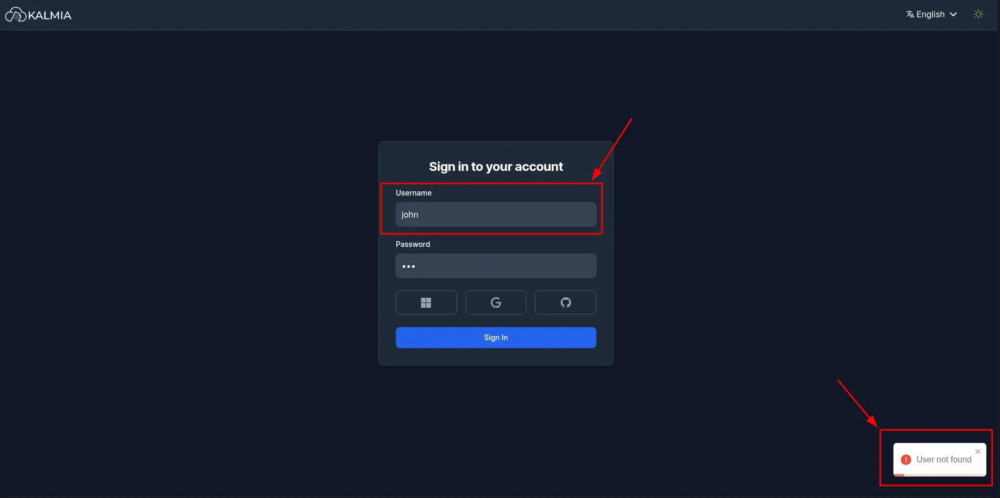
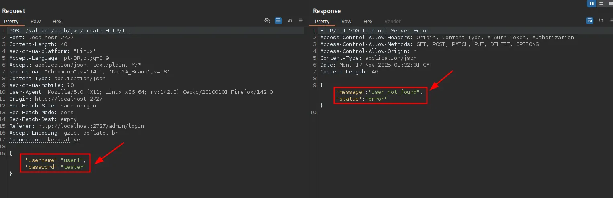
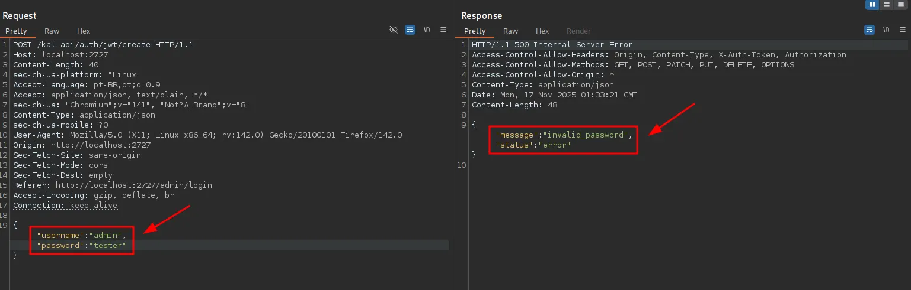
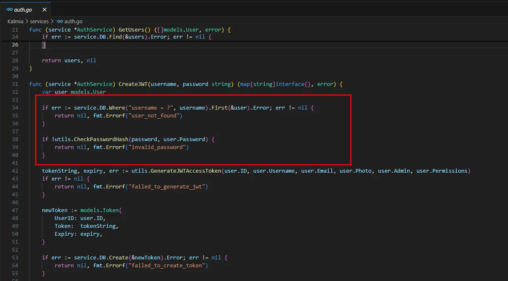

# CVE-2025-65899: Kalmia CMS v0.2.0 -  is vulnerable to Observable Response Discrepancy

## Vulnerability Overview

**CVE ID:** CVE-2025-65899  
**Product:** DifuseHQ Kalmia CMS  
**Affected Version:** 0.2.0  
**Vulnerability Type:** Observable Response Discrepancy  
**Privileges Required:** None  

### Impact

Allows unauthenticated attackers to enumerate valid usernames, enabling targeted password spraying, credential-stuffing, and account discovery attacks.

### Fixed Version

Pending maintainer approval - https://github.com/DifuseHQ/Kalmia/pull/34

## Description

Kalmia CMS version 0.2.0 contains a user enumeration vulnerability in its authentication mechanism. The application returns different error messages for invalid users (`user_not_found`) versus valid users with incorrect passwords (`invalid_password`). This observable response discrepancy allows unauthenticated attackers to enumerate valid usernames on the system, which can be leveraged for subsequent targeted attacks such as password spraying or social engineering.

## Technical Details

### Affected Components
- **Authentication Endpoint:** `/kal-api/auth/jwt/create`
- **HTTP Method:** POST
- **Authentication Logic:** JWT token creation process

### Vulnerability Root Cause
The authentication system fails to implement consistent error responses, revealing information about the existence of user accounts through different error messages:

- **Invalid Username:** Returns `{"message": "user_not_found"}`
- **Valid Username + Invalid Password:** Returns `{"message": "invalid_password"}`

This difference in responses allows attackers to distinguish between non-existent and valid user accounts.

## Exploitation Process

### Step 1: Invalid User Testing

The attacker attempts to authenticate with a non-existent username and observes the server response returning `User not found`.

### Step 2: Burp Suite Analysis - User Not Found

Using Burp Suite to intercept and analyze the authentication request, the attacker confirms the server returns `user_not_found` for invalid usernames, indicating the user does not exist in the system.

### Step 3: Burp Suite Analysis - Invalid Password

When testing with a valid username but incorrect password, Burp Suite captures the server response showing `invalid_password`, confirming the username exists in the system.

### Step 4: Backend Logic Analysis

Analysis of the backend authentication logic reveals the flawed implementation that returns different error messages:
- The system first checks if the user exists
- If user doesn't exist: returns `user_not_found`
- If user exists but password is wrong: returns `invalid_password`

This sequential validation process creates the observable discrepancy that enables user enumeration.

## Proof of Concept (PoC)

### Using the Provided Exploit Script

The `cve-2025-65899.py` script automates the user enumeration process:

```bash
python cve-2025-65899.py <TARGET_URL> [OPTIONS]
```

#### Script Parameters:
- `url`: Target Kalmia CMS base URL (required)
- `-u, --user`: Single username to test
- `-p, --password`: Password to use for testing (required)
- `-w, --wordlist`: Wordlist file for bulk user enumeration

#### Example Usage:

##### Single User Testing:
```bash
# Test if specific user exists
python cve-2025-65899.py http://target.com:2727 -u admin -p wrongpass

# Results:
# [+] Valid user: admin (if user exists)
# OR
# (no output if user doesn't exist)
```

##### Bulk User Enumeration:
```bash
# Enumerate users from wordlist
python cve-2025-65899.py http://target.com:2727 -w users.txt -p wrongpass

# Create a simple wordlist
echo -e "admin\nuser\nadministrator\ntest\nguest" > users.txt
```

#### Script Workflow:

1. **Single User Mode**: Tests one username and determines if it exists
2. **Enumeration Mode**: Iterates through a wordlist of potential usernames
3. **Response Analysis**: Analyzes server responses to categorize users as:
   - **Non-existent**: No output (user_not_found response)
   - **Valid**: Displays as "Valid user found"
   - **Valid Credentials**: If password is also correct

## References

- **CVE Details**: [CVE-2025-65899](https://cve.mitre.org/cgi-bin/cvename.cgi?name=CVE-2025-65899)
- **CWE-204**: [Observable Response Discrepancy](https://cwe.mitre.org/data/definitions/204.html)

---

**Disclaimer**: This information is provided for educational and defensive purposes only. Users are responsible for ensuring they have proper authorization before testing any systems.
