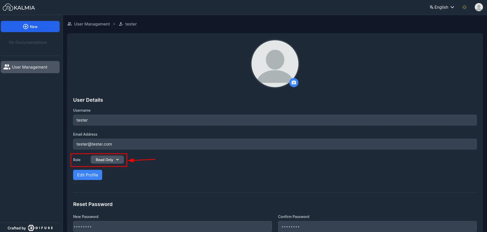
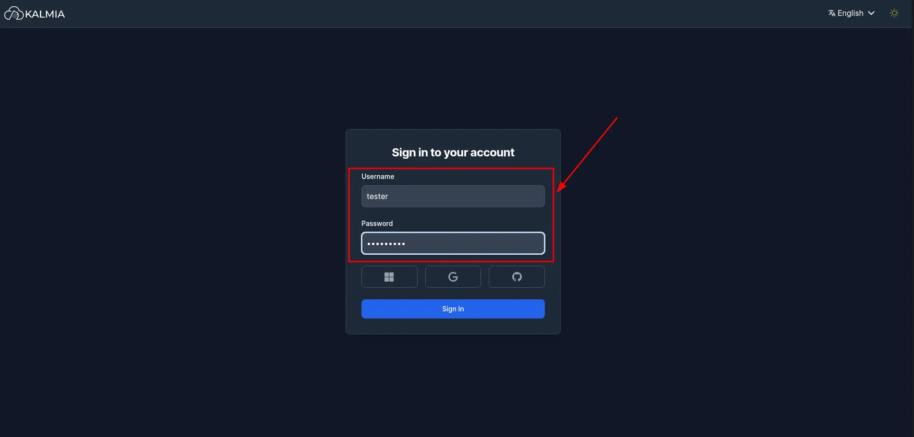
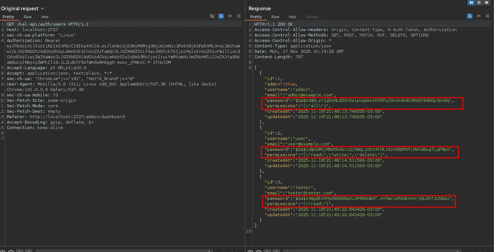
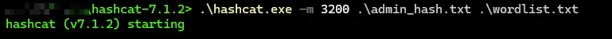
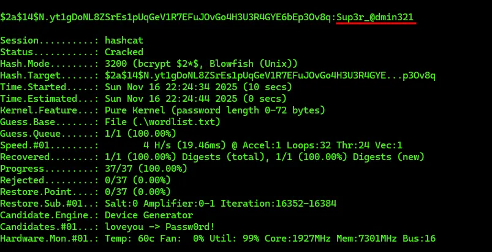

# CVE-2025-65900: Kalmia CMS v0.2.0 - is vulnerable to Incorrect Access Control

## Vulnerability Overview

**CVE ID:** CVE-2025-65900  
**Product:** DifuseHQ Kalmia CMS  
**Affected Version:** 0.2.0  
**Vulnerability Type:** Incorrect Access Control  
**Privileges Required:** Low (Read-only user account) 

### Impact

This vulnerability allows a low-privileged user to retrieve sensitive information for all platform accounts, including Blowfish password hashes. Attackers can perform offline cracking, escalate privileges, and potentially compromise administrative accounts, leading to full system takeover.

### Fixed Version

Pending maintainer approval - https://github.com/DifuseHQ/Kalmia/pull/34

## Description

DifuseHQ Kalmia CMS version 0.2.0 contains an Incorrect Access Control vulnerability in the /kal-api/auth/users API endpoint. Due to insufficient permission validation and excessive data exposure in the backend, an authenticated user with basic read permissions can retrieve sensitive information for all platform users, including Blowfish password hashes. This flaw allows unauthorized disclosure of credential material and enables offline brute-force attacks, potentially leading to full account compromise. The issue originates from improper authorization checks in middleware/auth.go and unfiltered user data returned by web/src/api/Requests.ts.

## Technical Details

### Affected Components
- **Authentication System:** `/kal-api/auth/jwt/create`
- **User Management API:** `/kal-api/auth/users`

### Vulnerability Root Cause
The application fails to properly sanitize sensitive information and block access to sensitive endpoints. Minimal read only users can:

1. Access administrative endpoints
2. Extract sensitive data including all user password hashes

## Exploitation Process

### Step 1: Initial Access with Read-Only User

An attacker starts with a legitimate read-only user account on the Kalmia CMS system.

### Step 2: Authentication Process

The attacker logs into the system using their read-only credentials through the standard authentication mechanism.

### Step 3: Accessing Sensitive Endpoint

Using tools like Burp Suite, the attacker consult `/kal-api/auth/users` API route and view all users access information.

### Step 4: Password Hash Cracking

The extracted password hashes are then processed using password cracking tools like hashcat to recover plaintext passwords.

### Step 5: Full Compromise

Successfully cracked passwords provide full access to user accounts, potentially including administrative accounts.

## Proof of Concept (PoC)

### Using the Provided Exploit Script

The `cve-2025-65900.py` script automates the exploitation process:

```bash
python cve-2025-65900.py <TARGET_URL> -u <READ_ONLY_USERNAME> -p <READ_ONLY_PASSWORD>
```

#### Script Parameters:
- `url`: Target Kalmia CMS base URL (required)
- `-u, --user`: Read-only username (required)
- `-p, --password`: Read-only password (required)
- `-t, --token-endpoint`: JWT token endpoint (default: `/kal-api/auth/jwt/create`)
- `-d, --dump`: User dump endpoint (default: `/kal-api/auth/users`)
- `-a, --auth`: Skip token generation and use provided JWT token
- `-o, --output`: Save extracted hashes to file

#### Example Usage:

```bash
# Basic exploitation
python cve-2025-65900.py http://target.com:2727 -u readonly_user -p readonly_pass

# Save hashes to file
python cve-2025-65900.py http://target.com:2727 -u readonly_user -p readonly_pass -o hashes.txt

# Use existing JWT token
python cve-2025-65900.py http://target.com:2727 -u readonly_user -p readonly_pass -a "eyJ0eXAiOiJKV1QiLCJhbGciOiJIUzI1NiJ9..."
```

#### Script Workflow:

1. **Token Acquisition**: Authenticates with provided credentials and requests JWT token
2. **Sensitive Endpoint**: Uses the token to access the sensitive endpoint
3. **Data Extraction**: Retrieves all user credentials and password hashes
4. **Output**: Displays results and optionally saves to file

## References

- **CVE Details**: [CVE-2025-65900](https://www.cve.org/CVERecord?id=CVE-2025-65900)
- **CWE-863**: [Incorrect Authorization](https://cwe.mitre.org/data/definitions/863.html)

---

**Disclaimer**: This information is provided for educational and defensive purposes only. Users are responsible for ensuring they have proper authorization before testing any systems.
