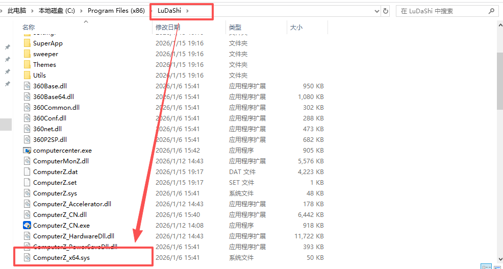
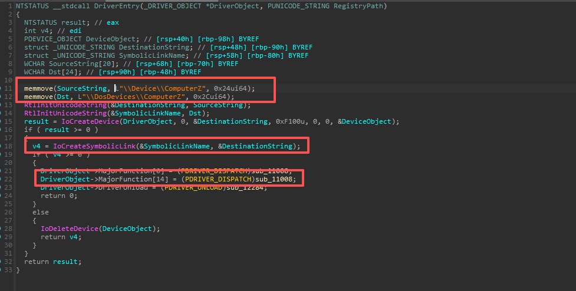
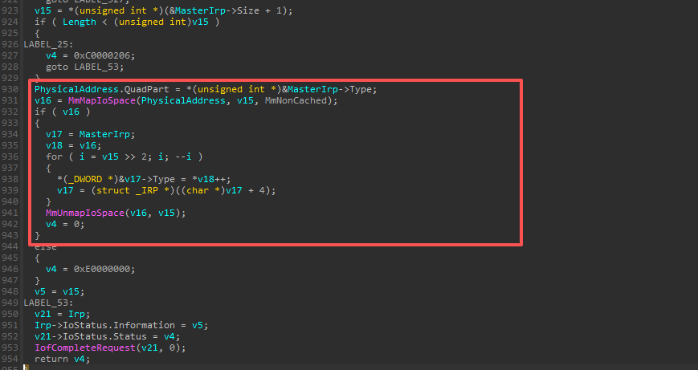
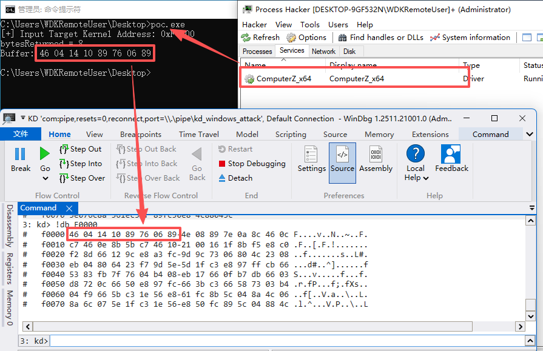

# CVE-2025-67246

**Vulnerability Title**:LuDaShi Incorrect Access Control

**Affected versions**:Less than 6.1026.4505.112

**Discovery time**:December 2, 2025

**Discoverer**:ZhouRui

**Analysis Report**:

LuDaShi is a well-known free system utility software that provides free hardware authentication, computer (mobile phone) stability assurance, and system performance enhancement. The **ComputerZ_x64.sys** driver in LuDaShi and its affiliated system products (computer performance optimization, system performance monitoring) contains data that can read the lower 4GB kernel address.

This driver exposes an IOCTL interface(0xF1002508) to user space. This interface does not adequately validate the passed memory address when processing user-provided input parameters. User-space processes can pass an arbitrary lower 4GB address value to the driver through this interface. The driver then uses this address to read physical memory content and returns the result to the user-space caller. Because this address parameter lacks effective access control checks, attackers can use it to read system memory regions that are normally inaccessible through the kernel virtual address space, resulting in the leakage of sensitive information. This issue allows local administrators to obtain system memory data without additional privileges by leveraging the loaded vulnerable driver, thus compromising the operating system's memory access isolation mechanism.

This driver provides the application layer with a usable symbolic link to the device object(ComputerZ). Further down, in the dispatch function sub_11008 for handling IOCTL.

When IoControlCode is **0xF1002508**, the following code will be executed. It maps arbitrary kernel address data in the lower 4GB to the application layer via MmMapIoSpace. An attacker can construct a Proof-of-Concept (POC) to read arbitrary size data from any physical address in the lower 4GB and return it to the application layer.

Load this driver, run the POC code in this repository, and the attack effect is as follows. In this example, I tried to read 8 bytes of data from physical address 0xF0000, but the amount of data read is arbitrary.

