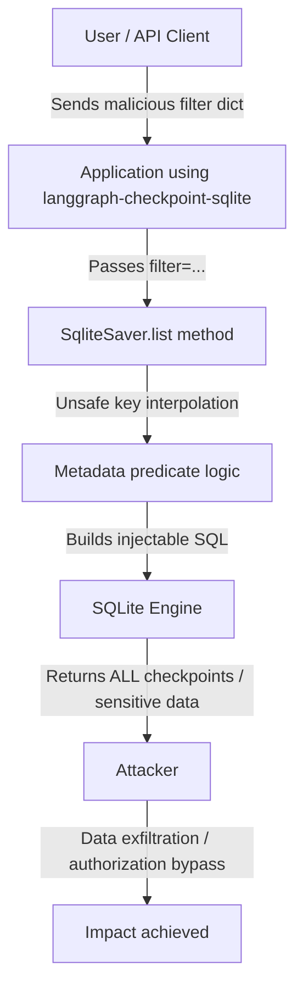

# CVE-2025-67644 PoC – LangGraph SQLite Checkpoint SQL Injection


**CVE-2025-67644** is a **SQL Injection** vulnerability (CWE-89) in the `langgraph-checkpoint-sqlite` package (part of LangGraph / LangChain ecosystem).  
It allows an attacker to inject arbitrary SQL via unsanitized **metadata filter keys** passed to the `list()` / `alist()` methods of `SqliteSaver`.

**Impact**: Full bypass of filters, leakage of all checkpoint records (including potentially sensitive conversation state, thread IDs, metadata), and in some deployment scenarios — broader database access.

**Affected versions**: < 3.0.1  
**Fixed in**: ≥ 3.0.1  
**CVSS score**: 7.3 (High) — AV:L / AC:L / PR:L / UI:N / S:C / C:H / I:L / A:N

## Vulnerability Summary

The internal `_metadata_predicate()` logic used unsafe f-string interpolation of user-controlled dictionary **keys** inside a JSON extraction expression:

```python
f"json_extract(CAST(metadata AS TEXT), '$.{query_key}')"
```

An attacker who can supply arbitrary keys (e.g. via API input) can close the JSON path early and inject SQL fragments, such as:

```python
{"env') OR '1'='1": "anything"}
```

→ resulting in a WHERE clause that always evaluates to true → returns **all** records.

## Attack Flow Diagram



*(This version avoids parentheses in node text where possible and uses quotes around labels with special characters/dots to prevent parse errors.)*

## Features of this PoC

- Clean synchronous exploit demonstration
- Automatically creates demo data if the database is empty
- CLI options: `--dump-all` (show full records), `--threads-only` (extract thread_ids only)
- Nice ASCII banner + clear output formatting

## Requirements

```bash
pip install langgraph-checkpoint-sqlite"<3.0.1"   # e.g. ==2.0.0
```

## Usage

```bash
# Basic check (count only)
python3 exploit.py checkpoints.db

# Dump full checkpoint details
python3 exploit.py checkpoints.db --dump-all

# Extract thread_ids only (useful for enumeration)
python3 exploit.py checkpoints.db --threads-only --dump-all

# Test against in-memory database (quick & volatile)
python3 exploit.py ":memory:" --dump-all
```

## Installation & Quick Start

1. Install vulnerable version:
   ```bash
   pip install langgraph-checkpoint-sqlite==2.0.0
   ```

2. Save the exploit code as `exploit.py`

3. Run against an existing or new checkpoint database:
   ```bash
   python3 exploit.py checkpoints.db --dump-all
   ```

## Remediation / Mitigation

- **Upgrade immediately**:
  ```bash
  pip install --upgrade langgraph-checkpoint-sqlite
  ```
  (version ≥ 3.0.1)

- Do **not** accept arbitrary metadata filter keys from untrusted sources (users, APIs, JSON payloads, etc.)
- In ≥ 3.0.1 the library enforces a strict regex on keys: `^[a-zA-Z0-9_.-]+$`

## Legal Notice

This is a **proof-of-concept** released for **educational and security research purposes only**.  
Do **not** use this code against production systems or any target without explicit written permission.  
The author is not responsible for misuse or damage caused by this code.

## References

- [GitHub Security Advisory GHSA-9rwj-6rc7-p77c](https://github.com/langchain-ai/langgraph/security/advisories/GHSA-9rwj-6rc7-p77c)
- [Fix Commit](https://github.com/langchain-ai/langgraph/commit/297242913f8ad2143ee3e2f72e67db0911d48e2a)
- [NVD Entry – CVE-2025-67644](https://nvd.nist.gov/vuln/detail/CVE-2025-67644)

---

**Responsible disclosure & research only.**  
Mohammed Idrees Banyamer  
[@banyamer_security](https://instagram.com/banyamer_security)
