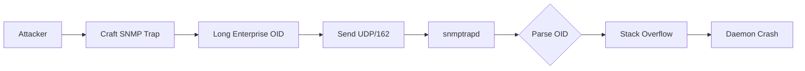

# CVE-2025-68615

**Net-SNMP snmptrapd Stack Buffer Overflow**

## Overview

Critical buffer overflow in Net-SNMP snmptrapd daemon via malformed SNMP trap packets.

| Field | Value |
|-------|-------|
| Product | Net-SNMP |
| Affected | < 5.9.5, < 5.10.pre2 |
| CVSS | 9.8 (Critical) |
| Type | Stack Buffer Overflow |
| Vector | UDP/162 (unauthenticated) |
| Impact | DoS / Potential RCE |

## Attack Flow



## Technical Details

The vulnerability exists in the enterprise OID parsing of SNMPv1 trap PDUs. When snmptrapd processes a trap with an excessively long enterprise OID, it writes beyond the stack buffer boundary.

## Usage

```bash
python exploit.py <target_ip>

python exploit.py 192.168.1.100 -l 512

python exploit.py 192.168.1.100 --escalate

python exploit.py 192.168.1.100 -p 162 -l 1024
```

## Parameters

| Flag | Description | Default |
|------|-------------|---------|
| `-p, --port` | SNMP trap port | 162 |
| `-l, --length` | OID overflow length | 256 |
| `-t, --timeout` | Socket timeout | 5 |
| `--escalate` | Try multiple sizes | off |

## Requirements

None (uses standard library only)

## Mitigation

- Upgrade to Net-SNMP 5.9.5 or 5.10.pre2
- Restrict UDP/162 access via firewall
- Disable snmptrapd if not required

## References

- [Net-SNMP Advisory](https://net-snmp.org)
- [GHSA-4389-rwqf-q9gq](https://github.com/advisories)

## Disclaimer

For authorized security testing only.
