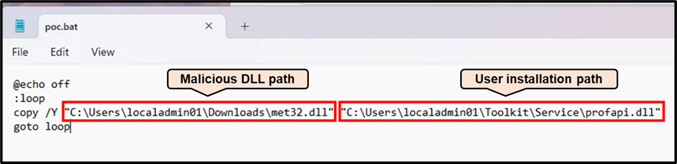
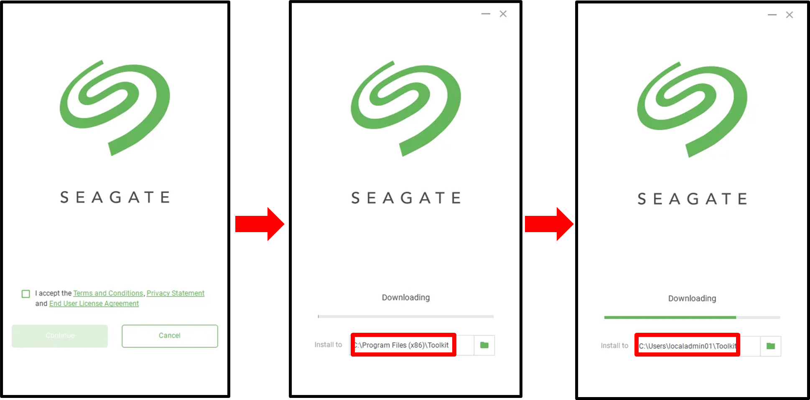
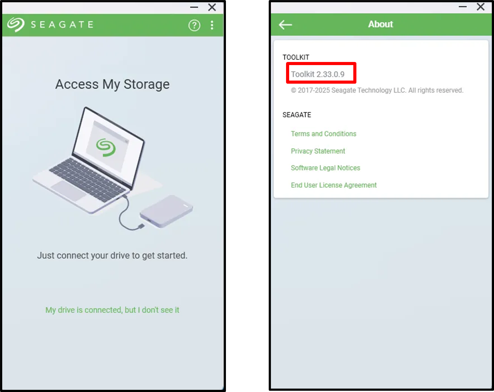
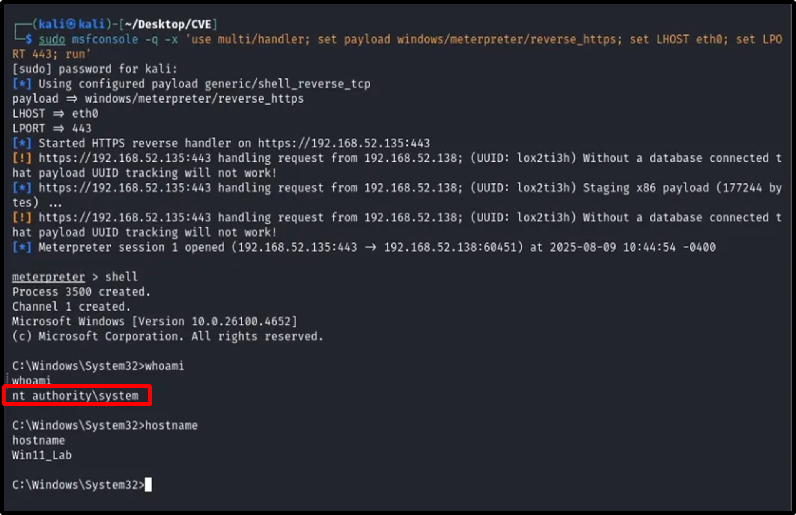

# CVE-2025-9267

## Description
In **Seagate Toolkit** on Windows there is an insecure DLL-loading vulnerability in the **Toolkit Installer** (prior to version **2.35.0.6**) where the installer attempts to load DLLs from the current working directory without validating their origin or integrity. An attacker who can place a malicious DLL in the same directory as the installer executable (for example by controlling the working/install directory) can cause the installer to load and execute that DLL with the privileges of the user running the installer, leading to arbitrary code execution. The issue stems from insecure DLL-loading practices such as relying on relative paths or failing to specify fully qualified paths when invoking system libraries.

## Affected Product
- **Vendor:** Seagate Technology  
- **Product:** Seagate Toolkit  
- **Platform:** Windows  
- **Version:** Prior to 2.35.0.6  
- **Component:** Service executable path

## Vulnerability Details
- **Vulnerability Type:**  
  - CWE-427 — Uncontrolled Search Path Element  
  - CWE-426 — Untrusted Search Path  
- **Attack Type:** Local 
- **Impact:**  
  - Escalation to SYSTEM privileges  
- **CVE ID:** [CVE-2025-9267](https://nvd.nist.gov/vuln/detail/CVE-2025-9267)  
- **CVSS Score (CNA):** 7.0 (High)
- **CVSS Vector:** `CVSS:4.0/AV:L/AC:L/AT:N/PR:H/UI:P/VC:H/VI:H/VA:H/SC:N/SI:N/SA:N`

## Discoverer
Natthawut Saexu

## Proof of Concept (PoC)

The tester prepared a malicious DLL and a script to continuously copy it to the user-controlled path.

The tester ran the installer and changed the installation path to a user-controllable location.

After the installation completed, the tester gained a reverse shell back to the attack machine with SYSTEM privileges.

## References
- [NVD – CVE-2025-9267](https://nvd.nist.gov/vuln/detail/CVE-2025-9267)  
- [MITRE CVE Record](https://cve.mitre.org/cgi-bin/cvename.cgi?name=CVE-2025-9267)  
- [Vendor Advisory – Seagate](https://www.seagate.com/product-security/#security-advisories)
