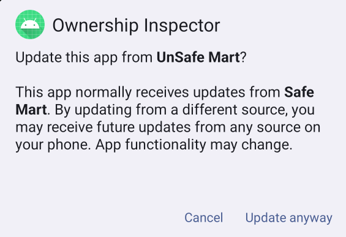
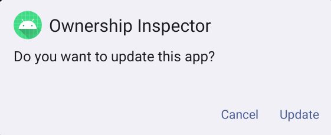
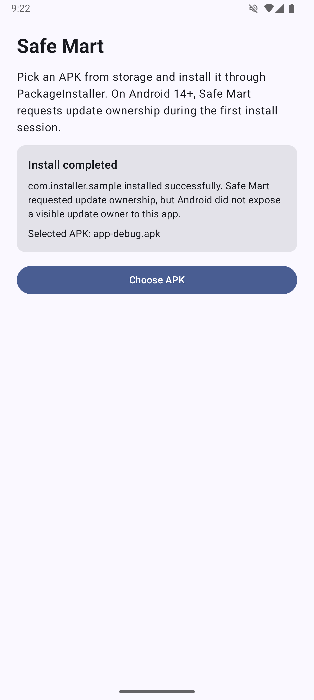
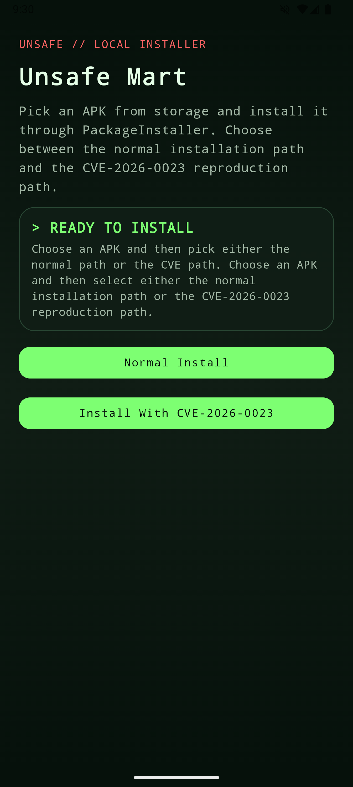
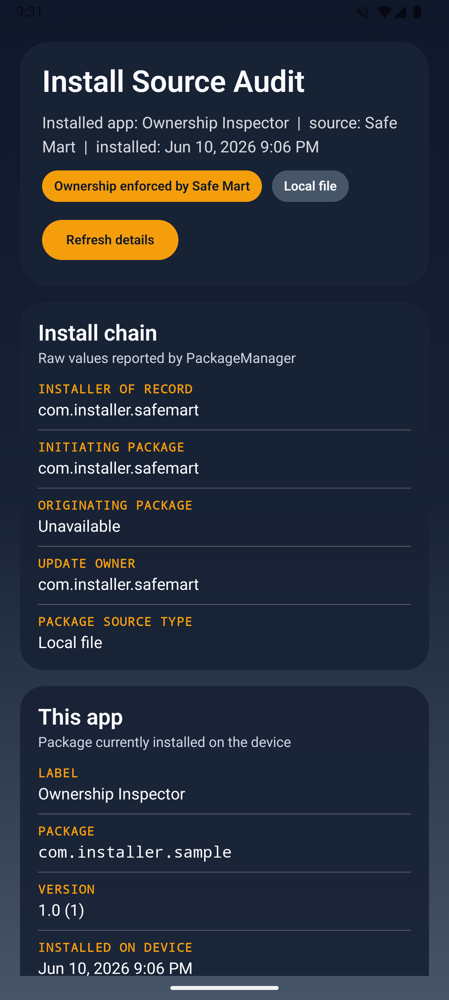
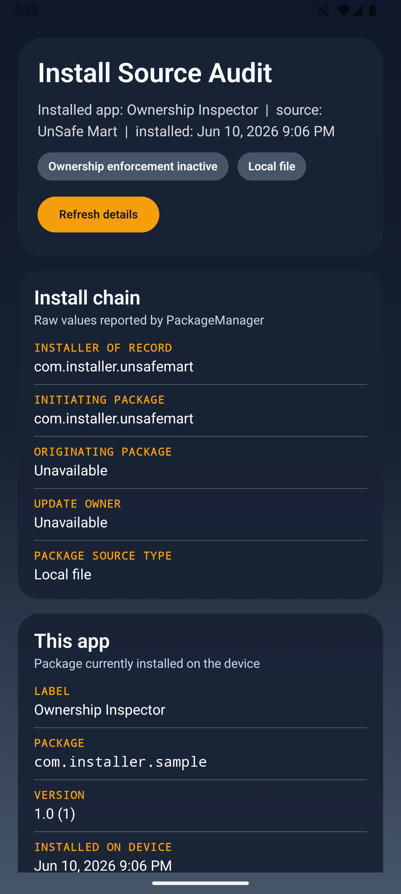
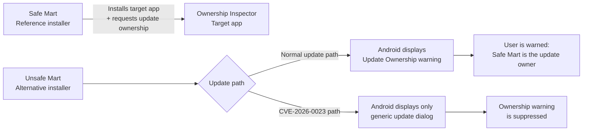

# CVE-2026-0023 - Android Update Ownership Trust Bypass PoC

A complete Android laboratory environment for reproducing and studying CVE-2026-0023.

This repository demonstrates how CVE-2026-0023 allows a regular installer to influence an internal Android installation flag that should only be controlled by the system, resulting in Android's Update Ownership warning being suppressed during application updates.

The project contains three Android applications that model a realistic update ownership workflow and provide a reproducible environment for observing the vulnerable behavior.

---

## Overview

Android introduced Update Ownership to help applications, app stores, and enterprise environments maintain a trusted update chain.

When an application has a registered update owner, Android warns the user if another installer attempts to update that application.

Under normal conditions, this warning tells the user that the application usually receives updates from a different source.

CVE-2026-0023 affects Android's package installation flow inside `PackageInstallerService#createSessionInternal`.

The issue is related to the handling of the internal `INSTALL_FROM_MANAGED_USER_OR_PROFILE` installation flag.

In vulnerable builds, this flag was not explicitly cleared before Android checked whether the installation was actually associated with a managed user or managed profile.

As a result, a regular installer could influence update ownership behavior and cause Android to suppress the expected Update Ownership warning.

This repository demonstrates the difference between the expected behavior and the vulnerable behavior using a controlled proof-of-concept environment.

---

## Quick Visual Comparison

| Expected behavior                                                         | Vulnerable behavior                                                         |
| ------------------------------------------------------------------------- | --------------------------------------------------------------------------- |
| Android displays the Update Ownership warning.                            | Android displays only a generic update dialog.                              |
|  |  |

---

## Vulnerability Information

| Field                                   | Value                                                                 |
| --------------------------------------- | --------------------------------------------------------------------- |
| CVE                                     | CVE-2026-0023                                                         |
| Component                               | Framework / PackageInstaller                                          |
| Affected file                           | `PackageInstallerService.java`                                        |
| Affected method                         | `createSessionInternal`                                               |
| Vulnerability type                      | Elevation of Privilege                                                |
| Severity                                | High                                                                  |
| CVSS v3.1                               | 7.8                                                                   |
| CVSS vector                             | `CVSS:3.1/AV:L/AC:L/PR:L/UI:N/S:U/C:H/I:H/A:H`                        |
| Attack Vector                           | Local                                                                 |
| Attack Complexity                       | Low                                                                   |
| Privileges Required                     | Low                                                                   |
| User Interaction                        | None                                                                  |
| Scope                                   | Unchanged                                                             |
| Impact                                  | Elevation of Privilege through unauthorized update ownership behavior |
| Android Security Bulletin               | March 2026                                                            |
| Android bug reference                   | `A-459461121`                                                         |
| Affected AOSP versions listed by Google | Android 14, 15, 16, 16-qpr2                                           |

---

## Patch Information

| Event                                     | Value                                                        |
| ----------------------------------------- | ------------------------------------------------------------ |
| Android Security Bulletin                 | March 2026                                                   |
| Bulletin publication date                 | March 2, 2026                                                |
| Security patch level section              | 2026-03-01                                                   |
| Bulletin-wide fully addressed patch level | 2026-03-05 or later                                          |
| Android bug reference                     | `A-459461121`                                                |
| AOSP patch                                | `09055276288a68cf35b0f84ba32e28822f74ecf9`                   |
| Patch title                               | `Explicitly unset INSTALL_FROM_MANAGED_USER_OR_PROFILE flag` |

CVE-2026-0023 is listed in the March 2026 Android Security Bulletin under the `2026-03-01` security patch level vulnerability details.

Android security patch levels of `2026-03-01` or later address all issues associated with the `2026-03-01` security patch level.

Android security patch levels of `2026-03-05` or later address all issues associated with the `2026-03-05` security patch level and all previous patch levels.

---

## Root Cause Summary

The vulnerable behavior is related to the handling of the internal `INSTALL_FROM_MANAGED_USER_OR_PROFILE` flag.

This flag is intended to represent installation behavior associated with a managed user or managed profile.

The official AOSP patch explicitly clears this flag before Android checks whether the install actually belongs to an organization-managed user.

The fixed logic ensures that only the system can set this flag based on the result of `DevicePolicyManagerInternal#isUserOrganizationManaged(userId)`.

Simplified patch logic:

```diff
final var dpmi = LocalServices.getService(DevicePolicyManagerInternal.class);

+ // Only the system should be able to set this flag - so ensure it is unset when not needed.
+ params.installFlags &= ~PackageManager.INSTALL_FROM_MANAGED_USER_OR_PROFILE;

if (dpmi != null && dpmi.isUserOrganizationManaged(userId)) {
    params.installFlags |= PackageManager.INSTALL_FROM_MANAGED_USER_OR_PROFILE;
}
```

Before the patch, the flag was not explicitly cleared before this managed-profile check.

After the patch, Android first removes the flag and only sets it again if the system determines that the user is actually organization-managed.

This prevents a regular installer from influencing this internal install-session state.

---

## Repository Components

This repository contains three Android applications:

```text
CVE-2026-0023-Update-Ownership-PoC
├── Safe Mart
├── Unsafe Mart
└── Ownership Inspector
```

---

### Safe Mart

Safe Mart is a reference installer application.

It installs the target application and requests update ownership during the initial installation.

Its purpose is to simulate a legitimate application store that becomes the registered update owner of the target app.

<p align="center">
  
</p>

---

### Unsafe Mart

Unsafe Mart is a second installer application used to reproduce CVE-2026-0023.

It supports two installation paths:

* Normal update path
* CVE-2026-0023 reproduction path

The normal path triggers Android's expected Update Ownership warning.

The CVE path suppresses the ownership warning and causes Android to display a generic update confirmation dialog instead.

<p align="center">
  
</p>

---

### Ownership Inspector

Ownership Inspector is the target application used in the demonstration.

The application declares support for update ownership and displays installer-related metadata reported by Android's `PackageManager`.

Its purpose is to make it easier to observe how the target application was installed or updated during each stage of the proof-of-concept.

<table align="center">
<tr>
<td align="center"><b>Before CVE-2026-0023</b></td>
<td align="center"><b>After CVE-2026-0023</b></td>
</tr>
<tr>
<td></td>
<td></td>
</tr>
</table>
---

## Reproduction Steps

The proof-of-concept demonstrates two different update flows:

* A normal update flow, where Android displays the expected Update Ownership warning.
* A CVE-2026-0023 reproduction flow, where the ownership warning is suppressed and replaced with a generic update confirmation dialog.



---

### 1. Install Safe Mart and Unsafe Mart

Install both installer applications on the test device.

Allow both applications to install unknown apps when Android requests this permission.

---

### 2. Install Ownership Inspector through Safe Mart

Open Safe Mart and select the Ownership Inspector APK.

Safe Mart installs the target application and requests update ownership during the initial installation session.

At this point, Safe Mart acts as the reference installer and becomes the expected update source for the target app.

<p align="center">
  
</p>

---

### 3. Verify the initial installation state

Open Ownership Inspector.

The application displays installer-related metadata reported by Android's `PackageManager`.

This step helps confirm the initial installation state before attempting updates from Unsafe Mart.

<p align="center">
  
</p>

---

### 4. Trigger the normal update path from Unsafe Mart

Open Unsafe Mart and select the Ownership Inspector APK.

Choose the normal update path.

Because Ownership Inspector was originally installed through Safe Mart with update ownership enabled, Android displays an Update Ownership warning.

This is the expected Android behavior.

<p align="center">
  
</p>

<p align="center">
  
</p>

The warning tells the user that the application normally receives updates from Safe Mart, while the current update attempt is coming from Unsafe Mart.

---

### 5. Trigger the CVE-2026-0023 reproduction path

Return to Unsafe Mart and select the Ownership Inspector APK again.

Choose the CVE-2026-0023 reproduction path.

In this flow, Android no longer displays the Update Ownership warning.

Instead, the system shows only a generic update confirmation dialog.

<p align="center">
  
</p>

This is the vulnerable behavior demonstrated by the proof-of-concept.

The important difference is not just the visual change in the dialog.

The security signal about the registered update owner is removed from the update flow.

---

### 6. Verify the final state

After the update completes, open Ownership Inspector again.

The application can be used to observe installer-related metadata after the CVE-2026-0023 reproduction path has completed.

<p align="center">
  
</p>

---

## What This PoC Demonstrates

This proof-of-concept demonstrates an Update Ownership trust model bypass.

More specifically, it shows that:

* A target application can be installed with update ownership enabled.
* Android normally warns the user when a different installer attempts to update that application.
* CVE-2026-0023 allows the update flow to bypass that ownership warning.
* The update confirmation is downgraded from an ownership-aware warning to a generic update prompt.
* The behavior can be reproduced without root access, ADB commands, or system privileges.

The PoC does not attempt to provide root access, arbitrary code execution, persistence, stealth, or malware-like behavior.

---

## Environment

The vulnerability was reproduced on Android 15.

The proof-of-concept does not require:

* Root access
* ADB commands
* System privileges
* Device owner privileges
* Profile owner privileges
* LSPosed
* Magisk

The entire demonstration is performed through regular Android applications running in the standard Android application sandbox.

The tested device security information can be observed in the application logs.

Example values collected by the PoC include:

```text
Build.VERSION.SECURITY_PATCH
Build.VERSION.SDK_INT
Build.VERSION.RELEASE
Build.VERSION.INCREMENTAL
Build.FINGERPRINT
```

---

## Requirements

To build and run the project, you need:

* Android Studio
* Android SDK
* A vulnerable Android device or emulator
* Android 14 or newer for Update Ownership related APIs
* Permission to install unknown apps for Safe Mart and Unsafe Mart

No special device modification is required.

---

## Building

Open each application project in Android Studio and build the debug APKs:

* Safe Mart
* Unsafe Mart
* Ownership Inspector

Then install Safe Mart and Unsafe Mart on the test device.

Ownership Inspector should be installed through Safe Mart during the reproduction flow.

---

## Implementation Notes

The PoC interacts with Android's `PackageInstaller` APIs and mutates installation session parameters to reproduce the vulnerable behavior.

During the CVE reproduction path, the PoC uses the system flag related to managed user or profile installation behavior:

```text
INSTALL_FROM_MANAGED_USER_OR_PROFILE
```

The vulnerability is not caused by hidden API access itself.

Hidden API access is only used as an implementation detail to reach the required framework interfaces from a regular application context.

The important security boundary is that this install flag should only be trusted when it is set by the system after validating the managed user or managed profile state.

---

## Acknowledgements

This project uses the RestrictionBypass library by ChickenHook to access non-SDK Android framework interfaces required by the proof-of-concept.

The hidden API access mechanism is not related to the root cause of CVE-2026-0023 and is only used to interact with the necessary PackageInstaller APIs.

RestrictionBypass:
https://github.com/ChickenHook/RestrictionBypass

Credits to the original authors for their work.

---

## Impact

Google classified CVE-2026-0023 as a High severity Elevation of Privilege vulnerability.

The issue does not provide root access or arbitrary code execution.

However, it allows an unprivileged installer to perform an operation that should normally be protected by Android's package installation security model.

The most relevant impact is likely within enterprise and managed-device deployment scenarios.

Organizations may rely on Update Ownership to ensure that applications are updated through an approved application store or enterprise installer.

By suppressing the ownership warning, CVE-2026-0023 weakens a trust signal that Android would normally provide before allowing an update from a different source.

For regular consumer devices, the practical impact depends heavily on the user's installation behavior, the device patch level, and whether the target application relies on update ownership semantics.

---

## Limitations

This repository is intended to demonstrate the vulnerability in a controlled research environment.

It does not attempt to:

* Exploit unrelated Android vulnerabilities
* Gain root access
* Bypass app signature verification
* Bypass APK signing requirements
* Install malware
* Hide from the user
* Persist after installation
* Automate exploitation at scale

The proof-of-concept focuses specifically on the Update Ownership warning bypass behavior associated with CVE-2026-0023.

---

## References

* Android Security Bulletin - March 2026
  https://source.android.com/docs/security/bulletin/2026/2026-03-01

* CVE-2026-0023 - CVE Record
  https://www.cve.org/CVERecord?id=CVE-2026-0023

* CVE-2026-0023 - NVD
  https://nvd.nist.gov/vuln/detail/CVE-2026-0023

* AOSP patch - Explicitly unset `INSTALL_FROM_MANAGED_USER_OR_PROFILE` flag
  https://android.googlesource.com/platform/frameworks/base/+/09055276288a68cf35b0f84ba32e28822f74ecf9

* RestrictionBypass by ChickenHook
  https://github.com/ChickenHook/RestrictionBypass

---

## Disclaimer

This repository is provided for security research, educational purposes, and vulnerability analysis.

The code is intended solely to reproduce and study CVE-2026-0023 in controlled environments and on devices where testing is authorized.

The author does not encourage or endorse unauthorized testing against devices, applications, users, organizations, or systems without permission.

Users are responsible for complying with all applicable laws, policies, and organizational requirements when testing or modifying Android devices.

Use this repository responsibly.
