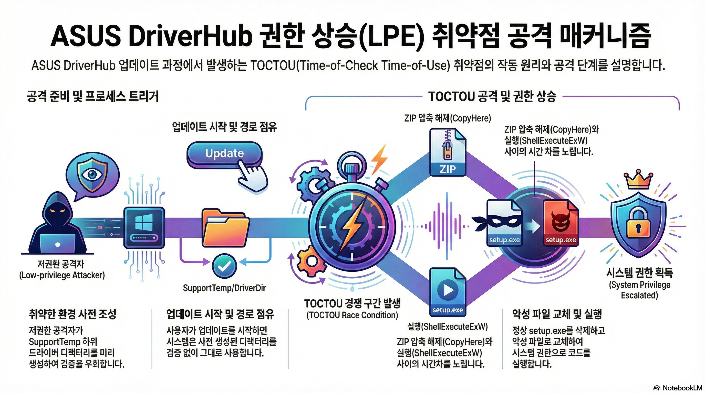
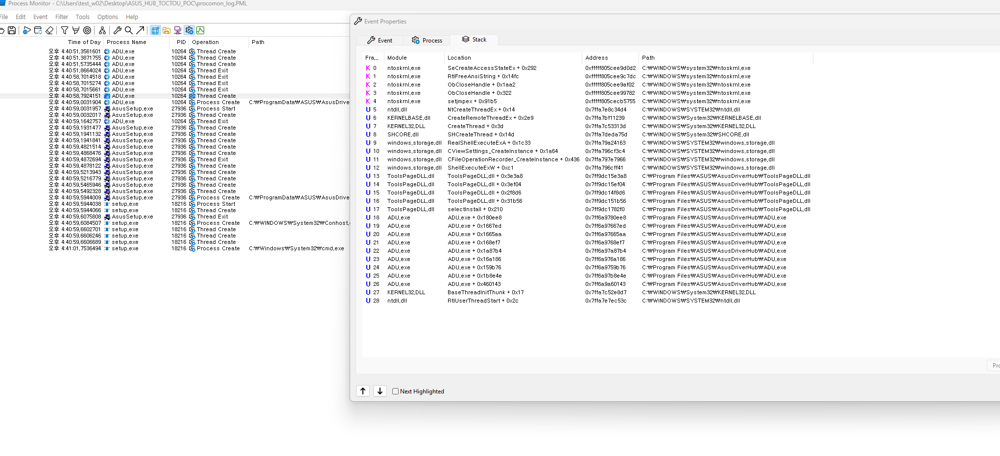

# ASUS DriverHub 드라이버 업데이트 과정에서 발생하는 TOCTOU 취약점으로 인한 로컬 권한 상승(LPE)

[toc]

## 1. 개요

ASUS DriverHub의 드라이버 업데이트 메커니즘에는 **TOCTOU(Time-of-Check to Time-of-Use)** 경쟁 상태 취약점이 존재합니다.  
ASUS DriverHub를 통해 수행되는 드라이버 업데이트 과정에서, 디렉터리와 실행 파일이 실행 직전에 존재 여부, 무결성, 접근 권한에 대해 적절한 검증 없이 사용됩니다.

그 결과, 로컬의 저권한 사용자가 대상 드라이버 디렉터리와 실행 파일(`setup.exe`)을 사전에 생성한 후 교체할 수 있습니다. 취약점이 성공적으로 악용될 경우, **상승된 권한으로 임의 코드 실행이 가능하여 로컬 권한 상승(LPE)**으로 이어질 수 있습니다.


## 2. 취약점 세부 사항



### 영향받는 경로

```
C:\ProgramData\ASUS\AsusDriverHub\SupportTemp
```


### 주요 관찰 사항

- `SupportTemp` 디렉터리는 저권한 사용자에 의해 디렉터리 및 파일 생성이 가능합니다.
- ASUS DriverHub는 `model.xml`에서 드라이버 정보를 가져오며, 이를 통해 드라이버 폴더 이름을 예측할 수 있습니다.
- 저권한 사용자는 다음과 같은 행위가 가능합니다.
  - 예상되는 드라이버 디렉터리를 사전에 생성
  - 업데이트 과정 이전에 공격자가 제어하는 파일을 해당 디렉터리에 배치

- 업데이트 과정 중:
  - ASUS DriverHub는 이미 존재하는 디렉터리나 파일에 대해 소유권, 권한, 무결성을 검증하지 않습니다.
  - 기존 디렉터리를 삭제하거나 안전하게 재생성하지 않습니다.
  - 실행 직전에 파일 핸들 잠금이나 무결성 검증이 수행되지 않습니다.

- 설치 실행 파일(`setup.exe`)은 **고정되고 예측 가능한 파일 시스템 경로**를 사용하여 Windows API `ShellExecuteExW`를 통해 실행됩니다.
- `setup.exe` 실행 시점에 다음과 같은 콜 스택이 관찰되었습니다.

    ```text
    13 ToolsPageDLL.dll ToolsPageDLL.dll + 0x3e3a8 0x7ff9dc15e3a8
    14 ToolsPageDLL.dll ToolsPageDLL.dll + 0x3ef04 0x7ff9dc15ef04
    15 ToolsPageDLL.dll ToolsPageDLL.dll + 0x2f8d6 0x7ff9dc14f8d6
    16 ToolsPageDLL.dll ToolsPageDLL.dll + 0x31b56 0x7ff9dc151b56
    17 ToolsPageDLL.dll selectInstall + 0x210 0x7ff9dc1782f0
    18 ADU.exe ADU.exe + 0x180ee8 0x7ff6a9780ee8
    ```
    1)  selectInstall → sub_180031920에서 설치 상태 갱신 + 실제 설치 호출 
        - 아이템 매칭 후 상태를 Installing으로 바꾸고 sub_18002EE70 호출
        - 결과에 따라 Installed / InstallFail로 상태 갱신
        ```c
        // sub_180031920_180031920.c - 164 line
            if ( v35 == i && (!v35 || !(unsigned int)sub_18022F080(v34, v33)) )
            sub_1800043D0(v31 + 4, (__int64)"Installing", 0xAui64);
        
            v38 = sub_18002EE70(v37, v36, v16);
        
            v43 = "InstallFail";
            if ( v38 == 1 )
            v43 = "Installed";
            sub_1800043D0(j + 4, (__int64)v43, v44);
        ```
    2) sub_18002EE70에서 압축해제 → 설치 실행 → model.xml 갱신
        - sub_18001A870로 압축해제
        - sub_18003E520로 설치 실행
        - 성공 시 doInstalled=true, m_szInstalledVersion 업데이트
        ```c
        // sub_18002EE70_18002EE70.c - 527 line
            sub_18001A870(psz, v129);
            if ( (unsigned int)sub_18003E520(a3) )
            {
            sub_180007890((__int64)v73, (int)"[%ls][%hs] Installed = success!!!", L"Installer", "install");
            sub_18002D400((__int64)"true", v74, a3, (__int64)&qword_1802987E0, (__int64)"true");
            WideCharToMultiByte(..., (LPCWCH)(a3 + 602), ... , MultiByteStr, ...);
            sub_18002D400((__int64)MultiByteStr, v76, a3, (__int64)&xmmword_180298730, (__int64)MultiByteStr);
            }
        ```
    3) sub_18003E520에서 실제 설치( setup.exe 실행 )
        - 설치 폴더에서 setup.exe -s를 ShellExecuteExW로 실행
        ```c
        // sub_18003E520_18003E520.c - 228 line
            sub_180046340(&lpFileName, L"%s\\setup.exe", v22);
            pExecInfo.lpDirectory = v22;
            pExecInfo.lpFile = L"setup.exe";
            pExecInfo.lpParameters = L"-s";
            if ( ShellExecuteExW(&pExecInfo) )
            v2 = 1;
        ```
- `ShellExecuteExW`는 실행 시점에 파일의 무결성이나 소유권을 재검증하지 않고 경로 기반으로 바이너리를 실행하므로, **TOCTOU 경쟁 상태**가 발생합니다.
- 실행 경로가 고정되어 있고 공격자가 제어할 수 있기 때문에, 적절한 시점에 `setup.exe`를 교체하면 **상승된 권한으로 공격자 코드가 실행**됩니다.


## 3. 공격 시나리오

### 증적 자료

#### PoC

- [PoC Video](./assets/poc.mp4)

  <video src="./assets/poc.mp4"/>

- [procomon log](./log/procomon_log.PML)

  

### 사전 조건
- 대상 드라이버 디렉터리가 업데이트 이전에 이미 존재하지 않아야 합니다.
- 공격자는 로컬 시스템에 저권한 사용자로 접근할 수 있어야 합니다.

### 공격 흐름

1. 공격자는 `model.xml`을 분석하여 드라이버 이름을 예측합니다.
2. 공격자는 다음 디렉터리 및 파일을 사전에 생성합니다.
    ```
    C:\ProgramData\ASUS\AsusDriverHub\SupportTemp\<driver_name>\setup.exe
    ```
3. ASUS DriverHub를 통해 드라이버 업데이트가 수행되는 동안:
- 드라이버 ZIP 파일이 `ZIPFileTemp`에서 `SupportTemp`로 이동됩니다.
- ZIP 압축 해제 과정에서 이미 존재하는 폴더를 덮어쓰지 않으므로, 공격자가 배치한 `setup.exe`폴더는 그대로 유지됩니다.
4. 공격자는 `setup.ini`에 대해 Opportunistic Lock(oplock)을 설정하여 TOCTOU 조건을 유발합니다.
5. 이 경쟁 상태 구간 동안 공격자는 `setup.exe`폴더를 악성 페이로드로 교체합니다.
6. ASUS DriverHub는 관리자 또는 SYSTEM 권한으로 해당 페이로드를 실행합니다.

## 4. 영향

취약점이 성공적으로 악용될 경우, 저권한 로컬 사용자가 **관리자 또는 SYSTEM 권한으로 임의 코드를 실행**할 수 있습니다.

### 영향 요약
- 로컬 권한 상승(Local Privilege Escalation, LPE)
- 고권한 사용자로서의 임의 코드 실행
- 시스템 전체 장악 가능성


## 5. 후기

- 방어적 코드가 전혀 없었던 것은 아니었습니다. 
  setup 파일은 ACL 권한이 높은 사용자에게만 접근이 허용되도록 설정되어 있었으며, 기존 파일이 존재하는 경우 이를 덮어쓰는 방식으로 동작했습니다. 이로 인해 심볼릭 링크(symlink)나 정션(junction) 파일과 같은 객체는 결과적으로 제거되는 구조였습니다.
  
- 또한 TOCTOU(Time-of-Check to Time-of-Use) 취약점을 유발하는 트리거가 고정적이지 않아, 특정 드라이버 환경에서는 다른 방식의 트리거가 필요할 수 있습니다. (압축 해제 순서, 트리거 파일 존재 x)

- 본문에서 나온 취약점에서는 고정된 경로와 파일명을 사용하므로, 파일 시스템을 기반으로 한 추가적인 공격 기법이나 기타 응용 취약점이 악용될 가능성은 상대적으로 낮습니다.

