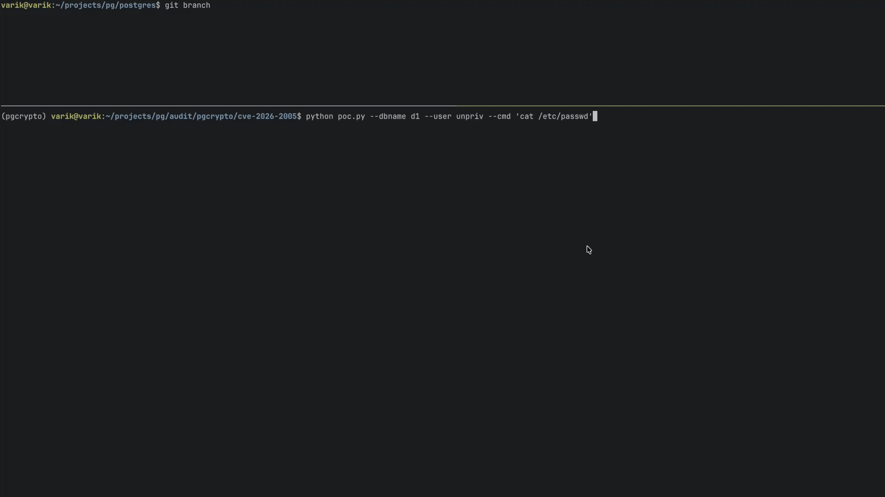

# CVE-2026-2005 - PostgreSQL pgcrypto Heap Overflow Exploit

PoC exploit for a heap-based buffer overflow in the PostgreSQL `pgcrypto`
extension's PGP session key parsing, leading to arbitrary memory read/write
and privilege escalation to superuser.

For full technical details, see the [Zeroday Cloud advisory](https://www.zeroday.cloud/blog/postgres-xint).

## Demo



## Usage

### 1. Compile PostgreSQL

Clone and compile PostgreSQL from the vulnerable commit so the binary's
symbol offsets match exactly. The exploit resolves the ASLR base by matching
leaked pointers against ELF symbol offsets - different builds or versions
will have different offsets and will fail.

```bash
git clone https://github.com/postgres/postgres.git
cd postgres
git checkout 4b324845ba5d24682b9b3708a769f00d160afbd7
./configure \
    --prefix="$HOME/projects/pg/pgsql" \
    --with-libxml \
    --with-libxslt \
    --enable-debug \
    --with-ssl=openssl
make -j$(nproc)
make install-world-bin
```

### 2. Install Python dependencies

```bash
pip install -r requirements.txt
```

### 3. Run the exploit

```bash
python poc.py \
    --binary "$HOME/projects/pg/pgsql/bin/postgres" \
    --dbname test-db \
    --host 127.0.0.1 \
    --port 5432 \
    --user test-user \
    --password secret \
    --cmd id
```

### Options

| Argument       | Default             | Description |
|---------------|---------------------|-------------|
| `--binary`    | (postgres binary)   | Path to postgres binary for symbol extraction |
| `--dbname`    | postgres            | Target database name |
| `--host`      | localhost           | PostgreSQL host |
| `--port`      | 5432                | PostgreSQL port |
| `--user`      | postgres            | Database user |
| `--password`  | (empty)             | Database password |
| `--cmd`       | whoami              | OS command to execute after privilege escalation |
| `--gdb`       | (flag)              | Attach GDB via tmux at the overflow point |

## Exploit Flow

The exploit proceeds in 7 stages:

1. **Heap pointer leak** - A crafted PGP message corrupts the `mdst` buffer's
   malloc chunk header. When PostgreSQL calls `pfree()` on the corrupted chunk,
   the allocator emits an error containing the pointer address, leaking the
   heap location of `mdst->data`.

2. **Arbitrary read** - A second overflow overwrites `mdst->data` to point at
   `(leaked_ptr - 0x10000)`. After decryption, `mbuf_steal_data()` returns
   the contents at that address as decrypted output, dumping heap memory that
   may contain stale code pointers.

3. **Pointer scan** - The hex dump is scanned for 8-byte little-endian values
   that look like code addresses (>= `0x500000000000`) but are not in the
   heap region. These are candidate PIE (Position Independent Executable)
   pointers.

4. **PIE base voting** - Each candidate address is tested against ELF symbol
   offsets from the postgres binary. For each `(addr - sym_offset)` pair
   where the page offset matches, a vote is cast. Candidates with 10+ votes
   are kept; the smallest base (PIE is the lowest-mapped ELF segment) sorted
   by votes is the top candidate.

5. **PIE base validation** - Using the arbitrary read primitive, the exploit
   reads `CurrentUserId` at `(candidate_base + current_user_offset)` and
   compares it against the session's known OID. A match confirms the PIE base.

6. **Arbitrary write** - The overflow corrupts both `msrc` and `mdst` MBuf
   headers. Forged `msrc->data`/`read_pos` point at an embedded sym-encrypted
   packet containing encrypted superuser OID (10). Forged `mdst->data` points
   at `CurrentUserId - 4` (the `-4` accounts for `SET_VARSIZE` in
   `pgp-pgsql.c:533` writing the output length into the first 4 bytes).

7. **Privilege escalation** - With `CurrentUserId` overwritten to 10
   (bootstrap superuser), `COPY FROM PROGRAM` executes the specified OS
   command as the postgres system user.

## Requirements

- Python 3.10+
- psycopg2-binary, pwntools, pycryptodome (`pip install -r requirements.txt`)
- PostgreSQL compiled from the vulnerable commit (4b324845) with `pgcrypto` enabled

## Disclaimer

This Proof of Concept is for educational and defensive research purposes only.
Use only against systems you own or have explicit authorization to test.

## References

- [CVE-2026-2005: PostgreSQL pgcrypto Integer Overflow to RCE](https://www.zeroday.cloud/blog/postgres-xint)
