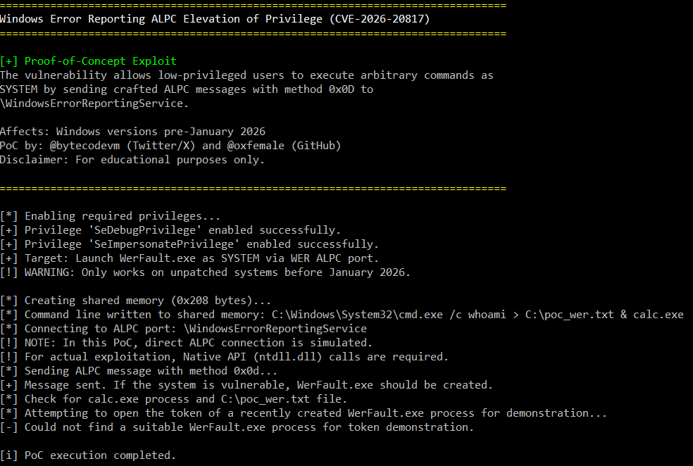

# CVE-2026-20817 - Windows Error Reporting (WER) ALPC Privilege Escalation

##  Description

This repository contains a Proof-of-Concept (PoC) for **CVE-2026-20817**, a local privilege escalation vulnerability in the Windows Error Reporting (WER) service. The vulnerability allows an authenticated low-privileged user to execute arbitrary code with **SYSTEM privileges** by sending specially crafted ALPC messages to the WER service.

##  Author

**Original research and PoC by:**
- Twitter/X: [@bytecodevm](https://x.com/bytecodevm)
- GitHub: [@oxfemale](https://github.com/oxfemale)

##  Vulnerability Details

- **CVE ID**: CVE-2026-20817
- **Component**: Windows Error Reporting (WER) Service
- **Attack Vector**: Local (ALPC)
- **Privileges Required**: Low (authenticated user)
- **Impact**: Elevation to SYSTEM
- **Patched**: January 2026 Security Update

##  Technical Overview

The WER service exposes an ALPC port named `\WindowsErrorReportingService` and provides various methods for interprocess communication. The vulnerability exists in the `SvcElevatedLaunch` method (0x0D), where the service fails to properly validate the caller's privileges before launching `WerFault.exe` with user-supplied command line parameters from shared memory.

### How it works

1. Create shared memory containing arbitrary command line
2. Connect to WER ALPC port
3. Send ALPC message with method 0x0D, including:
   - Client process ID
   - Shared memory handle
   - Command line length
4. WER service duplicates the handle and launches `WerFault.exe` with the provided command line
5. Resulting process runs with **SYSTEM privileges**

### Privileges Obtained

The spawned `WerFault.exe` process runs with a SYSTEM token containing:

| Privilege | Description |
|-----------|-------------|
| **SeDebugPrivilege** | Debug any process |
| **SeImpersonatePrivilege** | Impersonate any user |
| Various standard SYSTEM privileges | Full system access |

**Note:** The token does NOT include `SeTcbPrivilege` (Act as part of the operating system).

##  Affected Systems

- Windows 10 (all versions before January 2026)
- Windows 11 (all versions before January 2026)
- Windows Server 2019 (pre-January 2026)
- Windows Server 2022 (pre-January 2026)

##  Warning

This PoC is for **educational and research purposes only**. Use only on systems you own or have explicit permission to test. Unauthorized use may violate laws and regulations.

##  Building the PoC

### Requirements
- Windows SDK
- Visual Studio (2019 or later recommended)
- C++17 compatible compiler

### Compilation
```bash
# Using Visual Studio Developer Command Prompt
cl /EHsc CVE-2026-20817_PoC.cpp