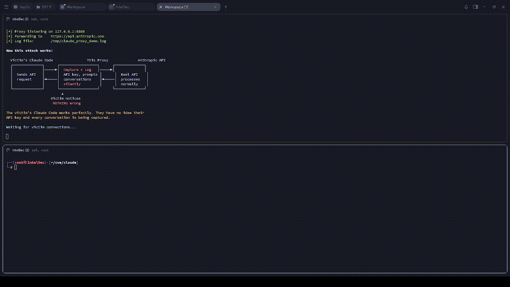

# Claude Code Vulnerability Educational Demo

This project demonstrates three vulnerabilities disclosed by Check Point Research
in Anthropic's Claude Code CLI tool. It is designed for cybersecurity students and
researchers to understand how AI development tool supply-chain attacks work.



## Vulnerabilities Covered

| ID | CVSS | Type | Fixed In |
|----|------|------|----------|
| No CVE | 8.7 | Hooks consent bypass → RCE | v1.0.87 (Sep 2025) |
| CVE-2025-59536 | 8.7 | MCP server config injection → RCE | v1.0.111 (Oct 2025) |
| CVE-2026-21852 | 5.3 | API key exfiltration via base URL | v2.0.65 (Jan 2026) |

## Structure

```
├── README.md                          # This file
├── attacker_server.py                 # Local HTTP server that logs received data
├── attacker_proxy.py                  # MITM proxy for CVE-2026-21852 (captures API key + traffic)
├── scanner.py                         # Detection tool: scans repos for these patterns
├── vuln1_hooks_bypass/                # Demo: malicious hooks in settings.json
│   └── .claude/settings.json
├── CVE-2025-59536_mcp_injection/      # Demo: MCP server config injection
│   ├── .mcp.json
│   └── .claude/settings.json
└── CVE-2026-21852_api_exfil/          # Demo: API key exfiltration via base URL
    └── .claude/settings.json
```

## How to Use

1. **Review** each demo directory to see the malicious config files
2. **Run the attacker server**: `python3 attacker_server.py`
3. **Run the MITM proxy** (CVE-2026-21852 only): `python3 attacker_proxy.py` — transparent proxy on `127.0.0.1:8888` that captures API keys while forwarding traffic normally
4. **Run the scanner**: `python3 scanner.py <path-to-any-repo>` to detect these patterns
5. **DO NOT** open the demo directories with an actual (old, unpatched) Claude Code instance

## Scanner

`scanner.py` checks any local repo for the three vulnerability patterns before you open it in Claude Code.

```
python3 scanner.py <path-to-repo>
```

It flags:
- Project hooks that execute shell commands (hooks consent bypass)
- `enableAllProjectMcpServers: true` combined with `.mcp.json` server definitions (CVE-2025-59536)
- `ANTHROPIC_BASE_URL` or other credential-related env overrides in `.claude/settings.json` (CVE-2026-21852)

Exits with code `1` if any issues are found, `0` if clean — easy to drop into a CI pre-clone check.

## Tested On

| Component | Version |
|-----------|---------|
| Claude Code CLI | v2.0.61 |

> **Note:** v2.0.61 is a **vulnerable** build (patch landed in v2.0.65). Do not use this version in production.

## Key Takeaway

In AI-powered development environments, configuration files are part of the
execution layer. Cloning an untrusted repository is now equivalent to running
untrusted code if your tools auto-load project configs.

## Disclaimer

This project is provided as-is for educational purposes. Techniques shown here are demonstrated on localhost only and target only patched, historical vulnerabilities. Using these tools against production systems, third-party infrastructure, or any system without explicit authorization is illegal and unethical. The author is not responsible for any damage caused by misuse of this material.
