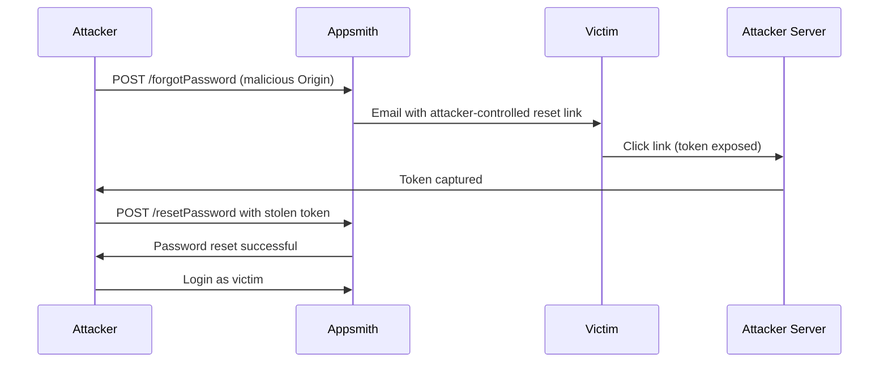

# CVE-2026-22794 - Technical Analysis

## Executive Summary

CVE-2026-22794 is a critical security vulnerability in Appsmith that allows attackers to hijack password reset tokens through Origin header manipulation. This document provides a detailed technical analysis of the vulnerability, its root cause, and exploitation methodology.

## Vulnerability Details

### Root Cause Analysis

The vulnerability exists in the password reset functionality of Appsmith. When a user requests a password reset, the application uses the HTTP `Origin` header from the request to construct the password reset URL that is sent to the user's email.

**Vulnerable Code Pattern:**
```java
// Simplified representation of the vulnerable code
public void forgotPassword(HttpServletRequest request, String email) {
    String originHeader = request.getHeader("Origin");
    
    // VULNERABILITY: Origin header is trusted without validation
    UserPasswordDTO userPasswordDTO = new UserPasswordDTO();
    userPasswordDTO.setBaseUrl(originHeader);  // <-- VULNERABLE LINE
    
    // Generate reset token and send email
    String resetToken = generateSecureToken();
    String resetUrl = userPasswordDTO.getBaseUrl() + "/user/resetPassword?token=" + resetToken;
    
    emailService.sendPasswordResetEmail(email, resetUrl);
}
```

### Security Impact

| Impact Category | Description |
|-----------------|-------------|
| **Confidentiality** | HIGH - Password reset tokens are leaked to attacker |
| **Integrity** | HIGH - Attacker can modify victim's password |
| **Availability** | LOW - Account access can be denied to legitimate user |

### Attack Prerequisites

1. **Attacker Requirements:**
   - Knowledge of victim's email address
   - Ability to host a web server (to capture tokens)
   - Network access to the target Appsmith instance

2. **Victim Requirements:**
   - Must click the password reset link in their email
   - No special privileges required

## Technical Exploitation

### HTTP Request Structure

**Normal Request:**
```http
POST /api/v1/users/forgotPassword HTTP/1.1
Host: appsmith.legitimate.com
Origin: https://appsmith.legitimate.com
Content-Type: application/json
Cookie: SESSION=...

{
    "email": "user@company.com"
}
```

**Malicious Request:**
```http
POST /api/v1/users/forgotPassword HTTP/1.1
Host: appsmith.legitimate.com
Origin: https://attacker-controlled.com
Content-Type: application/json

{
    "email": "victim@company.com"
}
```

### Token Capture Mechanism

When the victim clicks the password reset link, their browser makes a request to the attacker's server:

```
GET /user/resetPassword?token=eyJhbGciOiJIUzI1NiIsInR5cCI6IkpXVCJ9... HTTP/1.1
Host: attacker-controlled.com
User-Agent: Mozilla/5.0 ...
Referer: (email client or webmail)
```

The attacker's server captures the complete URL including the token parameter.

### Account Takeover Sequence



## Exploitation Variants

### Variant 1: Direct Token Capture

The attacker sets up a simple HTTP server to log incoming requests. When the victim clicks the link, the token is logged and the attacker uses it immediately.

### Variant 2: Phishing Enhancement

The attacker serves a convincing phishing page that:
1. Captures the token from the URL
2. Displays a fake "session expired" message
3. Redirects to the real Appsmith instance

This reduces suspicion from the victim.

### Variant 3: Mass Account Compromise

If the attacker has a list of email addresses, they can:
1. Send password reset requests for all emails
2. Run a token capture server
3. Automatically reset passwords as tokens arrive
4. Create a database of compromised accounts

## Indicators of Compromise (IoC)

### Log Analysis

Look for password reset requests with suspicious Origin headers:

```
# Apache/Nginx access logs
grep "forgotPassword" access.log | grep -v "Origin: https://your-legitimate-domain.com"
```

### Email Analysis

Examine password reset emails for:
- Reset URLs pointing to external domains
- Mismatched sender domain and link domain

### Network Monitoring

- Unusual outbound connections to unknown domains
- Password reset API calls with unusual Origin headers

## Remediation

### Immediate Mitigation

1. **Whitelist Validation:**
```java
private static final Set<String> ALLOWED_ORIGINS = Set.of(
    "https://appsmith.yourcompany.com",
    "https://app.appsmith.com"
);

public void forgotPassword(HttpServletRequest request, String email) {
    String originHeader = request.getHeader("Origin");
    
    if (!ALLOWED_ORIGINS.contains(originHeader)) {
        throw new InvalidOriginException("Invalid origin");
    }
    // ... rest of the code
}
```

2. **Server-Side Configuration:**
```java
public void forgotPassword(HttpServletRequest request, String email) {
    // Use configured base URL instead of Origin header
    String baseUrl = applicationConfig.getBaseUrl();
    
    UserPasswordDTO userPasswordDTO = new UserPasswordDTO();
    userPasswordDTO.setBaseUrl(baseUrl);
    // ... rest of the code
}
```

### Long-term Fixes

1. **Token Binding:**
   - Bind reset tokens to IP addresses
   - Implement short token expiration (15 minutes)
   - Add one-time use validation

2. **Additional Verification:**
   - Implement CAPTCHA on password reset
   - Add email verification step before allowing reset
   - Rate limit password reset requests

3. **Security Headers:**
   - Implement strict Content-Security-Policy
   - Add X-Frame-Options to prevent clickjacking
   - Enable HSTS

## CVSS Vector

```
CVSS:3.1/AV:N/AC:L/PR:N/UI:R/S:U/C:H/I:H/A:N
```

| Metric | Value | Justification |
|--------|-------|---------------|
| Attack Vector | Network | Exploitable over the internet |
| Attack Complexity | Low | No special conditions required |
| Privileges Required | None | No authentication needed |
| User Interaction | Required | Victim must click the link |
| Scope | Unchanged | Impact limited to Appsmith |
| Confidentiality | High | Complete token disclosure |
| Integrity | High | Password can be changed |
| Availability | None | No direct impact on availability |

**CVSS Score: 8.1 (High) to 9.1 (Critical)** depending on context

## References

- [CWE-346: Origin Validation Error](https://cwe.mitre.org/data/definitions/346.html)
- [CWE-640: Weak Password Recovery Mechanism for Forgotten Password](https://cwe.mitre.org/data/definitions/640.html)
- [OWASP Testing Guide - Forgot Password](https://owasp.org/www-project-web-security-testing-guide/)

## Timeline

| Date | Event |
|------|-------|
| YYYY-MM-DD | Vulnerability discovered |
| YYYY-MM-DD | Vendor notified |
| YYYY-MM-DD | Vendor acknowledged |
| YYYY-MM-DD | Patch released |
| YYYY-MM-DD | CVE assigned |
| YYYY-MM-DD | Public disclosure |

---

*This document is for security research and educational purposes only.*
