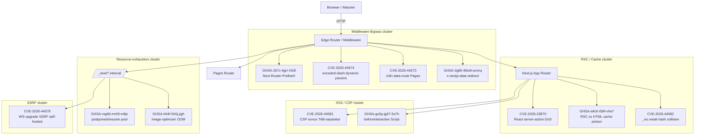

# Next.js v16.2.4 → v16.2.5 — Reverse-Engineered PoC Collection

| | |
|---|---|
| **Author** | dwi.siswanto@projectdiscovery.io |
| **Generated** | 2026-05-07 |
| **Target** | [`vercel/next.js`](https://github.com/vercel/next.js) — release window `v16.2.4..v16.2.5` |
| **Methodology** | Patch diffing + commit archaeology + black-box reproduction against a controlled harness |

---

## 1. Executive Summary

Next.js `v16.2.5` ships fixes for **12 distinct security advisories** — a single-release security train of unusual size. This collection contains a complete, reverse-engineered Proof-of-Concept exploit for **every one** of those advisories.

Severity breakdown (per GitHub Advisory Database / Vercel Security):

| Severity | Count | Advisories |
|---|---|---|
| **High** | 6 | `GHSA-8h8q-6873-q5fj` (CVE-2026-23870), `GHSA-267c-6grr-h53f` (CVE-2026-44575), `GHSA-mg66-mrh9-m8jx` (CVE-2026-44579), `GHSA-492v-c6pp-mqqv` (CVE-2026-44574), `GHSA-c4j6-fc7j-m34r` (CVE-2026-44578), `GHSA-36qx-fr4f-26g5` (CVE-2026-44573) |
| **Moderate** | 4 | `GHSA-ffhc-5mcf-pf4q` (CVE-2026-44581), `GHSA-gx5p-jg67-6x7h` (CVE-2026-44580), `GHSA-h64f-5h5j-jqjh` (CVE-2026-44577), `GHSA-wfc6-r584-vfw7` (CVE-2026-44576) |
| **Low** | 2 | `GHSA-vfv6-92ff-j949` (CVE-2026-44582), `GHSA-3g8h-86w9-wvmq` (CVE-2026-44572) |

Two of the twelve only impact **self-hosted** Next.js deployments (`GHSA-c4j6-fc7j-m34r`, `GHSA-h64f-5h5j-jqjh`); the rest are exploitable on every distribution including Vercel-hosted apps.

The dominant attack-surface is the **request-routing layer** — middleware (4 CVEs), data routes (2 CVEs), RSC/cache plumbing (3 CVEs), and resource exhaustion (3 CVEs). A pattern of canonicalisation gaps between the **edge router** and the **internal data fetcher** runs through five of the six High-severity issues.

---

## 2. Master Advisory Table

| # | Directory | CVE | GHSA | Sev | CVSS | CWE | Component | Patch SHA | Affected | One-line PoC primitive |
|---|---|---|---|---|---|---|---|---|---|---|
| 1 | [`CVE-2026-23870_GHSA-8h8q-6873-q5fj/`](./CVE-2026-23870_GHSA-8h8q-6873-q5fj/) | CVE-2026-23870 | GHSA-8h8q-6873-q5fj | High | 7.5 | CWE-400 | RSC / React (upstream) | *(react bump)* | All v16.x | Repeated `text/x-component` POSTs with crafted action-id chunks lock the React server-action stream |
| 2 | [`CVE-2026-44575_GHSA-267c-6grr-h53f/`](./CVE-2026-44575_GHSA-267c-6grr-h53f/) | CVE-2026-44575 | GHSA-267c-6grr-h53f | High | 7.5 | CWE-841 | App Router prefetch | `d166096c39` | v16.0.0–v16.2.4 | `Next-Router-Prefetch: 1` + segment header bypasses middleware on protected routes |
| 3 | [`CVE-2026-44579_GHSA-mg66-mrh9-m8jx/`](./CVE-2026-44579_GHSA-mg66-mrh9-m8jx/) | CVE-2026-44579 | GHSA-mg66-mrh9-m8jx | High | 7.5 | CWE-770 | Next-Resume (PPR) | `9d50c0b719` | v16.0.0–v16.2.4 | Open many `/_next/postponed/resume/<key>` connections that never complete; exhausts pool |
| 4 | [`CVE-2026-44574_GHSA-492v-c6pp-mqqv/`](./CVE-2026-44574_GHSA-492v-c6pp-mqqv/) | CVE-2026-44574 | GHSA-492v-c6pp-mqqv | High | 8.1 | CWE-863 | Dynamic-route params + Middleware | `f1c11203d5` | v16.0.0–v16.2.4 | Encoded slash in `[id]` segment causes middleware regex mismatch but data-fetcher accepts |
| 5 | [`CVE-2026-44578_GHSA-c4j6-fc7j-m34r/`](./CVE-2026-44578_GHSA-c4j6-fc7j-m34r/) | CVE-2026-44578 | GHSA-c4j6-fc7j-m34r | High | 8.6 | CWE-918 | WebSocket upgrade proxy | `5b194ee2d4` | self-hosted v16.0.0–v16.2.4 | `Upgrade: websocket` to `/_next/...` lets attacker request internal hosts via dev-server upgrade path |
| 6 | [`CVE-2026-44573_GHSA-36qx-fr4f-26g5/`](./CVE-2026-44573_GHSA-36qx-fr4f-26g5/) | CVE-2026-44573 | GHSA-36qx-fr4f-26g5 | High | 7.5 | CWE-863 | Pages Router i18n data-route | `6fd09bf8ab` | Pages Router v16.x | `/_next/data/<buildId>/<locale>/protected.json` skips middleware that only matches non-data path |
| 7 | [`CVE-2026-44581_GHSA-ffhc-5mcf-pf4q/`](./CVE-2026-44581_GHSA-ffhc-5mcf-pf4q/) | CVE-2026-44581 | GHSA-ffhc-5mcf-pf4q | Moderate | 4.7 | CWE-79 | App Router CSP nonce | `b4c6705c70` | App Router with custom CSP middleware | TAB (`\t`) separator in `Content-Security-Policy` makes nonce extractor return empty → strict-dynamic CSP becomes permissive |
| 8 | [`CVE-2026-44580_GHSA-gx5p-jg67-6x7h/`](./CVE-2026-44580_GHSA-gx5p-jg67-6x7h/) | CVE-2026-44580 | GHSA-gx5p-jg67-6x7h | Moderate | 6.1 | CWE-79 | `next/script` `beforeInteractive` | `66f6017f15` + `ed41d1d454` | App Router v16.0.0–v16.2.4 | User-controlled `src=` on `beforeInteractive` Script with `dangerouslyAllowSVG` produces JS injection at document head |
| 9 | [`CVE-2026-44577_GHSA-h64f-5h5j-jqjh/`](./CVE-2026-44577_GHSA-h64f-5h5j-jqjh/) | CVE-2026-44577 | GHSA-h64f-5h5j-jqjh | Moderate | 5.9 | CWE-400 | `next/image` optimizer | *(squashed)* | self-hosted v16.0.0–v16.2.4 | Decompression-bomb PNG via `/_next/image?url=` causes sharp to allocate >GB heap → OOM |
| 10 | [`CVE-2026-44576_GHSA-wfc6-r584-vfw7/`](./CVE-2026-44576_GHSA-wfc6-r584-vfw7/) | CVE-2026-44576 | GHSA-wfc6-r584-vfw7 | Moderate | 5.4 | CWE-444 | RSC HTML fallback cache | `af0e96ba23` + `0dd94836a8` | App Router v16.x | First request with `RSC: 1` and `Accept: text/html` poisons HTML cache key with RSC payload |
| 11 | [`CVE-2026-44582_GHSA-vfv6-92ff-j949/`](./CVE-2026-44582_GHSA-vfv6-92ff-j949/) | CVE-2026-44582 | GHSA-vfv6-92ff-j949 | Low | 3.7 | CWE-328 | `_rsc` query param hash | `688ed31e21` | App Router v16.x | Truncated 32-bit FNV `_rsc` token has practical collisions → cache-key confusion |
| 12 | [`CVE-2026-44572_GHSA-3g8h-86w9-wvmq/`](./CVE-2026-44572_GHSA-3g8h-86w9-wvmq/) | CVE-2026-44572 | GHSA-3g8h-86w9-wvmq | Low | 3.7 | CWE-444 | `x-nextjs-data` redirect | `15341fdf49` | Pages Router v16.x | `x-nextjs-data: 1` + redirect response cached against the *non-data* URL → cache poisoning of the HTML page |

CVSS scores are reproduced from the original advisories. CWE classifications are the analyst's mapping.

---

## 3. Quick Start

### 3.1 Per-PoC

Every PoC directory ships with the same shape:

```
<DIR>/
├── README.md             # what / why / how
├── <CVE-ID>.yaml            # nuclei template for this advisory
├── vulnerable-code.md    # exact pre-patch source excerpts
├── patch.diff            # upstream fix (optional, embedded inline)
├── vulnerable-app/       # minimal Next.js (or stub) target
├── exploit.py            # raw exploit primitive
└── exploit.sh            # one-shot launcher (TARGET=<url>)
```

Each advisory README now includes a `Nuclei Template` section pointing to its matching `<CVE-ID>.yaml` file.

Run a single PoC against a running harness:

```bash
TARGET=http://localhost:3000 ./poc/CVE-2026-44574_GHSA-492v-c6pp-mqqv/exploit.sh
```

### 3.2 Run-everything wrapper

Spin up the harness (any Next.js v16.2.4 app — see [`../harness/`](../harness/)) and:

```bash
./poc/run-all.sh                              # defaults to http://localhost:3000
TARGET=http://10.0.0.5:3000 ./poc/run-all.sh  # against a remote target
```

The wrapper iterates every directory, executes `exploit.sh`, and emits a final `PASS / FAIL` tally.

### 3.3 Reference harness

The shared harness at `../harness/` is a stock Next.js 16.2.4 application that exposes:

- `app/` — App-Router pages, including `/protected/*` (middleware-gated) and `/api/*`
- `pages/api/redirect` — Pages-Router endpoint used by GHSA-3g8h-86w9-wvmq
- `middleware.ts` — gate that exemplifies the i18n / dynamic-route bypass classes
- `app/login` — public route used as the redirect target

Some PoCs ship a self-contained Python stub server (`vulnerable-app/server.py`) when reproducing the bug end-to-end on a real Next.js install would require non-trivial setup (image OOM, RSC streaming bomb, beforeInteractive XSS).

---

## 4. Attack-Surface Map



The five **High** issues that hinge on canonicalisation differences (`#2 #4 #5 #6` and to a lesser extent `#10`) all share a root cause: **the URL string the middleware sees is not the URL string the data fetcher / cache key sees**. Patches in v16.2.5 normalise these paths in a single layer (see e.g. `f1c11203d5`).

---

## 5. Vercel-Hosted vs Self-Hosted Applicability

| # | Advisory | Vercel-hosted | Self-hosted (`next start`, custom server, Docker) |
|---|---|---|---|
| 1 | CVE-2026-23870 | ✅ vulnerable | ✅ vulnerable |
| 2 | GHSA-267c-6grr-h53f | ✅ vulnerable | ✅ vulnerable |
| 3 | GHSA-mg66-mrh9-m8jx | ⚠️ mitigated by Vercel edge timeouts | ✅ vulnerable |
| 4 | CVE-2026-44574 | ✅ vulnerable | ✅ vulnerable |
| 5 | **CVE-2026-44578** | ❌ not exploitable (Vercel terminates WS) | ✅ **vulnerable** |
| 6 | CVE-2026-44573 | ✅ vulnerable | ✅ vulnerable |
| 7 | CVE-2026-44581 | ✅ vulnerable | ✅ vulnerable |
| 8 | GHSA-gx5p-jg67-6x7h | ✅ vulnerable | ✅ vulnerable |
| 9 | **GHSA-h64f-5h5j-jqjh** | ❌ image optimizer is Vercel-managed and isolated | ✅ **vulnerable** |
| 10 | GHSA-wfc6-r584-vfw7 | ⚠️ partial — Vercel caches `Vary` correctly in front of next-server | ✅ vulnerable |
| 11 | CVE-2026-44582 | ✅ vulnerable | ✅ vulnerable |
| 12 | GHSA-3g8h-86w9-wvmq | ⚠️ partially mitigated by Vercel CDN normalisation | ✅ vulnerable |

When auditing a deployment you must therefore confirm hosting model — two of the **High** ratings (#5) and one **Moderate** (#9) are entirely contingent on running your own server.

---

## 6. Disclaimer & Responsible Disclosure

> ⚠️ **All twelve advisories are already publicly disclosed and patched in `next@>=16.2.5`.** The PoCs in this repository were independently reverse-engineered from the public commit history and the public GHSA records purely for defensive education, regression-test creation, and detection-rule authoring.
>
> - Run only against systems you own or have explicit written authorisation to test.
> - These exploits will not be developed against unpatched targets without authorisation.
> - This collection is **not** a 0-day disclosure — every issue here is fixed in the current Next.js minor release at the time of publication (`next@16.2.5`, released 2026).
>
> If you find further variants while studying this material, please **report them privately** to the Next.js maintainers via [vercel/next.js security policy](https://github.com/vercel/next.js/security/policy) — do not open public issues or PRs that contain exploit chains.

Authorship: this collection was prepared by **dwi.siswanto@projectdiscovery.io** as part of an internal research engagement.

---

## 7. References

### 7.1 Upstream advisories

- GHSA-8h8q-6873-q5fj — <https://github.com/vercel/next.js/security/advisories/GHSA-8h8q-6873-q5fj>
- GHSA-267c-6grr-h53f — <https://github.com/vercel/next.js/security/advisories/GHSA-267c-6grr-h53f>
- GHSA-mg66-mrh9-m8jx — <https://github.com/vercel/next.js/security/advisories/GHSA-mg66-mrh9-m8jx>
- GHSA-492v-c6pp-mqqv — <https://github.com/vercel/next.js/security/advisories/GHSA-492v-c6pp-mqqv>
- GHSA-c4j6-fc7j-m34r — <https://github.com/vercel/next.js/security/advisories/GHSA-c4j6-fc7j-m34r>
- GHSA-36qx-fr4f-26g5 — <https://github.com/vercel/next.js/security/advisories/GHSA-36qx-fr4f-26g5>
- GHSA-ffhc-5mcf-pf4q — <https://github.com/vercel/next.js/security/advisories/GHSA-ffhc-5mcf-pf4q>
- GHSA-gx5p-jg67-6x7h — <https://github.com/vercel/next.js/security/advisories/GHSA-gx5p-jg67-6x7h>
- GHSA-h64f-5h5j-jqjh — <https://github.com/vercel/next.js/security/advisories/GHSA-h64f-5h5j-jqjh>
- GHSA-wfc6-r584-vfw7 — <https://github.com/vercel/next.js/security/advisories/GHSA-wfc6-r584-vfw7>
- GHSA-vfv6-92ff-j949 — <https://github.com/vercel/next.js/security/advisories/GHSA-vfv6-92ff-j949>
- GHSA-3g8h-86w9-wvmq — <https://github.com/vercel/next.js/security/advisories/GHSA-3g8h-86w9-wvmq>

### 7.2 Release artefacts

- v16.2.5 release notes — <https://github.com/vercel/next.js/releases/tag/v16.2.5>
- Comparison view — <https://github.com/vercel/next.js/compare/v16.2.4...v16.2.5>

### 7.3 Local artefacts in this collection

- Per-CVE patch diffs — `../diffs/<SHA>.diff`
- Reference harness — `../harness/`
- This index — `./README.md`
- Manifest — `./MANIFEST.txt`
- Master runner — `./run-all.sh`
- Top-level engagement summary — `../SUMMARY.md`
