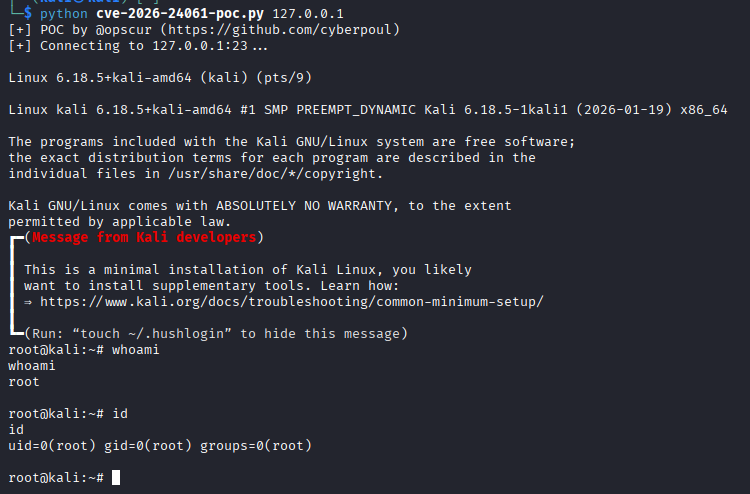

# CVE-2026-24061 – telnetd Authentication Bypass PoC


> Critical authentication bypass in `telnetd` leading to RCE as root 
> Affects systems with telnetd versions containing the vulnerability from 2015 onwards


## About
<p align="center"></p>

This PoC demonstrates **CVE-2026-24061**, a critical authentication bypass vulnerability in telnetd that has existed undetected for 11 years. The vulnerability stems from improper handling of the USER environment variable in telnetd's login process. You can check the infamous commit that introduced the vulnerability <a href="https://codeberg.org/inetutils/inetutils/commit/fa3245ac8c288b87139a0da8249d0a408c4dfb87" target="_blank" rel="noopener noreferrer">here.</a>

## Requirements

- Affected `telnetd` version: **from 1.9.3 to 2.7**
- Network access to target telnet service (ex. default port 23)
- No special privileges required on the attacking system


## Usage

- ```bash
  git clone https://github.com/0p5cur/CVE-2026-24061-POC
  
- ```bash
  cd CVE-2026-24061-POC

- ```bash
  python cve-2026-24061-poc.py <target_ip> <target_port>

## Mitigation

- Patch telnetd immediately as soon as patches are available even better `disable telnetd entirely and use SSH instead`
- Block telnet traffic at the network perimeter and implement network segmentation to limit telnet exposure

## References

- [NVD Entry – CVE-2026-24061](https://nvd.nist.gov/vuln/detail/CVE-2026-24061)
- [RFC 1572 - Telnet Environment Option](https://datatracker.ietf.org/doc/html/rfc1572)
