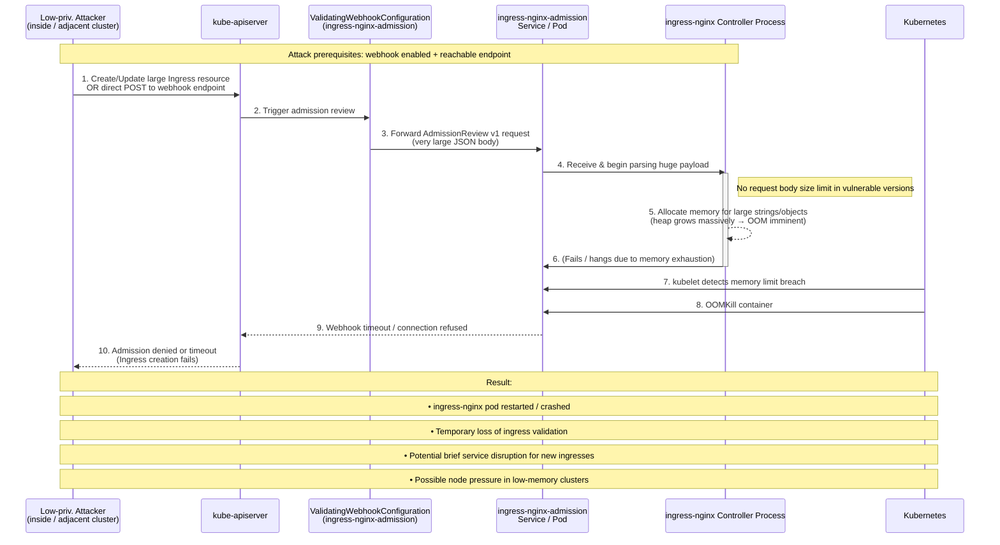

[](https://cve.mitre.org/cgi-bin/cvename.cgi?name=CVE-2026-24514)
[](https://nvd.nist.gov/vuln-metrics/cvss/v3-calculator?vector=AV:N/AC:L/PR:L/UI:N/S:U/C:N/I:N/A:H&version=3.1)
[](https://nvd.nist.gov/vuln/detail/CVE-2026-24514)
[](https://cwe.mitre.org/data/definitions/770.html)
[](https://example.com)
[](https://example.com)

# CVE-2026-24514 – Critical Memory Exhaustion in ingress-nginx Validating Admission Webhook

**Unauthenticated / low-privileged remote denial-of-service vulnerability allowing attackers to crash ingress-nginx controller pods via oversized AdmissionReview requests.**

## Overview & Business Impact

The **ingress-nginx** validating admission webhook (when enabled) does not enforce reasonable limits on the size of incoming AdmissionReview objects.  
An attacker who can reach the webhook endpoint — even with only low privileges — can submit extremely large JSON payloads, forcing the controller process to allocate massive amounts of memory.

**Consequences include:**

- Immediate OOM termination (OOMKilled) of ingress-nginx pods  
- Loss of admission validation for new/modified Ingress resources  
- Temporary or prolonged disruption of new ingress traffic routing  
- Potential cascading effects: node memory pressure, pod evictions, cluster instability in resource-constrained environments  
- In worst-case multi-tenant clusters: impact on unrelated namespaces and workloads

**CVSS v3.1 Base Score**  
6.5 Medium  
**Vector String**  
`CVSS:3.1/AV:N/AC:L/PR:L/UI:N/S:U/C:N/I:N/A:H`

**Weakness**  
CWE-770: Allocation of Resources Without Limits or Throttling

**Credits**  
Mohammed Idrees Banyamer – @banyamer_security (Jordan)

## Affected Versions

| Component              | Vulnerable Versions                  | Fixed Versions     | Webhook Enabled By Default? |
|------------------------|--------------------------------------|--------------------|-----------------------------|
| ingress-nginx          | < 1.13.7                             | ≥ 1.13.7           | No                          |
| ingress-nginx (1.14.x) | < 1.14.3                             | ≥ 1.14.3           | No                          |

**Note:** The vulnerability only manifests when the validating admission webhook feature is **explicitly enabled**.

## 📊 PoC Attack Flow


## Exploitation – Usage Examples

**Important:** This vulnerability should only be demonstrated in isolated lab/test clusters with explicit permission.  
Running this against production environments is illegal and may cause outages.

**Recommended safe testing method:**

```bash
# 1. Port-forward the admission service locally
kubectl port-forward svc/ingress-nginx-controller-admission \
  8443:443 -n ingress-nginx

# 2. Run PoC with increasing payload sizes (start small!)
python3 cve-2026-24514-Kubernetes.py https://localhost:8443/validate 25 --insecure

# 3. Monitor memory & pod status in another terminal
watch -n 2 'kubectl top pods -n ingress-nginx && kubectl get pods -n ingress-nginx'

# More aggressive examples (use with caution)
python3 cve-2026-24514-Kubernetes.py https://localhost:8443/validate 80 --insecure
python3 cve-2026-24514-Kubernetes.py https://localhost:8443/validate 150 --insecure --field-name enormousJunk
```

**Realistic attack scenarios:**

- Attacker inside the cluster (compromised pod / developer access) → direct internal DNS call
- Exposed webhook service due to misconfiguration (LoadBalancer / NodePort)
- Social engineering / supply-chain attack delivering malicious Ingress manifests with huge annotations / fields

## Mitigation & Hardening Recommendations

1. **Upgrade immediately** to ingress-nginx ≥ 1.13.7 or ≥ 1.14.3
2. If upgrade is delayed:
   - **Disable** the validating admission webhook (`--enable-validating-webhook=false`)
   - Restrict network access to the admission service using NetworkPolicy
3. Monitor ingress-nginx pods for abnormal memory usage / restarts
4. Consider resource quotas + memory limits on ingress-nginx namespace
5. Audit who can reach internal webhook endpoints

## References

- Official issue (assumed): https://github.com/kubernetes/ingress-nginx/issues/136680
- ingress-nginx security advisories: https://kubernetes.github.io/ingress-nginx/security/
- Project repository: https://github.com/kubernetes/ingress-nginx
- NVD CVE entry: https://nvd.nist.gov/vuln/detail/CVE-2026-24514

**Responsible disclosure & PoC credit:** Mohammed Idrees Banyamer (@banyamer_security)
