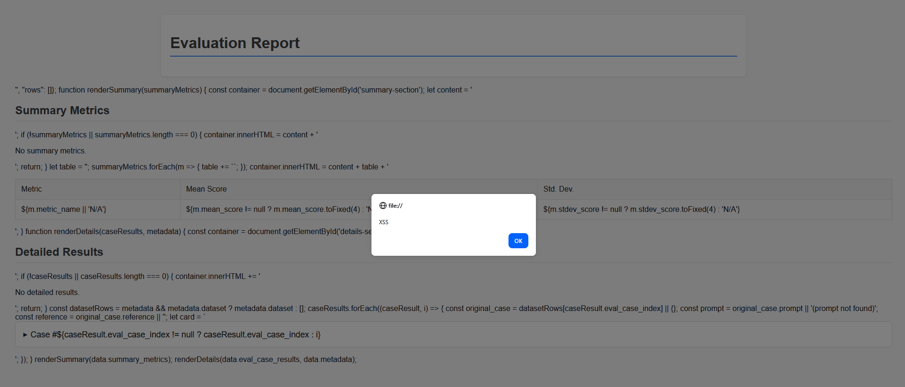

# Unauthenticated Stored Cross-Site Scripting (XSS) in _genai/_evals_visualization.py of Google Cloud Vertex AI SDK (google-cloud-aiplatform) versions from 1.98.0 up to (but not including) 1.131.0 - (github.com/googleapis/python-aiplatform)

- **Author: Joshua Provoste (N-day Researcher & Dev)**
- **Credits: Din Asotić (Zero-day Finder & Reporter)**

## About `google-cloud-aiplatform`

`google-cloud-aiplatform` is Google Cloud's official Python SDK for working with **Vertex AI**. It provides high-level abstractions to create, train, deploy, and use ML models (including AutoML and custom models), and to manage datasets, endpoints, pipelines, and predictions.

* https://pypi.org/project/google-cloud-aiplatform/
* https://github.com/googleapis/python-aiplatform

## Resume

`GCP-2026-011` (published and updated on 2026-02-20) documents `CVE-2026-2472`, a stored `XSS` vulnerability in the `_genai/_evals_visualization.py` component of the **Google Cloud Vertex AI Python SDK** (`google-cloud-aiplatform`) affecting versions `1.98.0` up to but not including `1.131.0`, where an **unauthenticated attacker can inject script escape sequences into model evaluation results or dataset JSON and achieve arbitrary JavaScript execution in a victim's Jupyter/Colab environment**; Google indicates the issue is fixed by upgrading to version `1.131.0` or later (with `1.131.0` released on 2025-12-16).

# About the XSS Vulnerability in `vertexai/_genai/_evals_visualization.py`

## Summary

The file is vulnerable to **stored XSS** because it **embeds attacker-controllable JSON directly into an inline `<script>` block** without performing **HTML script-context escaping**. This allows a malicious value containing a script-closing sequence (e.g., `</script>`) to **break out of the intended JavaScript data assignment** and inject executable JavaScript into the rendered Jupyter/Colab HTML.

## Why it is vulnerable

The core issue is the pattern:

- `_get_evaluation_html(...)` injects raw JSON into:
  - `const data = {eval_result_json};` **(line 101)**
- `_get_comparison_html(...)` injects raw JSON into:
  - `const data = {eval_result_json};` **(line 180)**
- `_get_inference_html(...)` injects raw JSON into:
  - `const data = JSON.parse({dataframe_json});` **(line 252)**

Even when the input is serialized with `json.dumps(...)`, that only makes it valid **JSON**—it does **not** make it safe for embedding inside an HTML `<script>` context. If any field in the JSON contains `</script>`, the browser's HTML parser can terminate the current script tag and parse the rest as attacker-controlled HTML/JS.

### The XSS payload

```
{
  "prompt": "</script><script>alert('XSS');</script>",
  "rows": []
}
```

## Local PoC of `CVE-2026-2472`

1. Install the specific vulnerable version of `google-cloud-aiplatform` and `pandas`

```
pip install google-cloud-aiplatform==1.98.0
pip install pandas
```

2. Execute `CVE-2026-2472.py` to generate the local PoC

```
(.venv) L:\>python CVE-2026-2472.py
[+] xss_proof_local.html
```

