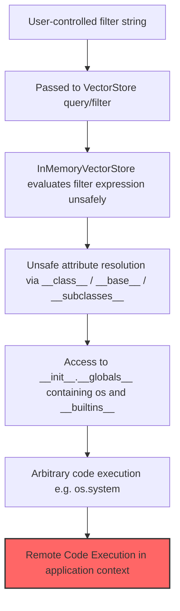

# Microsoft Semantic Kernel < 1.39.4 – Remote Code Execution PoC  
**CVE-2026-26030**

Untrusted filter expressions in `InMemoryVectorStore` allow unsafe attribute resolution leading to arbitrary Python code execution via `__builtins__` / `globals` traversal.

## 👤 Author
**Mohammed Idrees Banyamer**  
Security Researcher  

- GitHub: [https://github.com/mbanyamer](https://github.com/mbanyamer)  
- Instagram: [https://instagram.com/banyamer_security](https://instagram.com/banyamer_security)


## Attack Flow Diagram



## Exploit Details

- **CVE**: CVE-2026-26030  
- **Date**: 2026-02-24  
- **Exploit Author**: Mohammed Idrees Banyamer  
- **Country**: Jordan  
- **Instagram**: @banyamer_security  
- **GitHub**: [mbanyamer](https://github.com/mbanyamer)  
- **Vendor Homepage**: https://github.com/microsoft/semantic-kernel  
- **Package**: https://pypi.org/project/semantic-kernel/  
- **Affected versions**: semantic-kernel < 1.39.4 (Python)  
- **Fixed in**: semantic-kernel 1.39.4  
- **Tested on**: Python 3.10 – 3.12 / semantic-kernel 1.39.0  
- **Category**: Remote Code Execution  
- **CWE**: CWE-94 (Improper Control of Generation of Code / 'Code Injection')  
- **CVSS**: 9.8 (Critical) – estimated  
- **Exploit Type**: Proof of Concept  

**Description**  
Untrusted / user-controlled filter expressions passed to `InMemoryVectorStore` are evaluated unsafely, allowing attribute traversal that reaches `__builtins__`, `globals`, and eventually the `os` module — resulting in arbitrary Python code execution.

**Important notes**  
- This PoC is **local** — demonstrates the vulnerability without needing a network target  
- Real-world exploitation requires an application that passes **untrusted input** directly into filter expressions  
- Highest risk in **multi-tenant**, **agentic**, or **RAG** systems where users can influence filter logic

## Usage

The exploit demonstration is provided in a separate file:  
`exploit.py`

```bash
# 1. Install vulnerable version (for testing / research purposes only!)
pip install semantic-kernel==1.39.0

# 2. Run the PoC
python3 exploit.py
```

## Recommendation

**Upgrade immediately** to **semantic-kernel >= 1.39.4**

Applications using `InMemoryVectorStore` should:

- Never pass untrusted/user-controlled strings into filter expressions
- Apply strict input validation / sanitization if filters must be dynamic
- Consider safer / more restricted vector store implementations

## License
MIT License

Copyright © 2026 Mohammed Idrees Banyamer
