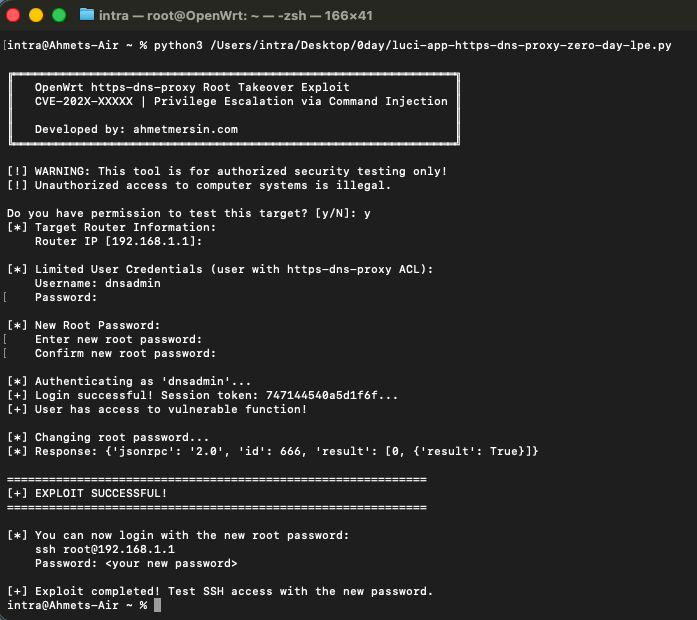

# OpenWrt luci-app-https-dns-proxy Privilege Escalation (CVE-2026-26899)

This repository contains the Proof of Concept (PoC) exploit for a critical OS command injection vulnerability in `luci-app-https-dns-proxy`.

## ✅ Status: FIXED
**The vulnerability has been patched.**
- **CVE ID:** CVE-2026-26899
- **Fix:** [openwrt/luci#8238](https://github.com/openwrt/luci/pull/8238) — official LuCI fix, merged 2026-01-21 (update to `2025.12.29-3`); the PR explicitly credits the reporter `@iwallplace`. Maintainer-repo equivalent: [luci-app-https-dns-proxy#15](https://github.com/mossdef-org/luci-app-https-dns-proxy/pull/15).

Users are advised to update their `luci-app-https-dns-proxy` package immediately.

## Vulnerability Details
- **Vendor:** OpenWrt (community package; maintainer: mossdef-org / stangri)
- **Product:** luci-app-https-dns-proxy (LuCI web interface for the https-dns-proxy package)
- **Type:** OS Command Injection (CWE-78)
- **Affected component:** `setInitAction` in `/usr/libexec/rpcd/luci.https-dns-proxy`
- **Affected versions:** 2025.12.29-2 and earlier
- **Fixed version:** 2025.12.29-3
- **Impact:** Privilege Escalation — an authenticated LuCI user can execute arbitrary OS commands as root

## Description
The `setInitAction` RPC method passes a user-supplied value to the system shell without proper sanitization. An authenticated LuCI user can therefore inject arbitrary shell commands that execute with root privileges.

## Usage
```bash
python3 exploit.py
```


